# Punctim


**0.x — versión preliminar, en desarrollo activo**  
**Desarrollado por DeMoD LLC**  
**Contacto:** alh477@demod.ltd 

[](https://github.com/ALH477/Punctim/actions/workflows/wire-certify.yml)
[](https://github.com/ALH477/Punctim/actions/workflows/ci.yml)
[](https://www.gnu.org/licenses/lgpl-3.0)


**Idiomas:** [English](README.md) · [Español](README.es-ES.md) · [日本語](README.ja-JP.md) · [Français](README.fr-FR.md) · [Italiano](README.it-IT.md)

> **Estado, con honestidad.** Punctim es **pre-1.0**. El proyecto aún no incluye
> "11 bindings de idiomas listos para producción". Lo que existe hoy es el **cuántum
> de red** y su **certificado multilingüe**, que pasa verde en CI para un pequeño conjunto de
> implementaciones. Consulte los [niveles de estado por idioma](#estado-por-idioma) a continuación para
> ver exactamente qué está certificado, qué tiene el diseño finalizado y qué sigue siendo un
> prototipo experimental. La versión 1.0.0 se reserva para cuando el conjunto anunciado esté
> verde en CI.

https://github.com/user-attachments/assets/4f167206-7c25-4f70-b277-4f23d707cb7f

## Resumen
Punctim es un framework de software libre y de código abierto (FOSS) evolucionado a partir del Protocolo Seguro DeMoD, diseñado para el intercambio de datos modular, interoperable y de baja latencia. Está orientado a aplicaciones como mensajería IoT, sincronización de juegos en tiempo real, computación distribuida y redes perimetrales (edge). Punctim presenta un diseño sin handshake (sin protocolo de enlace) y una capa de compatibilidad para transportes UDP, TCP, WebSocket y gRPC, con el objetivo de lograr redes peer-to-peer (P2P) con redundancia autorrecuperable.

El único invariante real y certificado hoy es el **cuántum de red**: el `DeModFrame` de 17 bytes. Todo lo demás — audio, estado de juego, transportes — es un *adaptador* sobre él, y el **certificado multilingüe** (`Documentation/golden_vectors.json`) es el contrato que mantiene las implementaciones idénticas a nivel de byte. La biblioteca enlazable es **LGPL-3.0**; GPL-3.0 se aplica únicamente al ejemplo incluido de DOOM.

El framework está diseñado para ser independiente del hardware y del idioma en dispositivos integrados (p. ej., Raspberry Pi), servidores en la nube y plataformas móviles. La amplitud de esa intención no coincide con la amplitud de lo que se entrega hoy: consulte los niveles de estado inmediatamente a continuación para conocer el estado real, idioma por idioma. Las funciones de mayor nivel del framework (CLI, TUI, optimización de topología impulsada por IA) están **planificadas**, no están presentes en la versión actual (consulte [`Documentation/DCF_CODE_REVIEW.md`](Documentation/DCF_CODE_REVIEW.md), elemento D1). La capa de *control* de malla es otra historia, y esta sección del README estaba desactualizada al respecto: el seguimiento de salud de pares, la agrupación por RTT, la selección de rutas Dijkstra ponderada por RTT, la elección de maestro y el failover **ya se entregan hoy** como **DCF-Mesh**, un adaptador opt-in que un nodo ejecuta en modo `auto`/`master` — consulte [Adaptadores sobre el cuántum](#adaptadores-sobre-el-cuántum).


## Estado por idioma

Punctim se implementa en muchos idiomas, pero están en niveles muy diferentes
de madurez. Un idioma solo es un **binding anunciable** una vez que su
códec de red está verificado mediante vectores de referencia en CI. Cada idioma **promociona a
"Certificado" cuando su trabajo CI `certify-<lang>` pasa a verde** ([`wire-certify.yml`](.github/workflows/wire-certify.yml)).

| Nivel | Idiomas | Qué significa |
|------|-----------|---------------|
| **Certificado** | **C** (`C_SDK/`), **Rust** (`codec/`), **Python** (`python/MCP/`, la referencia), **Lua** (`GUI/wirelab.lua` + `lua/`), **Go** (`go/`), **Java** (`java/com/demod/dcf/`), **Node.js** (`JS/nodejs/`), **Perl** (`perl/`), **C++** (`cpp/include/dcf/`), **Haskell** (`haskell/`), **Kotlin** (`kotlin/`), **Swift** (`swift/`), **Lisp** (`lisp/`) | Códec de red basado en vectores de referencia, cada uno certificando los 246 vectores a través de su trabajo CI `certify-<lang>` (sin restricciones, en cada push/PR). C/Rust/Python/Lua funcionan sin una cadena de herramientas adicional; el resto usa una cadena alojada (`haskell-actions`, `setup-kotlin`, `swift-actions`, apt `sbcl`). **Go ha evolucionado de un códec de red a un SDK completo solo con la stdlib** — códec de red certificado + adaptadores de juego/audio/texto y un nodo UDP `DcfNode` (`go/node`), con `certify-go` ejecutando `go vet`, `go test ./...`, y `go test -race ./node/`. Lua certifica adicionalmente el encuadramiento L2 de audio. **Lisp** certifica los 109 vectores de codificación + 137 vectores de síndrome completos (y el conjunto de vectores FEC) leyendo el JSON canónico directamente a través de un lector interno pequeño — aún sin Quicklisp — mediante `lisp/src/{wire,fec}.lisp` bajo SBCL básico. Estas son las únicas implementaciones que debe tratar como bindings oficiales. |
| **Experimental — en construcción** | _(ninguno)_ | Todos los idiomas anunciados están Certificados arriba. |

> Nota de preverificación local: la shell de desarrollo incluye cadenas de herramientas de C/Rust/Python/Go/Lua/Node/Perl/
> C++; Haskell/Kotlin/Swift/Lisp son verificados por sus trabajos CI alojados
> (y reproduciblemente mediante `nix shell nixpkgs#{ghc,kotlin,swift,sbcl}` / `make ci-local`).
> Swift específicamente no puede preverificarse bajo el envoltorio Nix Swift-on-Linux
> (no tiene subcomando `swift-test`); el ejecutor `certify-swift` es la autoridad.

> El SDK C es intencionalmente estrecho: solo cuatro módulos se compilan y entregan
> (`dcf_platform`, `dcf_error`, `dcf_ringbuf`, `dcf_connpool`). Consulte
> [`C_SDK/README.md`](C_SDK/README.md).

## Inicio rápido

**¿Nuevo aquí?** Punctim tiene un invariante: el cuántum de red `DeModFrame` de 17 bytes —
y todo lo demás (audio, juego, transportes) es un *adaptador* sobre él, mantenido honesto
por un **certificado multilingüe**. La forma más rápida de verificar "que funciona" es una ejecución de certificación verde:

```bash
git clone --recurse-submodules https://github.com/ALH477/DeMoD-Communication-Framework.git
cd DeMoD-Communication-Framework

# 1. Obtenga una cadena de herramientas — elija UNA:
nix develop                  # todas las cadenas de herramientas en una shell (recomendado); o
./install_deps.sh            # instalación nativa según distribución (Debian/Arch/Fedora); o
docker build -t punctim .  # todo en un contenedor

# 2. Primer éxito — certifique el códec de red en Python + Rust + C:
make certify                 # consulte `make help` para setup / test / docs / client
```

`make help` lista cada tarea. Lea estas primero — son normativas:

- [`Documentation/WIRE_QUANTUM_SPEC.md`](Documentation/WIRE_QUANTUM_SPEC.md) — el formato de trama de 17 bytes.
- [`Documentation/DCF_AUDIO_SPEC.md`](Documentation/DCF_AUDIO_SPEC.md) — audio colaborativo como un adaptador sobre él.
- [`Documentation/DCF_SNAKE_SPEC.md`](Documentation/DCF_SNAKE_SPEC.md) — cadena de audio de estudio sincronizada sobre cat5e (registro de cuanta + planos de pista PCM a una mezcladora).
- [Adaptadores sobre el cuántum](#adaptadores-sobre-el-cuántum) — la familia completa de adaptadores (audio, juego, texto, SSTV, snake, QKD) con el reparto de `seq` de cada uno, más las capas Pipe / HydraPack / Mesh / SPA / Steam / WASM.
- [`ARCHITECTURE.md`](ARCHITECTURE.md) — el mapa del repositorio (qué se entrega, qué es experimental).
- [`CONTRIBUTING.md`](CONTRIBUTING.md) — cómo compilar, probar y abrir un PR (el certificado es el contrato).

Los scripts bash (`install_deps.sh`, `*-edit-gen.sh`) y `flake.nix` / `Dockerfile`
inicializan su entorno. Consulte **Instalación** a continuación para los prerequisitos por idioma.


### Acrónimo HYDRA
El nombre **Punctim** expresa los **objetivos de diseño**: una malla descentralizada y autorrecuperable con adaptabilidad tipo proxy. El acrónimo **HYDRA** representa la arquitectura objetivo — varias filas a continuación están **planificadas**, no presentes en la versión actual (consulte [`Documentation/DCF_CODE_REVIEW.md`](Documentation/DCF_CODE_REVIEW.md), elemento D1):

| Letra | Significado | Característica | Descripción | Estado |
|--------|---------|---------|-------------|--------|
| **H** | **Highly** | Rendimiento | Cuántum de red de bajo overhead sin handshake, orientado a juegos y apps en tiempo real. | códec de red certificado |
| **Y** | **Yielding** | Enrutamiento Adaptativo | Optimización de topología impulsada por IA usando Dijkstra y agrupación basada en RTT. | **planificado** |
| **D** | **Decentralized** | Malla P2P | Sin punto único de fallo; modo AUTO para conmutación dinámica de roles. | P2P + conmutación de roles `auto`/`master` se entregan vía **DCF-Mesh** (opt-in) |
| **R** | **Resilient** | Autorrecuperación | Fallover y redundancia automáticos. | FSM de salud de pares, elección + failover vía **DCF-Mesh**; enrutamiento por IA **planificado** |
| **A** | **Adaptive** | Middleware Proxy | Sistema de plugins y conmutación de transporte (p. ej., gRPC, LoRaWAN) para retransmisión flexible de datos. | parcial / en progreso |

> **Importante**: Punctim cumple con las regulaciones de exportación de EE. UU. (EAR e ITAR). Evita la encriptación para permanecer libre de controles de exportación. Los usuarios deben asegurarse de que las extensiones personalizadas cumplan con la normativa; consulte a expertos legales para casos de uso específicos. DeMoD LLC declina responsabilidad por modificaciones no conformes.

## Características

Presentes hoy (certificadas o entregadas):
- **Cuántum de red certificado**: el `DeModFrame` de 17 bytes, idéntico a nivel de byte entre los [idiomas de nivel Certificado](#estado-por-idioma) y fijado por un certificado dorado de 246 vectores que CI diff en cada push.
- **Adaptadores sobre el cuántum**: siete adaptadores de carga útil — DCF-Audio (audio colaborativo), DCF-Game (estado/eventos de juego), DCF-Text (chat / agente a agente), DCF-SSTV (imágenes fijas), DCF-Snake registro + DCF-Cue (cadena de audio de estudio), y DCF-QKD (baliza de key-ID) — cada uno fragmentado sobre tramas ordinarias, cada uno con su encuadramiento L2 certificado a nivel de byte entre idiomas. Además, las capas que se sitúan por encima, por debajo y junto al cuántum: DCF-Pipe / Pipe-Multi, HydraPack, DCF-Mesh, DCF-SPA, DCF-Steam, DCF-WASM. Tabla completa, con el reparto de `seq` que los separa, en [Adaptadores sobre el cuántum](#adaptadores-sobre-el-cuántum). Para audio específicamente, **solo el encuadramiento L2, los bytes del códec PCM-diag y la disposición del parámetro PM están certificados a nivel de byte — la salida de Opus y el audio de síntesis PM NO están certificados a nivel de byte.**
- **SuperPack (opt-in, menor latencia para envíos emparejados)**: un contenedor que empaqueta **dos** tramas de 17 bytes en **un mensaje de 32 bytes** bajo un único CRC conjunto (`34 → 32` bytes, integridad más fuerte). Cuando ya está enviando tramas en pares, las envía como **un datagrama en lugar de dos** — un encabezado IP/UDP, una syscall, un paquete — por lo que el tráfico emparejado cruza la red con un overhead y latencia estrictamente menores por par que dos tramas separadas. `unpack` reconstruye ambas tramas bit a bit, por lo que el certificado de red permanece intacto; **certificado byte por byte en cada idioma de códec de red**. Consulte [`Documentation/SUPERPACK_SPEC.md`](Documentation/SUPERPACK_SPEC.md).
- **Nodos de malla en seis idiomas**: Go, Rust y **C** hablan un sobre común **ProtoMessage/UDP** (se conectan entre sí); Python y Node.js comparten un dialecto **trama desnuda + SuperPack/UDP**; y **C++** es un nodo **gRPC** (`MeshStream` bidireccional de tramas + SuperPacks + adaptadores, salud + reflexión). Todos se entregan como imágenes Docker construidas herméticamente con Nix (`alh477/dcf-{go,rs,c,cpp,python,nodejs}`) y se prueban juntas mediante `docker/mesh-interop-test.sh`.
- **Módem DCF (C, "modulaciones sobre medios cuánticos")**: el nodo C también transporta tramas a través de un **módem Faust-DSP** — FSK / OOK / PSK / QAM — sobre un medio físico (loopback/archivo; todavía sin backend de audio en vivo). El mapeo byte↔símbolo está **certificado en Python/Rust/C**; la forma de onda se prueba en loopback (misma política que la síntesis DCF-Audio). Consulte [`Documentation/DCF_MODEM_SPEC.md`](Documentation/DCF_MODEM_SPEC.md).
- **HydraModem (PHY M-FSK acústico, `hydramodem/`)**: una biblioteca C LGPL-3.0 independiente (relicenciada desde Apache-2.0 en la integración) que transporta la trama de 17 bytes sobre **sonido** con un receptor real — **M-FSK de fase continua**, adquisición de preámbulo/sincronización, **recuperación de sincronización de símbolos (±3000 ppm)**, FEC convolucional Viterbi blando + entrelazador, y RX por flujo. Un transporte *debajo* del cuántum (transporta la trama opacamente, certificado de red intacto; ancla CRC `0x29B1`). Su **capa física está escrita en Faust** — el modulador CPFSK y el banco de demodulación en cuadratura son los `.dsp` normativos — con un **DSP de referencia C idéntico a nivel de byte** como compilación predeterminada y un **backend Faust compilado** (`nix build .#hydramodem-faust`; tolerante a versiones entre **Faust 2.72–2.85**) verificado equivalente: descodificado cruzado en ambas direcciones y coincidido sobre cable. Su perfil predeterminado de 1000 baudios es un enlace de campo cercano/cableado y su recuperación de sincronización maneja relojes de muestra independientes de dos interfaces — probado en hardware real (dos interfaces USB cableadas en cruz, **PER 0% en 200 tramas en cada dirección, dúplex completo 0 interferencia**, vía `hydramodem/dcf-tools/`). `nix build .#hydramodem`.
- **Cadena de audio de estudio sincronizada sobre cat5e (DCF-Snake)**: una estrella de nodos de fuente → un centro **"mezclador"** sobre dual cat5e, para captura multicanal de estudio + monitoreo de baja latencia. Dos planos, ambos adaptadores sobre el cuántum: un **plano de grabación** que transporta el flujo QSS del códec **cuanta** de DeMoD (`CTRL(3)` 5:11, ≤8188 B/msg) y un plano de pista **PCM** bidireccional de baja latencia (`CTRL(3)` 9:7, ≤508 B/bloque), bloqueado a un reloj maestro `BEACON(2)` (servo PI de radio + ASRC por fuente en mezcladora). Un nuevo **transporte Ethernet raw-L2** (AF_PACKET, EtherType personalizado, lotes SuperPack) viaja debajo — sin IP/UDP. **Certificado a nivel de byte en Python/C/Rust**: ambos encuadramientos L2, la carga útil del reloj y `unwrap_pid`; **NO certificado a nivel de byte** (flotante, misma política que síntesis Opus/PM): audio cuanta QSS, ASRC, PLC y mezcla de pista. quanta se ejecuta como un *subproceso* (`nix build .#quanta`, GPL-3.0) mantenido fuera del cierre LGPL. Consulte [`Documentation/DCF_SNAKE_SPEC.md`](Documentation/DCF_SNAKE_SPEC.md).
- **Telemetría de sensores sobre cable (DCF-Sense)**: una capa configurable para muchos nodos de sensores → una pasarela sobre un enlace HydraModem de banda de audio cableado (invernaderos, etc.). Una lectura = una trama desnuda (`src_id`=nodo, carga útil escalada de 4 bytes); un **MAC** configurable (`tdma`/`dedicated`/`csma`/`fdma`) maneja el medio compartido ya que un PHY no tiene. Un adaptador sobre el cuántum (certificado intacto). Ejecutado sobre HydraModem real (transporte ctypes subprocess o in-proceso), FDMA multiplica la capacidad, retransmisión de malla vía puente, y un nodo C portátil decodifica en la pasarela Python — todo con PER 0% en el banco (`python/dcf/sense/`). Consulte [`Documentation/DCF_SENSE_SPEC.md`](Documentation/DCF_SENSE_SPEC.md).
- **Interoperable con JANUS (STANAG 4748 de la OTAN)**: un transporte `janus:` lleva la trama de 17 bytes como **carga** JANUS sobre el estándar acústico subacuático ratificado (FH-BFSK + FEC conv), por lo que una malla DCF puede intercambiar tramas con equipo JANUS real. Se ejecuta como **GPL-3.0** janus-c de referencia como *proceso separado* (nunca enlazado), manteniendo la biblioteca LGPL limpia; una dependencia opcional `nix build .#janus-c` que CI salta cuando está ausente. Un transporte debajo del cuántum (trama opaca, certificado intacto) — verificado ida y vuelta exacta a nivel de byte mediante el codificador/decodificador estándar. Consulte [`Documentation/DCF_JANUS_SPEC.md`](Documentation/DCF_JANUS_SPEC.md).
- **Ejecutado sobre UDP _o_ radio (DCF-SDR + FEC)**: un módem IQ de banda base compleja (GFSK / QPSK / 16-QAM / OOK·AM / AFSK-over-FM) transporta tramas a un dispositivo **SoapySDR** (HackRF / RTL-SDR / Pluto / LimeSDR) o a un archivo `.cf32` independiente del hardware, hecho fiable por un **FEC sistemático Reed-Solomon + entrelazador** que _corrige_ los errores de bit que un enlace RF/acústico lossy inyecta (no solo los detecta con CRC). Los **bytes RS-FEC están certificados byte por byte en los 13 idiomas de códec de red**; la forma de onda IQ se prueba en loopback. Consulte [`Documentation/DCF_SDR_SPEC.md`](Documentation/DCF_SDR_SPEC.md) y [`Documentation/DCF_FEC_SPEC.md`](Documentation/DCF_FEC_SPEC.md).
- **Malla autorrecuperable (DCF-Mesh — entregada)**: FSM de vitalidad de pares, agrupación por RTT, selección de rutas Dijkstra ponderada por RTT, elección de maestro y failover descentralizado — la capa de algoritmos y el adaptador de control REPORT/ROLE certificados en C/Rust/Python/Go, con runtimes vivos en los nodos **Go, C, Rust y Python**. Opt-in: un nodo lo ejecuta en modo `auto`/`master`, y los nodos `p2p` simples no se ven afectados. (En revisiones anteriores figuraba como "planificado"; sí se entrega. Lo que sigue planificado es la capa *impulsada por IA* por encima de él.) Consulte [Adaptadores sobre el cuántum](#adaptadores-sobre-el-cuántum).
- **Diseño sin handshake, libre de encriptación**: encuadramiento de bajo overhead para uso en tiempo real; libre de encriptación por diseño para cumplimiento de exportación EAR/ITAR.
- **Sistema multiagente LangGraph (`langgraph_agents/`)**: agentes impulsados por LLM que se comunican sobre la malla DCF mediante herramientas MCP. Backends plugueables (echo, Grok, GLM-5p2 vía Fireworks), enrutamiento basado en coordinador a subgrafos especializados, puente de flujo seguro UTF-8 para fragmentación DCF-Text, y CLI + TUI Rich/Textual con banner de bienvenida Sierpinski. Libre de encriptación para control de exportación — los agentes se comunican sobre el mismo transporte DCF en texto plano, no un canal encriptado separado.
- **Código Abierto**: LGPL-3.0 (biblioteca) asegura transparencia y contribuciones comunitarias.

Planificadas / en progreso (objetivos de diseño, no la versión actual):
- **Modularidad y plugins**: APIs estandarizadas y un sistema de plugins para extensiones personalizadas — *parcial / en progreso*.
- **Flexibilidad de transporte**: una capa de compatibilidad para UDP, TCP, WebSocket, gRPC y transportes personalizados — *en progreso*; la interoperabilidad completa entre idiomas sigue los [niveles de idioma](#estado-por-idioma).
- **Optimización de topología impulsada por IA**: usar las métricas de DCF-Mesh (estado de pares, grupos RTT, pesos de ruta) para impulsar decisiones de topología automáticamente — **planificado**. Las métricas mismas, y los algoritmos de enrutamiento/asignación de roles por debajo, ya se entregan hoy (véase la lista de entregados arriba).
- **Usabilidad**: CLI para automatización y TUI para monitoreo — **planificado**.
- **Persistencia**: **StreamDB** es **solo para SDK Lisp y experimental** (un almacén de clave-valor incrustado de Rust vía CFFI); extensiones a otros SDK son aspiracionales, no entregadas.

## Adaptadores sobre el cuántum

El `DeModFrame` de 17 bytes es el único formato de red. Todo lo demás — audio, estado
de juego, texto, imágenes, lecturas de sensores, una baliza de key-ID — es un
**adaptador**: una carga útil de aplicación fragmentada sobre tramas ordinarias, con
el encuadramiento L2 certificado a nivel de byte entre idiomas exactamente igual que
el cuántum. **Ninguno de ellos toca el certificado de red de 246 vectores.**

**Siete adaptadores fragmentan una carga útil sobre tramas, y cada uno reparte de
forma distinta el campo `seq` de 16 bits.** El audio y los dos planos de la cadena
viajan sobre `CTRL(3)`; texto, juego y SSTV viajan sobre `DATA(0)`. **No hay ninguna
etiqueta en banda** que distinga dos adaptadores `DATA`, así que un nodo enruta las
tramas de un canal al único reensamblador que ejecuta allí — **nunca multiplexe
Text, SSTV y Game en el mismo `dst`.**

| Adaptador | Plano | `seq` (id : frag) | Tope | Encuadramiento L2 certificado en | Especificación |
|---------|-------|-------------------|-----|--------------------------|------|
| **DCF-Audio** | `CTRL(3)` | 11 : 5 | ≤124 B / bloque de 20 ms | C, Rust, Python, Lua | [`DCF_AUDIO_SPEC.md`](Documentation/DCF_AUDIO_SPEC.md) |
| **DCF-Game** | `DATA(0)` | 11 : 5 | ≤124 B / mensaje | C, Rust, Python | [`DCF_GAME_SPEC.md`](Documentation/DCF_GAME_SPEC.md) |
| **DCF-Text** | `DATA(0)` | 6 : 10 | ≤4092 B / mensaje (1023 fragmentos) | C, Rust, Python, Go (+ port a Node) | [`DCF_TEXT_SPEC.md`](Documentation/DCF_TEXT_SPEC.md) |
| **DCF-SSTV** | `DATA(0)` | 5 : 11 | ≤8188 B / imagen (2047 fragmentos) | C, Rust, Python, Go, Node | [`DCF_SSTV_SPEC.md`](Documentation/DCF_SSTV_SPEC.md) |
| **DCF-Snake** (registro) | `CTRL(3)` | 5 : 11 | ≤8188 B / mensaje | C, Rust, Python | [`DCF_SNAKE_SPEC.md`](Documentation/DCF_SNAKE_SPEC.md) |
| **DCF-Cue** (monitor) | `CTRL(3)` | 9 : 7 | ≤508 B / bloque PCM | C, Rust, Python | [`DCF_SNAKE_SPEC.md`](Documentation/DCF_SNAKE_SPEC.md) |
| **DCF-QKD** | `CTRL(3)` | 14 : 2 | 16 B, 4 fragmentos fijos, **sin descriptor** | C, Rust, Python | [`DCF_QKD_SPEC.md`](Documentation/DCF_QKD_SPEC.md) |

La línea entre certificado y no certificado se traza siempre igual: **los bytes de
encuadramiento están certificados; la salida DSP analógica o de coma flotante no lo
está.** Así, para audio, solo el encuadramiento L2, los bytes del códec PCM-diag y la
disposición del parámetro PM están certificados a nivel de byte — la salida de Opus y
el audio de síntesis PM no lo están. La misma salvedad cubre el audio cuanta QSS en
DCF-Snake, el ASRC/PLC/mezcla de pista de la mezcladora, la forma de onda IQ de
DCF-SDR y el audio de síntesis de HydraModem/PM.

> **DCF-QKD mantiene material de clave en memoria**, por lo que tiene una postura de
> exportación distinta a la del resto del árbol aunque no implemente ningún algoritmo
> criptográfico. La regla normativa: **el material de clave NO DEBE colocarse en una
> carga útil de `DeModFrame`.** La red transporta el `key_ID` — un identificador de
> 128 bits no secreto acuñado por hardware KME externo — y nada más. Nunca conecte
> una clave entregada a un cifrador en la capa DCF; eso colapsa la postura de
> exportación de todo el proyecto, no solo la de este módulo.
> [`DCF_QKD_SPEC.md`](Documentation/DCF_QKD_SPEC.md)

**No son fragmentadores de tramas.** Estos se sitúan por encima, por debajo o junto al
cuántum — ninguno de ellos lo modifica:

- **DCF-Pipe — transferencia masiva sin pérdidas.** El cuántum de red como *plano de control*: un vocabulario certificado y pequeño (OPEN / CREDIT / SACK / NACK / DONE / ABORT) dirige un carril de datagramas simple, rápido y sin estado por debajo. Su invariante es un único escalar — **Φ = N − |R|**, el déficit — que es a la vez la propiedad de seguridad y la variante de terminación: `DONE ⟺ Φ = 0 ⟺ objeto exacto a nivel de byte`. La pérdida se cura en dos niveles: corrupción dentro del presupuesto hacia adelante vía DCF-FEC (sin ida y vuelta), y un fragmento totalmente perdido se NACKea y retransmite, con "en vuelo" vs "perdido" decidido por *ronda, no por posición*. Certificado en C/Rust/Python; `pipe_vectors.json` intacto. [`DCF_PIPE_SPEC.md`](Documentation/DCF_PIPE_SPEC.md)
- **DCF-Pipe Multi-Control.** Hasta **3** comandos Pipe en estado estacionario empaquetados en **una carga útil de 4 bytes** (`byte0 = 0xC0 | (count<<4) | flags`), de modo que un cuántum dirige tres pipes concurrentes en enlaces con escasez de ancho de banda. OPEN, NACK/SACK grandes, DONE y ABORT siguen viajando en los formatos originales de sesión única. Certificado en C/Rust/Python. [`DCF_PIPE_MULTI_SPEC.md`](Documentation/DCF_PIPE_MULTI_SPEC.md)
- **HydraPack — serialización universal.** La única capa por encima de *ambos* planos: entra un valor de aplicación y sale o bien una secuencia de cuanta de 4 bytes (en o por debajo de un umbral de tamaño) o bien un búfer de bytes contiguo (por encima), según el tamaño y la política de esquema. Modelo de esquema declarativo, emisión consciente del plano, sin nuevo formato de red. Certificado en C/Rust/Python. [`HYDRAPACK_SPEC.md`](Documentation/HYDRAPACK_SPEC.md)
- **DCF-Mesh — autorrecuperación.** Un adaptador de control `MsgMesh = 11`: REPORT (nodo→maestro) y ROLE (maestro→nodo), más la capa de algoritmos certificada (FSM de vitalidad de pares, agrupación por RTT, Dijkstra ponderada por RTT, selección de rutas, elección de maestro). El runtime los impulsa desde PING/PONG en vivo y se ejecuta en los nodos **Go, C, Rust y Python**; el failover es descentralizado (que un maestro quede Inalcanzable dispara una reelección local del nodo sano de id más bajo). Certificado en C/Rust/Python/Go. [`DCF_MESH_SPEC.md`](Documentation/DCF_MESH_SPEC.md)
- **DCF-SPA — autorización de puerto en un solo paquete.** Un autenticador de canal secundario que abre puertos de datos de la malla para dispositivos en una red compartida. **Autentica y controla el acceso; no cifra y no ofrece confidencialidad** — esa frontera es deliberada, y es lo que lo mantiene fuera de ECCN 5A002 y dentro de la postura sin cifrado. [`DCF_SPA_SPEC.md`](Documentation/DCF_SPA_SPEC.md)
- **DCF-Steam — transporte compatible con Steam.** La API `ISteamNetworkingSockets` de Valve por debajo de la red: **P2P** de Steam para clientes y **hubs de servidor dedicado** desde las imágenes Docker. Una API, dos backends — **GNS** abierto (predeterminado, hermético, probado en CI) y **Steamworks** propietario (opt-in, añade relé SDR/lobbies) — que comparten la ruta de envío/recepción/hub. La criptografía de transporte queda *por debajo* del códec; la carga útil DCF permanece en texto plano. [`DCF_STEAM_SPEC.md`](Documentation/DCF_STEAM_SPEC.md)
- **DCF-Control / DCF-Telemetry (borrador).** El par de enlace dividido del motor DeMoD — operaciones de control GUI→motor (cargar un efecto, fijar un parámetro, disparar una nota) serializadas como **DCF-Text**, y la lectura de vuelta motor→GUI (medidores por ranura, estado de transporte, osciloscopio opcional) reutilizando el **encuadramiento L2 `CTRL` de DCF-Audio**, con pérdida por diseño (latest-wins, sin retransmisión). No añaden encuadramiento propio. [`DCF_CONTROL_SPEC.md`](Documentation/DCF_CONTROL_SPEC.md) · [`DCF_TELEMETRY_SPEC.md`](Documentation/DCF_TELEMETRY_SPEC.md)
- **DCF-WASM — cliente de navegador.** El códec certificado compilado a `wasm32` ejecuta la misma interfaz de comunicaciones en el navegador, entregada como un único `index.html` autocontenido y llegando a la malla a través de un relé WS↔UDP sin estado (los navegadores no pueden abrir UDP). El códec se ejecuta en el navegador, no en el puente. [`DCF_WASM_SPEC.md`](Documentation/DCF_WASM_SPEC.md)

La telemetría de sensores (**DCF-Sense**) y JANUS se tratan en la lista de
características de arriba; ambos son igualmente adaptadores/transportes sobre el
cuántum.

## Arquitectura

```mermaid
graph TD
    A[Punctim Framework] --> B[CLI]
    A --> C[TUI]
    A --> D[Networking Layer]
    
    D --> E[Server Mode]
    D --> F[Client Mode]
    D --> G[P2P Mode]
    D --> H[AUTO Mode]
    H --> I[Master Node]
    I --> J[Role Assignment]
    I --> K[Config Management]
    I --> L[Metrics Collection]
    G --> M[Self-Healing Redundancy]
    M --> N[Peer Discovery]
    M --> O[Failure Detection]
    M --> P[RTT-Based Grouping]
    
    D --> Q[Transport Layer]
    Q --> R[WebSocket]
    Q --> S[UDP]
    Q --> T[TCP]
    Q --> U[gRPC]
    Q --> V[Custom Plugins]
    
    D --> W[Protocol Buffers]
    W --> X[Serialization/Deserialization]
    
    A --> Y[Language Bindings]
    Y --> Z[Perl]
    Y --> AA[Python]
    Y --> AB[C/C++]
    Y --> AC[Node.js]
    Y --> AD[Go]
    Y --> AE[Rust]
    Y --> AF[Java/Kotlin]
    Y --> AG[Swift]
    Y --> AH[Lisp]
    
    A --> AI[Platform Support]
    AI --> AJ[Embedded Devices]
    AI --> AK[Cloud Servers]
    AI --> AL[Mobile: Android/iOS]
    
    A --> AM[SDKs]
    AM --> AN[C SDK]
    AM --> AO[Punctim-Lisp SDK]
    AM --> AP[Future SDKs: Python, Perl, etc.]
    
    A --> AQ[Persistence Layer]
    AQ --> AR[StreamDB] 
```


## Audio Colaborativo (DCF-Audio)

Punctim transporta audio colaborativo en tiempo real (jam sessions, comunicación) sobre la malla
**sin un nuevo formato de red**: un bloque de códec de 20 ms es un adaptador sobre el `DeModFrame` de 17 bytes,
serializado en una breve ráfaga de tramas `CTRL` ordinarias. La capa de encuadramiento (L2) es agnóstica al códec y está **certificada a nivel de byte en C, Rust y Python** —
de la misma manera que el cuántum de red. **El alcance de "certificado" aquí es exacto: solo el encuadramiento L2,
los bytes del códec PCM-diag y la disposición del parámetro PM están certificados a nivel de byte.
La salida de Opus y el audio de síntesis PM (phase-mod) NO están certificados a nivel de byte.** Consulte
[`Documentation/DCF_AUDIO_SPEC.md`](Documentation/DCF_AUDIO_SPEC.md).

Tres códecs operan detrás de un registro `codec_id`:

| id | Códec | Uso | Notas |
|----|-------|-----|-------|
| 0 | **Opus** | colaboración de banda ancha | ~24 kbps; necesita libopus (bloqueado detrás de `--features opus`); salida no certificada a nivel de byte |
| 1 | **PCM-diag** | referencia LAN / depuración | 6 kHz 8-bit; determinista y certificado a nivel de byte |
| 2 | **Faust phase-mod** | musical / instrumento | resintetiza timbre desde un bloque de parámetros de 8 bytes (bloqueado detrás de `--features pm`); disposición de parámetros certificada, audio de síntesis no |

Ejecute el jam loopback sin cabeza de 2 pares (informe de latencia / pérdida de paquetes / SNR):

```bash
cd codec && cargo run --example jam_loopback -- --codec pcm          # predeterminado, sin dependencias
cd codec && cargo run --example jam_loopback -- --codec pcm --loss 0.05   # pruebe PLC
```

Certifique una implementación de audio contra los vectores de referencia:

```bash
python3 python/MCP/gen_audio_vectors.py /tmp/audio_vectors.json   # regenerar + verificar leyes
cd codec && cargo test --test certify_audio                       # Rust
gcc -std=c11 -I codec C_SDK/tests/test_audio_certify.c -lm -o /tmp/ac && /tmp/ac   # C
```

## Por aire (DCF-SDR + FEC)


*(regenerar con `nix run nixpkgs#vhs -- Documentation/media/dcf-sdr-demo.tape` desde `nix develop .#sdr`)*

Punctim no está atado a IP. El **mismo `DeModFrame` de 17 bytes** que se conecta por UDP puede
cruzar **radio real** — dos laptops + dos RTL-SDR de ~$25, sin internet — porque dos
adaptadores operan debajo del socket:

- **DCF-FEC** — un código sistemático **Reed-Solomon** sobre GF(2⁸) (+ un entrelazador de bloque para
  ráfagas RF) que **corrige** los errores de byte que un enlace lossy inyecta, donde el CRC de la trama
  solo los detecta. Los bytes RS están **certificados byte por byte en los 13 idiomas de códec de red**
  (como SuperPack); consulte [`Documentation/DCF_FEC_SPEC.md`](Documentation/DCF_FEC_SPEC.md).
- **DCF-SDR** — un módem IQ (`python/modem/iq.py`) que renderiza tramas codificadas FEC a
  banda base compleja — **GFSK / QPSK / 16-QAM / OOK·AM / AFSK-over-FM** — para un dispositivo SoapySDR
  o un archivo `.cf32`. El mapeo byte↔símbolo está certificado (Python/Rust/C); la
  forma de onda se prueba en loopback. Consulte [`Documentation/DCF_SDR_SPEC.md`](Documentation/DCF_SDR_SPEC.md).

Envíe una trama por aire (o a un archivo) y recupérela — no se necesita hardware para la
ruta `.cf32`:

```bash
nix develop .#sdr                                                   # faust + rtl-sdr + hackrf + soapysdr
python3 python/modem/sdr.py tx --text "DCF!" --mod gfsk --iq /tmp/d.cf32
python3 python/modem/sdr.py rx --iq /tmp/d.cf32 --mod gfsk          # → recupera "DCF!", CRC válido

# radio real (TX necesita licencia / banda ISM):
python3 python/modem/sdr.py tx --text "DCF!" --soapy driver=hackrf --freq 433.9M --rate 2M
python3 python/modem/sdr.py rx --soapy driver=rtlsdr --freq 433.9M --rate 2M --secs 3
# .cf32 también se conecta directamente a rtl_sdr / hackrf_transfer / GNU Radio.
```

Vea todo el pipeline — incluyendo FEC recuperando una trama que un enlace crudo descartaría — con
la demostración de un comando:

```bash
bash python/modem/demo.sh
```

**Yendo al campo** (senderismo, búsqueda y rescate, ayuda en desastres, bomberos, caza,
paintball/airsoft, maratón)? [`Documentation/DCF_FIELD_USE.md`](Documentation/DCF_FIELD_USE.md)
cubre el perfil de radio portátil (AFSK de banda media → MSK/4-FSK, RS-FEC), la
malla orientada al uplink (enrutar a quien tenga Starlink — `python3 python/modem/uplink_demo.py`),
una metodología de pruebas de campo por niveles, y las reglas legales/de seguridad.

> **Texto plano por aire.** El cable DCF es libre de encriptación por diseño (cumplimiento
> EAR/ITAR), y **RF no tiene WireGuard** — lo que transmite es un broadcast. Trate
> un enlace por aire como público; aplique cifrado proporcionado por el operador, conforme a exportación
> *sobre* la trama si necesita confidencialidad ([`Documentation/DCF_SECURITY_EXPOSURE.md`](Documentation/DCF_SECURITY_EXPOSURE.md)).

## Instalación
Clone el repositorio con submódulos:
```bash
git clone --recurse-submodules https://github.com/ALH477/DeMoD-Communication-Framework.git
cd DeMoD-Communication-Framework
```

### Prerequisitos
- **Perl**: módulos CPAN: `JSON`, `IO::Socket::INET`, `Getopt::Long`, `Curses::UI`, `Google::ProtocolBuffers::Dynamic`, `Grpc::XS`, `Module::Pluggable`.
- **Python**: `pip install protobuf grpcio grpcio-tools importlib`.
- **C SDK**: `libprotobuf-c`, `libuuid`, `libdl`, `libcjson`, `cmake`, `ncurses`.
- **C++**: `grpc`, `protobuf`.
- **Node.js**: `grpc`, `protobufjs`.
- **Go**: ninguno — el SDK Go (`go/`) es **solo stdlib** (sin `go get`, sin `go.sum`).
- **Rust**: `tonic`, `prost` (para gRPC/Protobuf).
- **Java/Kotlin (Android)**: `io.grpc:grpc-okhttp`, `com.google.protobuf:protobuf-java`.
- **Swift (iOS)**: `GRPC-Swift`, `SwiftProtobuf`.
- **Lisp**: SBCL con Quicklisp; dependencias: `cl-protobufs`, `cl-grpc`, `cffi`, etc. (consulte `lisp/src/punctim.lisp`).
- **StreamDB**: Compile `libstreamdb.so` desde `streamdb/` usando Cargo para persistencia en el SDK Punctim-Lisp.

### Generando Protobuf/gRPC
Use `protoc` para generar bindings para cada idioma:
- **Perl/Python**: `protoc --perl_out=perl/lib --python_out=python/dcf --grpc_out=python/dcf --plugin=protoc-gen-grpc_python=python -m grpc_tools.protoc messages.proto services.proto`
- **C SDK**: `protoc --c_out=c_sdk/src messages.proto`
- **C++**: `protoc --cpp_out=cpp/src --grpc_out=cpp/src --plugin=protoc-gen-grpc=grpc_cpp_plugin messages.proto services.proto`
- **Node.js**: `protoc --js_out=import_style=commonjs:nodejs/src --grpc_out=nodejs/src --plugin=protoc-gen-grpc=grpc_node_plugin messages.proto services.proto`
- **Go**: `protoc --go_out=go/src --go-grpc_out=go/src messages.proto services.proto`
- **Rust**: Use `tonic-build` en `build.rs`
- **Android**: `protoc --java_out=android/app/src/main --grpc_out=android/app/src/main --plugin=protoc-gen-grpc-java=grpc-java-plugin messages.proto services.proto`
- **iOS**: `protoc --swift_out=ios/Sources --grpc-swift_out=ios/Sources messages.proto services.proto`
- **Lisp**: `protoc --lisp_out=lisp/src messages.proto services.proto`

### Compilando SDKs
- **C SDK**: `cd c_sdk && mkdir build && cd build && cmake .. && make`
- **Perl**: `cpanm --installdeps .`
- **Python**: `pip install -r python/requirements.txt`
- **Lisp**: Cargue vía SBCL: `(load "lisp/src/punctim.lisp")`
- **Otros**: Siga las herramientas de compilación específicas del idioma (p. ej., `cargo build` para Rust).


## Ejemplos

> **Estos fragmentos ilustran la superficie de API gRPC *intendida*, no la realidad
> certificada.** En todos los idiomas, los bindings
> gRPC son bosquejos y dependen de código generado que no se entrega hoy;
> trátelos como intención de diseño. Solo los puntos de entrada del códec de red de la [capa Certificada](#estado-por-idioma)
> están garantizados. El ejemplo C a continuación se corrigió para usar
> los módulos que realmente se compilan.

### Perl (Cliente gRPC, ilustrativo / experimental)
```perl
# perl/punctim.pl
use Grpc::XS;
use Punctim::Messages qw(PunctimMessage);
my $client = Grpc::XS::channel('localhost:50051');
my $stub = $client->service('PunctimService');
my $request = PunctimMessage->new(data => 'Hola');
my $response = $stub->SendMessage($request);
print $response->{data}, "\n";
```

### Python (Cliente gRPC)
```python
# python/punctim.py
import grpc
from punctim.services_pb2_grpc import PunctimServiceStub
from punctim.messages_pb2 import PunctimMessage
channel = grpc.insecure_channel('localhost:50051')
stub = PunctimServiceStub(channel)
request = PunctimMessage(data='Hola')
response = stub.SendMessage(request)
print(response.data)
```

### C SDK (módulos entregados)

> La API de cliente de alto nivel (`punctim_client_*` / `dcf_client_*`) vive bajo
> `C_SDK/include/experimental/` y **no se compila ni se entrega**. El SDK C que
> se compila hoy es el núcleo de cuatro módulos (`dcf_platform`, `dcf_error`,
> `dcf_ringbuf`, `dcf_connpool`). El ejemplo a continuación usa solo símbolos entregados;
> consulte [`C_SDK/README.md`](C_SDK/README.md) para más.

```c
// Pool de conexiones con circuit breaker (API entregada)
#include <dcf/dcf_connpool.h>

DCFConnPoolConfig cfg = DCF_CONNPOOL_CONFIG_DEFAULT;
cfg.factory = my_connection_factory;
cfg.max_connections = 100;
cfg.circuit.failure_threshold = 5;

DCFConnPool* pool = dcf_connpool_create(&cfg);
dcf_connpool_start(pool);

DCFPooledConn* conn = dcf_connpool_acquire(pool, "server1", 5000);
if (conn) {
    /* usar conexión... */
    dcf_connpool_release(pool, conn, true);
}
dcf_connpool_destroy(pool, true);
```

### C++ (Servidor gRPC)
```cpp
// cpp/src/punctim.cpp
#include <grpcpp/grpcpp.h>
#include "services.grpc.pb.h"
class ServerImpl final : public PunctimService::Service {
    grpc::Status SendMessage(grpc::ServerContext* context, const PunctimMessage* request, PunctimMessage* response) override {
        response->set_data("Echo: " + request->data());
        return grpc::Status::OK;
    }
};
int main() {
    grpc::ServerBuilder builder;
    builder.AddListeningPort("0.0.0.0:50051", grpc::InsecureServerCredentials());
    ServerImpl service;
    builder.RegisterService(&service);
    std::unique_ptr<grpc::Server> server(builder.BuildAndStart());
    server->Wait();
    return 0;
}
```

### Node.js (Cliente gRPC)
```javascript
// nodejs/src/punctim.js
const grpc = require('@grpc/grpc-js');
const protoLoader = require('@grpc/proto-loader');
const packageDefinition = protoLoader.loadSync(['messages.proto', 'services.proto']);
const punctimProto = grpc.loadPackageDefinition(packageDefinition).punctim;
const client = new punctimProto.PunctimService('localhost:50051', grpc.credentials.createInsecure());
const request = { data: 'Hola', recipient: 'peer1' };
client.sendMessage(request, (err, response) => {
  if (err) console.error(err);
  console.log(response.data);
});
```

### Go (Nodo DCF — real, solo stdlib)
El SDK Go (`go/`) es un nodo funcional, certificado, **solo stdlib** — sin gRPC, sin codegen.
Una llamada `SendTextDCF` fragmenta un mensaje en tramas certificadas `DeModFrame` de 17 bytes y
las envía por UDP; el receptor las vuelve a ensamblar. Consulte `go/README.md`.
```go
package main

import (
    "log"
    "net"
    "time"

    "github.com/ALH477/Punctim/go/node"
    "github.com/ALH477/Punctim/go/text"
)

// Incrustar DefaultMessageHandler; sobrescribir solo los brazos que le importen.
type app struct {
    node.DefaultMessageHandler
    n     *node.DcfNode
    reasm *text.TextReassembler
}

func (a *app) HandleText(payload []byte, from *net.UDPAddr) {
    if pkt := a.n.ReassembleTextPayload(a.reasm, payload); pkt != nil {
        log.Printf("texto de %s en ch %d: %q", from, pkt.Dst, pkt.Text)
    }
}

func main() {
    cfg := node.DefaultConfig() // UDP, p2p, 0.0.0.0:7777
    n, err := node.New(&cfg)
    if err != nil {
        log.Fatal(err)
    }
    if err := n.Start(&app{n: n, reasm: text.NewTextReassembler()}); err != nil {
        log.Fatal(err) // lanza el receptor + ping + goroutines ARQ
    }
    defer n.Stop()

    n.AddPeer("peer1", "192.168.1.50", 7777)
    ch := text.ChannelID("lobby") // crc16 del nombre del canal
    n.SendTextDCF([]byte("hola por DeModFrame"), 1, uint32(time.Now().UnixMicro()), 1, ch, 0, true)
    time.Sleep(2 * time.Second)
}
```

### Rust (Servidor gRPC)
```rust
// rust/src/main.rs
use tonic::{transport::Server, Request, Response, Status};
use services::punctim_service_server::{PunctimService, PunctimServiceServer};
use services::{PunctimMessage};
#[derive(Default)]
pub struct Networking {}
#[tonic::async_trait]
impl PunctimService for Networking {
    async fn send_message(&self, request: Request<PunctimMessage>) -> Result<Response<PunctimMessage>, Status> {
        let reply = PunctimMessage { data: format!("Echo: {}", request.into_inner().data) };
        Ok(Response::new(reply))
    }
}
#[tokio::main]
async fn main() -> Result<(), Box<dyn std::error::Error>> {
    let addr = "[::1]:50051".parse()?;
    let net = Networking::default();
    Server::builder().add_service(PunctimServiceServer::new(net)).serve(addr).await?;
    Ok(())
}
```

### Lisp (Cliente gRPC con StreamDB)
```lisp
;; lisp/src/punctim.lisp (extracto)
(in-package :punctim)
(punctim-init "config.json" :restore-state t)
(punctim-start)
(punctim-quick-send "¡Hola desde Lisp!" "localhost:50052")
(punctim-db-insert "/test/key" "test data")  ; Almacenar en StreamDB
(print (punctim-db-query "/test/key"))  ; Consultar desde StreamDB
(punctim-stop)
```

### Android (Cliente Kotlin)
```kotlin
// android/app/src/main/kotlin/com/example/punctim/PunctimClient.kt
import io.grpc.ManagedChannelBuilder
import com.example.punctim.services.PunctimServiceGrpc
import com.example.punctim.messages.PunctimMessage
class PunctimClient(host: String, port: Int) {
    private val channel = ManagedChannelBuilder.forAddress(host, port).usePlaintext().build()
    private val stub = PunctimServiceGrpc.newBlockingStub(channel)
    fun sendMessage(data: String, recipient: String): String {
        val request = PunctimMessage.newBuilder().setData(data).setRecipient(recipient).build()
        return stub.sendMessage(request).data
    }
}
```

### iOS (Cliente Swift)
```swift
// ios/PunctimClient.swift
import GRPC
import NIO
import SwiftProtobuf
class PunctimClient {
    private let connection: ClientConnection
    private let client: PunctimServiceClient
    init(host: String, port: Int) {
        let group = PlatformSupport.makeEventLoopGroup(loopCount: 1)
        connection = ClientConnection.insecure(group: group).connect(host: host, port: port)
        client = PunctimServiceClient(channel: connection)
    }
    func sendMessage(data: String, recipient: String) -> String? {
        var request = PunctimMessage()
        request.data = data
        request.recipient = recipient
        do {
            let response = try client.sendMessage(request).response.wait()
            return response.data
        } catch { return nil }
    }
}
```

### Ejemplo de Plugin (Transporte C para C SDK)
```c
// c_sdk/plugins/custom_transport.c
#include <punctim_sdk/punctim_plugin_manager.h>
typedef struct { /* Datos privados */ } CustomTransport;
bool setup(void* self, const char* host, int port) { return true; }
bool send(void* self, const uint8_t* data, size_t size, const char* target) { return true; }
uint8_t* receive(void* self, size_t* size) { *size = 0; return NULL; }
void destroy(void* self) { free(self); }
ITransport iface = {setup, send, receive, destroy};
void* create_plugin() { return calloc(1, sizeof(CustomTransport)); }
const char* get_plugin_version() { return "1.0"; }
```

## Configuración
Cree `config.json` basado en `config.json.example`. Punctim admite varios niveles de optimización para equilibrar rendimiento, fiabilidad y uso de recursos:

- **Optimización Alta (Enfocada en Rendimiento)**: Prioriza la velocidad con mínimo overhead — usa transportes ligeros (p. ej., UDP), modo rápido en StreamDB (saltando verificaciones CRC para lecturas ~10x más rápidas) y registro reducido. Adecuado para aplicaciones de alto throughput y baja latencia como juegos, donde la integridad de datos se gestiona externamente.
  ```json
  {
    "framework": "punctim",
    "transport": "udp",
    "host": "localhost",
    "port": 50051,
    "mode": "p2p",
    "node-id": "node-1",
    "peers": ["localhost:50052"],
    "group-rtt-threshold": 20,
    "storage": "streamdb",
    "streamdb-path": "dcf.streamdb",
    "log-level": 2
  }
  ```

- **Optimización Equilibrada (Predeterminada)**: Combina fiabilidad y rendimiento — usa gRPC para entrega fiable, modo estándar de StreamDB (con verificaciones CRC) y registro de nivel info. Ideal para aplicaciones de propósito general como computación distribuida.
  ```json
  {
    "framework": "punctim",
    "transport": "gRPC",
    "host": "localhost",
    "port": 50051,
    "mode": "auto",
    "node-id": "node-1",
    "peers": ["localhost:50052"],
    "group-rtt-threshold": 50,
    "storage": "streamdb",
    "streamdb-path": "dcf.streamdb",
    "log-level": 1
  }
  ```

- **Optimización Baja (Enfocada en Fiabilidad)**: Enfatiza la integridad de datos y depuración — usa transportes fiables (p. ej., SCTP), desactiva el modo rápido en StreamDB para verificaciones CRC completas y habilita registro de depuración. Mejor para desarrollo o sistemas críticos como IoT con conectividad intermitente.
  ```json
  {
    "framework": "punctim",
    "transport": "sctp",
    "host": "localhost",
    "port": 50051,
    "mode": "master",
    "node-id": "node-1",
    "peers": ["localhost:50052"],
    "group-rtt-threshold": 100,
    "storage": "streamdb",
    "streamdb-path": "dcf.streamdb",
    "log-level": 0
  }
  ```

Para nodo maestro:
```json
{
  "framework": "punctim",
  "transport": "gRPC",
  "host": "localhost",
  "port": 50051,
  "mode": "master",
  "node-id": "master1",
  "peers": ["localhost:50052", "localhost:50053"],
  "group-rtt-threshold": 50,
  "storage": "streamdb",
  "streamdb-path": "dcf.streamdb"
}
```

## Pruebas

**El certificado es la prueba que importa.** Los certificados de red/audio/juego multilingües
son lo que bloquea cada push (`.github/workflows/wire-certify.yml`); ejecútelos
localmente con `make certify` o directamente:

```bash
python3 python/MCP/verify_laws.py /tmp/gv.json   # Python (referencia) — regenerar + verificar
cd codec && cargo test --test certify            # Rust
gcc -std=c11 -Wall -Wextra -I codec C_SDK/tests/test_wire_certify.c -lm -o /tmp/wc && /tmp/wc   # C
```

Pruebas unitarias por idioma (donde existen):
- **C SDK**: `cd C_SDK && mkdir build && cd build && cmake .. && make && ctest` (el certificado de red es `C_SDK/tests/test_wire_certify.c`; `tests/legacy/` está en cuarentena y no se compila).
- **Python**: `pytest python/tests/`.
- **Lisp**: `sbcl --non-interactive --load lisp/src/wire.lisp --load lisp/src/fec.lisp` certifica los 246 vectores de red + el conjunto de vectores FEC contra `Documentation/{golden,fec}_vectors.json` (sin dependencias, sin Quicklisp; trabajo CI `certify-lisp`); el SDK completo (`lisp/src/punctim.lisp`) se aut_certifica al cargar.
- **Go**: `cd go && go test ./...` — certifica el códec de red (246 vectores dorados) más los
  adaptadores de juego/audio/texto, y prueba el SDK UDP stdlib-only `DcfNode` (transporte ProtoMessage, RTT par, ARQ fiable) mediante una prueba de integración loopback de dos nodos.
- **Java**: `javac -d /tmp/jout java/com/demod/dcf/Frame.java java/com/demod/dcf/Certify.java && java -cp /tmp/jout com.demod.dcf.Certify` — certifica los 246 vectores.
- **Kotlin**: `cd kotlin && gradle run` (o el trabajo CI `certify-kotlin`) — certifica los 246 vectores + SuperPack + FEC.
- **Node.js**: `node JS/nodejs/test/certify.js` (o `npm --prefix JS/nodejs run certify`) — certifica los 246 vectores.
- **Perl**: `cd perl && prove -l t/` (o `perl Makefile.PL && make test`) — certifica los 246 vectores.
- **C++**: `g++ -std=c++17 -I cpp/include cpp/tests/certify.cpp -o cert && ./cert` (o `cmake . && ctest`) — certifica los 246 vectores.
- **Swift**: `cd swift && swift test` — certifica los 246 vectores + SuperPack + FEC (trabajo CI `certify-swift`; el envoltorio Nix Swift-on-Linux carece de `swift-test`, por lo que el ejecutor alojado es la autoridad localmente).
- **Malla**: `cd go && go test ./mesh/` (Go), `cd codec && cargo test --test certify_mesh` (Rust), `gcc -std=c11 -I codec C_SDK/tests/test_mesh_certify.c -lm -o /tmp/mc && /tmp/mc` (C), `python3 python/MCP/gen_mesh_vectors.py /tmp/mv.json` (regenerar + verificar leyes) — certifica la capa de algoritmos de malla más los bytes de control REPORT/ROLE. La *temporización* del runtime se prueba por integración, no por vectores.
- **Integración**: la agrupación por RTT, el failover y la asignación de roles AUTO/master están **implementados y probados por integración** en los nodos de malla Go/C/Rust/Python, con los algoritmos y los bytes de control certificados (véase **Malla** arriba). La **persistencia StreamDB** sigue **planificada**.

### Beneficios Mejorados de la Integración de StreamDB en Punctim-Lisp

> **Estado:** StreamDB es **solo para SDK Lisp y experimental**. No está
> probado en batalla, no se entrega en ningún otro SDK y no forma parte de la ruta
> certificada de red. Las secciones a continuación describen sus beneficios y diseño *intendidos*, no
> una garantía de producción.

A medida que continuamos construyendo los SDKs en el monorepo Punctim (https://github.com/ALH477/DeMoD-Communication-Framework), la integración de StreamDB en el SDK Punctim-Lisp es un paso experimental hacia el almacenamiento persistente e incrustado. StreamDB, una base de datos clave-valor ligera e incrustada implementada en Rust, es actualmente exclusiva del SDK Punctim-Lisp, sirviendo como prueba de concepto de cómo Punctim puede incorporar almacenamiento. Esta exclusividad nos permite iterar en el entorno expresivo de Lisp antes de cualquier expansión a otros SDKs (p. ej., C, Python). A continuación, iteramos sobre los objetivos de diseño y beneficios de StreamDB, con notas sobre su sinergia con las características DSL de Punctim-Lisp, mientras enfatizamos el papel de DeMoD LLC en desarrollar la única versión completa GPLv3 para democratizar la tecnología de vanguardia.

#### 1. **Persistencia Superior para Sistemas Distribuidos Tolerantes a Fallos**
   - **Iteración**: Más allá de la recuperación básica de estado, el almacenamiento paginado de StreamDB (páginas de 4KB con encadenamiento para documentos de hasta 256MB) y el índice trie inverso permiten consultas eficientes basadas en prefijos para datos jerárquicos (p. ej., `/state/peers/node1/rtt`). En Punctim-Lisp, esto significa que los nodos pueden persistir estructuras complejas como grupos de pares o registros de mensajes de forma atómica, reduciendo la fragmentación y soportando bases de datos de hasta 8TB — ideal para escalar redes Punctim.
   - **Específico de Punctim-Lisp**: Las macros de la DSL (p. ej., `def-punctim-plugin`) permiten envolver sin esfuerzo operaciones de StreamDB, haciendo que la persistencia parezca nativa (p. ej., `punctim-db-insert "/metrics/sends" count`). Esta compactez (integrada en ~50 líneas) mejora la tolerancia a fallos en modo AUTO, donde los cambios de roles dinámicos dependen de recargas de estado rápidas desde StreamDB.
   - **Ángulo de Democratización**: La versión completa GPLv3 de DeMoD asegura acceso abierto a características avanzadas como reparación automática de cadenas, empoderando a los desarrolladores para construir sistemas resilientes sin dependencias propietarias.

#### 2. **Acceso a Datos de Latencia Ultra Baja para Cargas de Trabajo en Tiempo Real**
   - **Iteración**: QuickAndDirtyMode de StreamDB (saltando CRC para lecturas ~10x más rápidas, hasta 100MB/s) y caché LRU complementan la mensajería submilisegundo de Punctim-Lisp, permitiendo acceso casi instantáneo a estados en caché. Nuevo: En escenarios edge, la opción sin mmap de StreamDB asegura rendimiento consistente en hardware restringido, con búsquedas <1ms para métricas RTT durante agrupación de pares.
   - **Específico de Punctim-Lisp**: Integrado directamente en `punctim-node` (vía slot `streamdb`), cachea resultados de `punctim-get-metrics` o `punctim-group-peers`, reduciendo E/S en bucles de alta frecuencia. La tipificación dinámica de Lisp se combina con el soporte de flujo binario de StreamDB para manejo flexible de datos (p. ej., almacenar mensajes CLOS serializados).
   - **Ángulo de Democratización**: Al open-sourcear la implementación completa GPLv3, DeMoD hace accesibles bases de datos incrustadas de alta velocidad, nivelando el terreno para desarrolladores independientes frente a soluciones propietarias como Redis.

#### 3. **Extensibilidad Modular y Sinergia de Plugins**
   - **Iteración**: El trait `DatabaseBackend` de StreamDB permite backends personalizados (p. ej., en memoria para pruebas), extendiendo el sistema de plugins de Punctim-Lisp. Nuevo: Middleware puede engancharse en operaciones de StreamDB (p. ej., serializar datos como JSON/CBOR antes de insertar), creando un punto de extensión unificado para transportes y almacenamiento.
   - **Específico de Punctim-Lisp**: Como backend principal (no un plugin, para acoplamiento estrecho), mejora la modularidad — p. ej., `save-state` usa rutas de StreamDB como `/state/config`, consultables vía `punctim-db-search "/state/"`. Se integra con transportes (p. ej., Serial para embedded), almacenando datos de IoT localmente antes de sincronizar.
   - **Ángulo de Democratización**: La versión GPLv3 de DeMoD incluye backends plugueables, fomentando extensiones comunitarias (p. ej., integración S3), promoviendo la innovación en el ecosistema Punctim.

#### 4. **Optimizado para Despliegues con Recursos Restringidos**
   - **Iteración**: Los parámetros ajustables de StreamDB (p. ej., tamaño de página, límites de caché) y dependencias mínimas lo hacen perfecto para Punctim-Lisp en dispositivos como Raspberry Pi. Nuevo: Gestión de páginas libres (LIFO first-fit con consolidación) minimiza la fragmentación, soportando nodos edge de ejecución prolongada con almacenamiento limitado.
   - **Específico de Punctim-Lisp**: La eficiencia de ~700 líneas de la DSL se combina con la huella ligera de StreamDB, permitiendo despliegues en hardware IoT basado en ARM. Por ejemplo, persistir registros de sensores en StreamDB durante períodos sin conexión, sincronizando vía LoRaWAN al conectarse.
   - **Ángulo de Democratización**: La impl completa GPLv3 de DeMoD democratiza bases de datos incrustadas, proporcionando características como recolección de huérfanos sin costosas licencias, ideal para proyectos de hardware abierto.

#### 5. **Interoperabilidad Translingüe Sin Esfuerzo**
   - **Iteración**: El almacenamiento basado en archivos y FFI de StreamDB (vía `libstreamdb.so`) permite acceso compartido entre SDKs Punctim. Nuevo: Nodos Punctim-Lisp pueden almacenar métricas JSON-serializadas en StreamDB, legibles por SDKs C para redes híbridas.
   - **Específico de Punctim-Lisp**: Los bindings CFFI en `punctim.lisp` exponen StreamDB como funciones DSL (p. ej., `punctim-db-insert`), asegurando que las características dinámicas de Lisp (p. ej., macros) mejoren la interoperabilidad sin complejidad.
   - **Ángulo de Democratización**: Como la única versión completa GPLv3 (desarrollada desde el repo C# incompleto de Iain Ballard), la impl Rust de DeMoD promueve acceso abierto a bases de datos avanzadas con capacidad FFI.

#### 6. **Manejo de Errores Robusto y Recuperación Automatizada**
   - **Iteración**: Las verificaciones CRC32, monotonicidad de versión y recuperación de StreamDB (p. ej., reconstrucción de índice) fortalecen el manejo de `punctim-error` de Punctim-Lisp. Nuevo: Se integra con failover (`punctim-heal`), recuperando estados desde StreamDB tras fallos.
   - **Específico de Punctim-Lisp**: Los errores de StreamDB se envuelven en `punctim-error`, se registran vía `log4cl` y se prueban en FiveAM (p. ej., `streamdb-integration-test`), asegurando resiliencia en mallas P2P.
   - **Ángulo de Democratización**: GPLv3 asegura mejoras impulsadas por la comunidad en recuperación, haciendo almacenamiento fiable accesible para todos.

#### 7. **Monitoreo y Análisis Avanzado**
   - **Iteración**: StreamDB almacena métricas históricas (p. ej., `/metrics/sends`), permitiendo análisis de tendencias. Nuevo: Búsquedas por prefijo (`punctim-db-search "/metrics/"`) soportan optimización IA en modo Master.
   - **Específico de Punctim-Lisp**: Mejora `punctim-get-metrics` consultando StreamDB, visualizado en TUI o Graphviz.
   - **Ángulo de Democratización**: La impl abierta de DeMoD democratiza almacenamiento listo para análisis para IA edge.

#### 8. **Pruebas y Validación Simplificadas**
   - **Iteración**: Las pruebas de StreamDB se integran con FiveAM, verificando persistencia en escenarios de red. Nuevo: Asegura que los datos sobrevivan reinicios, crítico para modo AUTO.
   - **Específico de Punctim-Lisp**: `streamdb-integration-test` valida CRUD y recuperación, extendiendo las pruebas de Punctim.
   - **Ángulo de Democratización**: GPLv3 fomenta herramientas de pruebas compartidas para despliegues fiables de Punctim.

### Exclusividad de StreamDB en Punctim-Lisp (Por Ahora)
StreamDB está integrado actualmente solo en el SDK Punctim-Lisp para prototipar sus beneficios en el entorno dinámico de Lisp (p. ej., macros para wrappers de StreamDB). Esto permite iteración rápida en características de persistencia (p. ej., registro de mensajes en `punctim-send`) antes de portar a otros SDKs. Planes futuros incluyen bindings CFFI para SDK C y wrappers Python, expandiendo StreamDB en todo el monorepo.

### StreamDB Completo GPLv3 de DeMoD: Democratizando Tecnología de Vanguardia
DeMoD LLC desarrolló la única versión completa GPLv3 de StreamDB desde el repo C# incompleto de Iain Ballard, reimplementándolo en Rust para seguridad y rendimiento. Esto asegura que características de vanguardia (p. ej., indexación trie, versioning tipo MVCC) estén disponibles libremente, promoviendo innovación abierta en almacenamiento incrustado y alineándose con la filosofía FOSS de Punctim. Al open-sourcear bajo GPLv3, DeMoD democratiza tecnología típicamente bloqueada en sistemas propietarios, permitiendo a desarrolladores construir soluciones avanzadas y sin costo.

## Sistema Multiagente LangGraph (`langgraph_agents/`)

Agentes impulsados por LLM que se comunican sobre la malla DCF en tiempo real usando MCP.
Backends LLM plugueables (echo, Grok, GLM-5p2 vía Fireworks, o cualquier
API compatible con OpenAI), enrutamiento basado en coordinador, servidor API HTTP, servidor MCP,
CLI Rich + TUI Textual con banner de bienvenida Sierpinski, e integración nativa DSL Lisp. Libre de encriptación para control de exportación.

**Documentación completa:** [`langgraph_agents/README.md`](langgraph_agents/README.md)

```bash
nix run .#agent -- backends          # listar backends LLM
nix run .#agent-serve                # servidor API HTTP
nix run .#agent-mcp                  # servidor MCP (stdio)
nix develop .#agents                 # shell de desarrollo
docker run -p 8000:8000 alh477/dcf-agent
```

## Documentación

Para documentación comprensiva sobre el Framework Punctim, incluyendo guías detalladas de SDKs, referencias de API, especificaciones de diseño y procesos de contribución, consulte la documentación generada por Sphinx. Estas cubren todos los SDKs en el monorepo (p. ej., C SDK, Python, Punctim-Lisp, Rust) y se construyen desde las fuentes Markdown/reST en `Documentation/`.

### Visualizando la Documentación
- **En línea**: Alojada en GitHub Pages en [https://alh477.github.io/DeMoD-Communication-Framework/](https://alh477.github.io/DeMoD-Communication-Framework/) (auto-construida vía CI/CD en pushes a `main`).
- **Localmente**: Construya la documentación usted mismo (o ejecute `make docs` desde la raíz del repo):
  ```bash
  cd Documentation
  pip install -r requirements.txt  # Instalar Sphinx, myst-parser, etc.
  make docs-html  # Genera HTML en Documentation/_build/html/
  open _build/html/index.html  # Ver en navegador
  ```
- **Secciones Clave**:
  - [Especificaciones de Diseño](https://alh477.github.io/DeMoD-Communication-Framework/specs/dcf_design_spec.html): Cubre diseño de protocolo, modo AUTO, nodo maestro, plugins y guías de SDK.
  - [Guías de SDK](https://alh477.github.io/DeMoD-Communication-Framework/guides/sdk-development.html): Tutoriales para desarrollar e integrar SDKs (p. ej., C SDK con agrupación RTT, Punctim-Lisp con persistencia StreamDB).
  - [Referencias de API](https://alh477.github.io/DeMoD-Communication-Framework/api/index.html): Auto-generadas desde comentarios/docstrings en código entre idiomas (p. ej., `punctim_client_send_message` en C, `punctim-quick-send` en Lisp).
  - [Guías de Contribución](https://alh477.github.io/DeMoD-Communication-Framework/process/CONTRIBUTING.html): Cómo agregar nuevos SDKs o plugins.

La documentación soporta salidas multi-formato (HTML, ePub) e incluye renderizado personalizado para esquemas Protobuf. Para el código fuente, consulte el directorio `Documentation/` en el repo. Las contribuciones para mejorar la documentación son bienvenidas — siga el estilo en `Documentation/dcf_design_spec.markdown`.

## Contribuir
¡Las contribuciones son bienvenidas! Consulte **[CONTRIBUTING.md](CONTRIBUTING.md)** para el flujo de trabajo completo y **[ARCHITECTURE.md](ARCHITECTURE.md)** para el mapa del repositorio. En resumen:
1. Fork el repositorio y cree una rama desde `main` (`git checkout -b feature/xyz`).
2. Agregue pruebas y código (siga estilo: `perltidy`, `black`, `ktlint`, `swiftformat`, `clang-format` para C, convenciones Lisp para Punctim-Lisp).
3. **El certificado es el contrato** — si toca cualquier códec, regenere los vectores dorados y ejecute los certificados (`make certify`); CI falla por desviación.
4. Envíe un PR usando la [plantilla de pull request](.github/PULL_REQUEST_TEMPLATE.md).
5. Discuta problemas vía [GitHub Issues](https://github.com/ALH477/DeMoD-Communication-Framework/issues).
Se fomentan SDKs nuevos y mejorados. El umbral para que un idioma promocione de
**Experimental** a **Certificado** es concreto: su trabajo CI `certify-<lang>` pasa
los vectores dorados. Las características de mayor nivel (agrupación RTT, plugins, modo AUTO) están
planificadas y son aditivas; el cumplimiento LGPL-3.0 es requerido.

# [DeMoD LLC](https://DeMoD.ltd) Corta el embrollo, corta el precio. Innovación sin gastos superfluos.

[](https://ko-fi.com/F1F11PNYX4)

```
  ___   _      _   _   ___  ____________          ______    ___  ___     ______   _      _     _____ 
 / _ \ | |    | | | | /   ||___  /___  /          |  _  \   |  \/  |     |  _  \ | |    | |   /  __ \
/ /_\ \| |    | |_| |/ /| |   / /   / /   ______  | | | |___| .  . | ___ | | | | | |    | |   | /  \/
|  _  || |    |  _  / /_| |  / /   / /   |______| | | | / _ \ |\/| |/ _ \| | | | | |    | |   | |    
| | | || |____| | | \___  |./ /  ./ /             | |/ /  __/ |  | | (_) | |/ /  | |____| |___| \__/\
\_| |_/\_____/\_| |_/   |_/\_/   \_/              |___/ \___\_|  |_/\___/|___/   \_____/\_____/\____/
```
