# Punctim


**0.x — préversion, en développement actif**
**Développé par DeMoD LLC**  
**Contact :** alh477@demod.ltd 

[](https://github.com/ALH477/Punctim/actions/workflows/wire-certify.yml)
[](https://github.com/ALH477/Punctim/actions/workflows/ci.yml)
[](https://www.gnu.org/licenses/lgpl-3.0)


**Langues :** [English](README.md) · [Español](README.es-ES.md) · [日本語](README.ja-JP.md) · [Français](README.fr-FR.md) · [Italiano](README.it-IT.md)

> **État, en toute honnêteté.** Punctim est **pré-1.0**. Le projet ne livre pas
> encore « 11 bindings de langages prêts pour la production ». Ce qui est réel aujourd'hui,
> c'est le **quantum filaire** et son **certificat inter-langages**, vert en CI pour un
> petit ensemble d'implémentations. Voir les [niveaux d'état par langage](#état-par-langage)
> ci-dessous pour savoir exactement ce qui est certifié, ce qui a un design abouti, et ce
> qui reste une ébauche expérimentale. La version 1.0.0 est réservée au moment où
> l'ensemble annoncé sera vert en CI.

https://github.com/user-attachments/assets/4f167206-7c25-4f70-b277-4f23d707cb7f

## Vue d'ensemble
Punctim est un framework logiciel libre et open source (FOSS) issu du DeMoD Secure Protocol, conçu pour un échange de données modulaire, interopérable et à faible latence. Il vise des applications comme la messagerie IoT, la synchronisation de jeux en temps réel, le calcul distribué et le networking en périphérie (edge). Punctim propose un design sans handshake et une couche de compatibilité pour les transports UDP, TCP, WebSocket et gRPC, avec pour objectif un réseau pair-à-pair (P2P) à redondance auto-cicatrisante.

Le seul invariant réel et certifié aujourd'hui est le **quantum filaire** : le `DeModFrame` de 17 octets. Tout le reste — audio, état de jeu, transports — est un *adaptateur* par-dessus, et le **certificat inter-langages** (`Documentation/golden_vectors.json`) est le contrat qui maintient les implémentations identiques octet pour octet. La bibliothèque linkable est **LGPL-3.0** ; GPL-3.0 ne couvre que l'exemple DOOM fourni.

Le framework vise l'indépendance du matériel et du langage sur les appareils embarqués (p. ex. Raspberry Pi), les serveurs cloud et les plateformes mobiles. L'ampleur de cette intention n'est pas celle de ce qui est livré aujourd'hui — voir les niveaux d'état juste en dessous pour l'état réel, langage par langage. Les fonctions de plus haut niveau (CLI, TUI, optimisation de topologie pilotée par l'IA) sont **planifiées**, absentes de la version actuelle (voir [`Documentation/DCF_CODE_REVIEW.md`](Documentation/DCF_CODE_REVIEW.md), point D1). La couche de *contrôle* du mesh est une autre histoire, et cette section du README était obsolète à ce sujet : le suivi de santé des pairs, le regroupement par RTT, la sélection de routes Dijkstra pondérée par RTT, l'élection de maître et le basculement **sont livrés aujourd'hui** sous le nom **DCF-Mesh**, un adaptateur opt-in qu'un nœud exécute en mode `auto`/`master` — voir [Adaptateurs sur le quantum](#adaptateurs-sur-le-quantum).


## État par langage

Punctim est implémenté dans de nombreux langages, mais à des niveaux de maturité
très différents. Un langage n'est un **binding annonçable** que lorsque son
codec filaire est vérifié par vecteurs de référence en CI. Chaque langage **passe
au rang « Certifié » lorsque son job CI `certify-<lang>` passe au vert**
([`wire-certify.yml`](.github/workflows/wire-certify.yml)).

| Niveau | Langages | Signification |
|------|-----------|---------------|
| **Certifié** | **C** (`C_SDK/`), **Rust** (`codec/`), **Python** (`python/MCP/`, la référence), **Lua** (`GUI/wirelab.lua` + `lua/`), **Go** (`go/`), **Java** (`java/com/demod/dcf/`), **Node.js** (`JS/nodejs/`), **Perl** (`perl/`), **C++** (`cpp/include/dcf/`), **Haskell** (`haskell/`), **Kotlin** (`kotlin/`), **Swift** (`swift/`), **Lisp** (`lisp/`) | Codec filaire à vecteurs de référence, chacun certifiant les 246 vecteurs via son job CI `certify-<lang>` (sans gate, à chaque push/PR). C/Rust/Python/Lua tournent sans toolchain supplémentaire ; les autres utilisent une toolchain hébergée (`haskell-actions`, `setup-kotlin`, `swift-actions`, apt `sbcl`). **Go est passé d'un codec filaire à un SDK complet stdlib-only** — fil certifié + adaptateurs game/audio/text et un nœud UDP `DcfNode` (`go/node`), avec `certify-go` qui exécute `go vet`, `go test ./...`, et `go test -race ./node/`. Lua certifie en plus le framing L2 audio. **Lisp** certifie les 109 vecteurs d'encodage + 137 de syndrome (et le jeu de vecteurs FEC) en lisant le JSON canonique via un petit lecteur in-tree — toujours sans Quicklisp — via `lisp/src/{wire,fec}.lisp` sous SBCL nu. Ce sont les seules implémentations à traiter comme bindings. |
| **Expérimental — en construction** | _(aucun)_ | Tous les langages annoncés sont Certifiés ci-dessus. |

> Note de pré-vérification locale : le shell de dev fournit les toolchains C/Rust/Python/Go/Lua/Node/Perl/
> C++ ; Haskell/Kotlin/Swift/Lisp sont vérifiés par leurs jobs CI hébergés
> (et de façon reproductible via `nix shell nixpkgs#{ghc,kotlin,swift,sbcl}` / `make ci-local`).
> Swift en particulier ne peut pas être pré-vérifié sous le wrapper Nix Swift-on-Linux
> (pas de sous-commande `swift-test`) ; le runner `certify-swift` fait autorité.

> Le SDK C est volontairement étroit : seuls quatre modules compilent et sont livrés
> (`dcf_platform`, `dcf_error`, `dcf_ringbuf`, `dcf_connpool`). Voir
> [`C_SDK/README.md`](C_SDK/README.md).

## Démarrage rapide

**Nouveau ici ?** Punctim a un invariant — le quantum filaire `DeModFrame` de 17 octets —
et tout le reste (audio, jeu, transports) est un *adaptateur* par-dessus, tenu honnête
par un **certificat inter-langages**. Le plus rapide « ça marche » est une cert verte :

```bash
git clone --recurse-submodules https://github.com/ALH477/DeMoD-Communication-Framework.git
cd DeMoD-Communication-Framework

# 1. Get a toolchain — pick ONE:
nix develop                  # all toolchains in one shell (recommended); or
./install_deps.sh            # distro-aware native install (Debian/Arch/Fedora); or
docker build -t punctim .  # everything in a container

# 2. First success — certify the wire codec across Python + Rust + C:
make certify                 # see `make help` for setup / test / docs / client
```

`make help` liste chaque tâche. Lisez d'abord ces documents — ils sont normatifs :

- [`Documentation/WIRE_QUANTUM_SPEC.md`](Documentation/WIRE_QUANTUM_SPEC.md) — le format de trame de 17 octets.
- [`Documentation/DCF_AUDIO_SPEC.md`](Documentation/DCF_AUDIO_SPEC.md) — audio collaboratif comme adaptateur par-dessus.
- [`Documentation/DCF_SNAKE_SPEC.md`](Documentation/DCF_SNAKE_SPEC.md) — snake audio studio synchronisé sur cat5e (plan d'enregistrement quanta + plans de cue PCM vers une console).
- [Adaptateurs sur le quantum](#adaptateurs-sur-le-quantum) — la famille complète d'adaptateurs (audio, jeu, texte, SSTV, snake, QKD) avec le découpage `seq` de chacun, plus les couches Pipe / HydraPack / Mesh / SPA / Steam / WASM.
- [`ARCHITECTURE.md`](ARCHITECTURE.md) — la carte du dépôt (ce qui est livré, ce qui est expérimental).
- [`CONTRIBUTING.md`](CONTRIBUTING.md) — comment builder, tester et ouvrir une PR (le certificat est le contrat).

Les scripts bash (`install_deps.sh`, `*-edit-gen.sh`) et `flake.nix` / `Dockerfile`
amorcent votre environnement. Voir **Installation** ci-dessous pour les prérequis par langage.


### Acronyme HYDRA
Le nom **Punctim** exprime les **objectifs de conception** : un mesh décentralisé auto-cicatrisant avec une adaptabilité de type proxy. L'acronyme **HYDRA** désigne l'architecture cible — plusieurs lignes ci-dessous sont **planifiées**, absentes de la version actuelle (voir [`Documentation/DCF_CODE_REVIEW.md`](Documentation/DCF_CODE_REVIEW.md), point D1) :

| Lettre | Sens | Fonction | Description | État |
|--------|---------|---------|-------------|--------|
| **H** | **Highly** | Performance | Quantum filaire sans handshake à faible overhead, orienté jeux et apps temps réel. | codec filaire certifié |
| **Y** | **Yielding** | Routage adaptatif | Optimisation de topologie pilotée par l'IA via Dijkstra et regroupement basé sur le RTT. | **planifié** |
| **D** | **Decentralized** | Mesh P2P | Pas de point unique de défaillance ; mode AUTO pour bascule dynamique de rôles. | P2P + bascule de rôles `auto`/`master` livrés via **DCF-Mesh** (opt-in) |
| **R** | **Resilient** | Auto-cicatrisation | Basculement et redondance automatiques. | FSM de santé des pairs, élection + failover via **DCF-Mesh** ; routage IA **planifié** |
| **A** | **Adaptive** | Middleware proxy | Système de plugins et bascule de transport (p. ex. gRPC, LoRaWAN) pour un relais de données flexible. | partiel / en cours |

> **Important** : Punctim est conforme aux réglementations d'export américaines (EAR et ITAR). Il évite le chiffrement pour rester hors contrôle à l'export. Les utilisateurs doivent s'assurer que les extensions personnalisées sont conformes ; consultez des experts juridiques pour des cas d'usage spécifiques. DeMoD LLC décline toute responsabilité pour les modifications non conformes.

## Fonctionnalités

Présentes aujourd'hui (certifiées ou livrées) :
- **Quantum filaire certifié** : le `DeModFrame` de 17 octets, identique octet pour octet entre les [langages de niveau Certifié](#état-par-langage) et ancré par un certificat doré de 246 vecteurs que la CI diff à chaque push.
- **Adaptateurs sur le quantum** : sept adaptateurs de charge utile — DCF-Audio (audio collaboratif), DCF-Game (état/événements de jeu), DCF-Text (chat / agent-à-agent), DCF-SSTV (images fixes), DCF-Snake enregistrement + DCF-Cue (snake audio studio), et DCF-QKD (balise key-ID) — chacun fragmenté sur des trames ordinaires, chacun avec son framing L2 certifié octet pour octet entre langages. Plus les couches au-dessus, en dessous et à côté du quantum : DCF-Pipe / Pipe-Multi, HydraPack, DCF-Mesh, DCF-SPA, DCF-Steam, DCF-WASM. Tableau complet, y compris le découpage `seq` qui les sépare, dans [Adaptateurs sur le quantum](#adaptateurs-sur-le-quantum). Pour l'audio spécifiquement, **seuls le framing L2, les octets du codec PCM-diag et la disposition des paramètres PM sont certifiés octet pour octet — la sortie Opus et l'audio de synthèse PM ne le sont PAS.**
- **SuperPack (opt-in, latence réduite pour envois appariés)** : un conteneur qui emballe **deux** trames de 17 octets dans **un message de 32 octets** sous un CRC joint unique (`34 → 32` octets, intégrité plus forte). Quand vous envoyez déjà des trames par paires, elles partent en **un datagramme au lieu de deux** — un en-tête IP/UDP, un syscall, un paquet — donc le trafic apparié traverse le réseau avec un overhead et une latence par paire strictement inférieurs à deux trames séparées. `unpack` reconstruit les deux trames bit-exactes, le certificat filaire reste intact ; **certifié octet pour octet dans chaque langage de codec filaire**. Voir [`Documentation/SUPERPACK_SPEC.md`](Documentation/SUPERPACK_SPEC.md).
- **Nœuds mesh en six langages** : Go, Rust et **C** parlent une enveloppe commune **ProtoMessage/UDP** (ils se maillent entre eux) ; Python et Node.js partagent un dialecte **trame nue + SuperPack/UDP** ; et **C++** est un nœud **gRPC** (`MeshStream` bidirectionnel de trames + SuperPacks + adaptateurs, santé + réflexion). Tous sont livrés comme images Docker construites de façon hermétique avec Nix (`alh477/dcf-{go,rs,c,cpp,python,nodejs}`) et exercés ensemble par `docker/mesh-interop-test.sh`.
- **Modem DCF (C, « modulations across quanta mediums »)** : le nœud C transporte aussi des trames via un **modem Faust-DSP** — FSK / OOK / PSK / QAM — sur un médium physique (loopback/fichier ; pas encore de backend audio live). Le mapping octet↔symbole est **certifié entre Python/Rust/C** ; la forme d'onde est testée en loopback (même politique que la synthèse DCF-Audio). Voir [`Documentation/DCF_MODEM_SPEC.md`](Documentation/DCF_MODEM_SPEC.md).
- **HydraModem (PHY M-FSK acoustique, `hydramodem/`)** : une bibliothèque C LGPL-3.0 autonome (relicenciée depuis Apache-2.0 à l'intégration) qui transporte la trame de 17 octets sur le **son** avec un vrai récepteur — **M-FSK** à phase continue, acquisition préambule/sync, **récupération de timing symbole (±3000 ppm)**, FEC convolutionnel soft-Viterbi + entrelaceur, et RX en streaming. Un transport *sous* le quantum (transporte la trame de façon opaque, certificat filaire intact ; ancre CRC `0x29B1`). Sa **couche physique est écrite en Faust** — le modulateur CPFSK et le banc de démod en quadrature sont les `.dsp` normatifs — avec un **DSP de référence C identique octet pour octet** comme build par défaut et un **backend Faust compilé** (`nix build .#hydramodem-faust` ; tolérant aux versions **Faust 2.72–2.85**) vérifié équivalent : décodage croisé dans les deux sens et matché sur câble. Son profil par défaut à 1000 bauds est un lien near-field/câblé et sa récupération de timing gère les horloges d'échantillonnage indépendantes de deux interfaces — prouvé sur matériel réel (deux interfaces USB croisées, **PER 0 % sur 200 trames dans chaque sens, full-duplex 0 diaphonie**, via `hydramodem/dcf-tools/`). `nix build .#hydramodem`.
- **Snake audio studio synchronisé sur cat5e (DCF-Snake)** : une étoile de nœuds sources → un hub **« mixer »** sur dual cat5e, pour capture multipiste studio + monitoring basse latence. Deux plans, tous deux adaptateurs sur le quantum : un **plan d'enregistrement** portant le flux QSS du codec **quanta** DeMoD (`CTRL(3)` 5:11, ≤8188 o/msg) et un **plan de cue PCM** bidirectionnel basse latence (`CTRL(3)` 9:7, ≤508 o/bloc), calés sur une horloge média grandmaster `BEACON(2)` (servo PI côté spoke + ASRC par source côté mixer). Un nouveau **transport Ethernet raw-L2** (AF_PACKET, EtherType custom, SuperPack en batch) circule en dessous — pas d'IP/UDP. **Certifié octet pour octet entre Python/C/Rust** : les deux framings L2, la charge utile d'horloge et `unwrap_pid` ; **NON certifié octet pour octet** (flottant, même politique qu'Opus/PM) : audio quanta QSS, ASRC, PLC et le mix de cue. quanta s'exécute en *sous-processus* (`nix build .#quanta`, GPL-3.0) hors de la closure LGPL. Voir [`Documentation/DCF_SNAKE_SPEC.md`](Documentation/DCF_SNAKE_SPEC.md).
- **Télémétrie capteurs sur fil (DCF-Sense)** : une couche configurable pour de nombreux nœuds capteurs → une passerelle sur un lien HydraModem filaire en bande audio (serres, etc.). Une lecture = une trame nue (`src_id`=nœud, charge utile mise à l'échelle sur 4 octets) ; un **MAC** configurable (`tdma`/`dedicated`/`csma`/`fdma`) gère le médium partagé car un PHY n'en a pas. Un adaptateur sur le quantum (certificat intact). Tourne sur HydraModem réel (sous-processus ou transport ctypes in-process), FDMA multiplie la capacité, relais mesh via le bridge, et un nœud C portable décode dans la passerelle Python — le tout à PER 0 % sur le banc (`python/dcf/sense/`). Voir [`Documentation/DCF_SENSE_SPEC.md`](Documentation/DCF_SENSE_SPEC.md).
- **Interopère avec JANUS (NATO STANAG 4748)** : un transport `janus:` porte la trame de 17 octets comme **cargo** JANUS sur le standard acoustique sous-marin ratifié (FH-BFSK + FEC conv), pour qu'un mesh DCF échange des trames avec du matériel JANUS réel. Il lance la référence **GPL-3.0** janus-c en *processus séparé* (jamais linké), gardant la bibliothèque LGPL propre ; dépendance optionnelle `nix build .#janus-c` que la CI ignore si absente. Un transport sous le quantum (trame opaque, certificat intact) — aller-retour octet-exact vérifié via l'encodeur/décodeur standard. Voir [`Documentation/DCF_JANUS_SPEC.md`](Documentation/DCF_JANUS_SPEC.md).
- **Tourne sur UDP _ou_ radio (DCF-SDR + FEC)** : un modem IQ en bande de base complexe (GFSK / QPSK / 16-QAM / OOK·AM / AFSK-over-FM) porte des trames vers un appareil **SoapySDR** (HackRF / RTL-SDR / Pluto / LimeSDR) ou un fichier `.cf32` indépendant du matériel, rendu fiable par un **FEC Reed-Solomon systématique + entrelaceur** qui _corrige_ les erreurs de bits qu'un lien RF/acoustique lossy injecte (pas seulement les détecte par CRC). Les **octets RS-FEC sont certifiés octet pour octet dans les 13 langages de codec filaire** ; la forme d'onde IQ est testée en loopback. Voir [`Documentation/DCF_SDR_SPEC.md`](Documentation/DCF_SDR_SPEC.md) et [`Documentation/DCF_FEC_SPEC.md`](Documentation/DCF_FEC_SPEC.md).
- **Mesh auto-cicatrisant (DCF-Mesh — livré)** : FSM de vitalité des pairs, regroupement par RTT, sélection de routes Dijkstra pondérée par RTT, élection de maître et failover décentralisé — la couche d'algorithmes et l'adaptateur de contrôle REPORT/ROLE certifiés en C/Rust/Python/Go, avec runtimes vivants dans les nœuds **Go, C, Rust et Python**. Opt-in : un nœud l'exécute en mode `auto`/`master`, et les nœuds `p2p` simples ne sont pas affectés. (Listé comme « planifié » dans des révisions antérieures ; il est livré. Ce qui reste planifié, c'est la couche *pilotée par l'IA* au-dessus.) Voir [Adaptateurs sur le quantum](#adaptateurs-sur-le-quantum).
- **Design sans handshake, sans chiffrement** : framing à faible overhead pour le temps réel ; sans chiffrement par conception pour la conformité d'export EAR/ITAR.
- **Système multi-agents LangGraph (`langgraph_agents/`)** : agents pilotés par LLM qui communiquent sur le mesh DCF via des outils MCP. Backends plugables (echo, Grok, GLM-5p2 via Fireworks), routage par coordinateur vers des sous-graphes spécialistes, pont de streaming UTF-8-safe pour le chunking DCF-Text, et CLI Rich + TUI Textual avec bannière Sierpinski. Sans chiffrement pour le contrôle d'export — les agents communiquent sur le même transport DCF en clair, pas un canal chiffré séparé.
- **Open Source** : LGPL-3.0 (bibliothèque) garantit transparence et contributions communautaires.

Planifiées / en cours (objectifs de conception, pas la version actuelle) :
- **Modularité et plugins** : APIs standardisées et système de plugins pour extensions custom — *partiel / en cours*.
- **Flexibilité de transport** : couche de compatibilité pour UDP, TCP, WebSocket, gRPC et transports custom — *en cours* ; l'interopérabilité complète inter-langages suit les [niveaux de langage](#état-par-langage).
- **Optimisation de topologie pilotée par l'IA** : utiliser les métriques DCF-Mesh (état des pairs, groupes RTT, poids de routes) pour piloter automatiquement les décisions de topologie — **planifié**. Les métriques elles-mêmes, et les algos de routage/affectation de rôles en dessous, sont livrés aujourd'hui (voir la liste livrée ci-dessus).
- **Ergonomie** : CLI pour l'automation et TUI pour le monitoring — **planifié**.
- **Persistance** : **StreamDB** est **réservé au SDK Lisp et expérimental** (store clé-valeur embarqué Rust via CFFI) ; les extensions aux autres SDK sont aspirationales, non livrées.

## Adaptateurs sur le quantum

Le `DeModFrame` de 17 octets est le seul format filaire. Tout le reste — audio, état
de jeu, texte, images, lectures capteurs, balise key-ID — est un **adaptateur** : une
charge utile applicative fragmentée sur des trames ordinaires, avec le framing L2
certifié octet pour octet entre langages exactement comme le quantum. **Aucun d'eux
ne touche le certificat filaire de 246 vecteurs.**

**Sept adaptateurs fragmentent une charge utile sur des trames, et chacun découpe
différemment le champ `seq` de 16 bits.** L'audio et les deux plans snake circulent
sur `CTRL(3)` ; texte, jeu et SSTV sur `DATA(0)`. Il n'y a **aucune étiquette in-band**
qui distingue deux adaptateurs `DATA`, donc un nœud route les trames d'un canal vers
le seul réassembleur qu'il y exécute — **ne multiplexez jamais Text, SSTV et Game
sur le même `dst`.**

| Adaptateur | Plan | `seq` (id : frag) | Capacité | Framing L2 certifié en | Spec |
|---------|-------|-------------------|-----|--------------------------|------|
| **DCF-Audio** | `CTRL(3)` | 11 : 5 | ≤124 o / bloc 20 ms | C, Rust, Python, Lua | [`DCF_AUDIO_SPEC.md`](Documentation/DCF_AUDIO_SPEC.md) |
| **DCF-Game** | `DATA(0)` | 11 : 5 | ≤124 o / message | C, Rust, Python | [`DCF_GAME_SPEC.md`](Documentation/DCF_GAME_SPEC.md) |
| **DCF-Text** | `DATA(0)` | 6 : 10 | ≤4092 o / message (1023 frags) | C, Rust, Python, Go (+ port Node) | [`DCF_TEXT_SPEC.md`](Documentation/DCF_TEXT_SPEC.md) |
| **DCF-SSTV** | `DATA(0)` | 5 : 11 | ≤8188 o / image (2047 frags) | C, Rust, Python, Go, Node | [`DCF_SSTV_SPEC.md`](Documentation/DCF_SSTV_SPEC.md) |
| **DCF-Snake** (enregistrement) | `CTRL(3)` | 5 : 11 | ≤8188 o / message | C, Rust, Python | [`DCF_SNAKE_SPEC.md`](Documentation/DCF_SNAKE_SPEC.md) |
| **DCF-Cue** (monitor) | `CTRL(3)` | 9 : 7 | ≤508 o / bloc PCM | C, Rust, Python | [`DCF_SNAKE_SPEC.md`](Documentation/DCF_SNAKE_SPEC.md) |
| **DCF-QKD** | `CTRL(3)` | 14 : 2 | 16 o, 4 frags fixes, **sans descripteur** | C, Rust, Python | [`DCF_QKD_SPEC.md`](Documentation/DCF_QKD_SPEC.md) |

La ligne certifié/non certifié est toujours tirée de la même façon : **les octets de
framing sont certifiés ; la sortie DSP analogique ou flottante ne l'est pas.** Ainsi
pour l'audio, seuls le framing L2, les octets PCM-diag et la disposition des paramètres
PM sont certifiés octet pour octet — la sortie Opus et l'audio de synthèse PM ne le
sont pas. La même réserve couvre l'audio quanta QSS dans DCF-Snake, l'ASRC/PLC/mix
de cue du mixer, la forme d'onde IQ de DCF-SDR, et l'audio de synthèse HydraModem/PM.

> **DCF-QKD conserve du matériel de clé en mémoire**, donc il a une posture d'export
> différente du reste de l'arbre même s'il n'implémente aucun algorithme cryptographique.
> La règle normative : **le matériel de clé NE DOIT PAS être placé dans une charge utile
> `DeModFrame`.** Le fil transporte le `key_ID` — un identifiant non secret de 128 bits
> émis par du matériel KME externe — et rien d'autre. Ne branchez jamais une clé livrée
> dans un chiffreur à la couche DCF ; cela fait s'effondrer la posture d'export de tout
> le projet, pas seulement de ce module.
> [`DCF_QKD_SPEC.md`](Documentation/DCF_QKD_SPEC.md)

**Ce ne sont pas des fragmenteurs de trames.** Ils se placent au-dessus, en dessous
ou à côté du quantum — aucun ne le modifie :

- **DCF-Pipe — transfert bulk sans perte.** Le quantum filaire comme *plan de contrôle* : un petit vocabulaire certifié (OPEN / CREDIT / SACK / NACK / DONE / ABORT) pilote une voie de datagrammes simple, rapide et sans état en dessous. Son invariant est un scalaire unique — **Φ = N − |R|**, le déficit — à la fois propriété de sûreté et variante de terminaison : `DONE ⟺ Φ = 0 ⟺ objet octet-exact`. La perte guérit en deux niveaux : corruption dans le budget en avant via DCF-FEC (sans aller-retour), un chunk entièrement perdu est NACKé et retransmis, « en vol » vs « perdu » décidé par *round, pas par position*. Certifié C/Rust/Python ; `pipe_vectors.json` intact. [`DCF_PIPE_SPEC.md`](Documentation/DCF_PIPE_SPEC.md)
- **DCF-Pipe Multi-Control.** Jusqu'à **3** commandes Pipe en régime permanent emballées dans **une charge utile de 4 octets** (`byte0 = 0xC0 | (count<<4) | flags`), pour qu'un quantum pilote trois pipes concurrentes sur des liens à bande passante rare. OPEN, grands NACK/SACK, DONE et ABORT restent sur les formats monosesion d'origine. Certifié C/Rust/Python. [`DCF_PIPE_MULTI_SPEC.md`](Documentation/DCF_PIPE_MULTI_SPEC.md)
- **HydraPack — sérialisation universelle.** La seule couche au-dessus des *deux* plans : une valeur applicative entre, et sort soit une séquence de quanta de 4 octets (au-dessous d'un seuil de taille) soit un buffer d'octets contigu (au-dessus), selon la taille et la politique de schéma. Modèle de schéma déclaratif, émission plane-aware, pas de nouveau format filaire. Certifié C/Rust/Python. [`HYDRAPACK_SPEC.md`](Documentation/HYDRAPACK_SPEC.md)
- **DCF-Mesh — auto-cicatrisation.** Un adaptateur de contrôle `MsgMesh = 11` : REPORT (nœud→maître) et ROLE (maître→nœud), plus la couche d'algos certifiée (FSM de vitalité des pairs, regroupement RTT, Dijkstra pondéré par RTT, sélection de routes, élection de maître). Le runtime les pilote depuis les PING/PONG live et tourne dans les nœuds **Go, C, Rust et Python** ; le failover est décentralisé (un maître Unreachable déclenche une réélection locale du nœud sain d'id le plus bas). Certifié C/Rust/Python/Go. [`DCF_MESH_SPEC.md`](Documentation/DCF_MESH_SPEC.md)
- **DCF-SPA — autorisation de port en un seul paquet.** Un authentificateur de canal secondaire qui ouvre les ports de données du mesh pour des appareils sur un réseau partagé. Il **authentifie et contrôle l'accès ; il ne chiffre pas et n'offre aucune confidentialité** — cette frontière est délibérée, et c'est ce qui le maintient hors ECCN 5A002 et dans la posture sans chiffrement. [`DCF_SPA_SPEC.md`](Documentation/DCF_SPA_SPEC.md)
- **DCF-Steam — transport compatible Steam.** L'API `ISteamNetworkingSockets` de Valve sous le fil : **P2P** Steam pour les clients, **hubs de serveur dédié** depuis les images Docker. Une API, deux backends — **GNS** ouvert (défaut, hermétique, testé en CI) et **Steamworks** propriétaire (opt-in, ajoute relais SDR/lobbies) — partageant le chemin send/recv/hub. La crypto de transport reste *sous* le codec ; la charge utile DCF reste en clair. [`DCF_STEAM_SPEC.md`](Documentation/DCF_STEAM_SPEC.md)
- **DCF-Control / DCF-Telemetry (brouillon).** La paire de lien scindé du moteur DeMoD — ops de contrôle GUI→moteur (charger un effet, fixer un paramètre, déclencher une note) sérialisées en **DCF-Text**, et le retour moteur→GUI (mètres par slot, état de transport, scope optionnel) réutilisant le **framing L2 `CTRL` de DCF-Audio**, lossy by design (latest-wins, pas de retransmit). Ils n'ajoutent pas de framing propre. [`DCF_CONTROL_SPEC.md`](Documentation/DCF_CONTROL_SPEC.md) · [`DCF_TELEMETRY_SPEC.md`](Documentation/DCF_TELEMETRY_SPEC.md)
- **DCF-WASM — client navigateur.** Le codec certifié compilé en `wasm32` pilote la même UI de comms dans le navigateur, livré comme un seul `index.html` autonome et atteignant le mesh via un relais WS↔UDP sans état (les navigateurs ne peuvent pas ouvrir d'UDP). Le codec tourne dans le navigateur, pas dans le bridge. [`DCF_WASM_SPEC.md`](Documentation/DCF_WASM_SPEC.md)

La télémétrie capteurs (**DCF-Sense**) et JANUS sont couvertes dans la liste de
fonctionnalités ci-dessus ; tous deux sont également des adaptateurs/transports sur
le quantum.

## Architecture

```mermaid
graph TD
    A[Punctim Framework] --> B[CLI]
    A --> C[TUI]
    A --> D[Networking Layer]
    
    D --> E[Server Mode]
    D --> F[Client Mode]
    D --> G[P2P Mode]
    D --> H[AUTO Mode]
    H --> I[Master Node]
    I --> J[Role Assignment]
    I --> K[Config Management]
    I --> L[Metrics Collection]
    G --> M[Self-Healing Redundancy]
    M --> N[Peer Discovery]
    M --> O[Failure Detection]
    M --> P[RTT-Based Grouping]
    
    D --> Q[Transport Layer]
    Q --> R[WebSocket]
    Q --> S[UDP]
    Q --> T[TCP]
    Q --> U[gRPC]
    Q --> V[Custom Plugins]
    
    D --> W[Protocol Buffers]
    W --> X[Serialization/Deserialization]
    
    A --> Y[Language Bindings]
    Y --> Z[Perl]
    Y --> AA[Python]
    Y --> AB[C/C++]
    Y --> AC[Node.js]
    Y --> AD[Go]
    Y --> AE[Rust]
    Y --> AF[Java/Kotlin]
    Y --> AG[Swift]
    Y --> AH[Lisp]
    
    A --> AI[Platform Support]
    AI --> AJ[Embedded Devices]
    AI --> AK[Cloud Servers]
    AI --> AL[Mobile: Android/iOS]
    
    A --> AM[SDKs]
    AM --> AN[C SDK]
    AM --> AO[Punctim-Lisp SDK]
    AM --> AP[Future SDKs: Python, Perl, etc.]
    
    A --> AQ[Persistence Layer]
    AQ --> AR[StreamDB] 
```


## Audio collaboratif (DCF-Audio)

Punctim transporte de l'audio collaboratif en temps réel (jams, talkback) sur le mesh
**sans nouveau format filaire** : un bloc codec de 20 ms est un adaptateur sur le
`DeModFrame` de 17 octets, sérialisé en une courte salve de trames `CTRL` ordinaires. La
couche de framing (L2) est agnostique au codec et **certifiée octet pour octet entre C,
Rust et Python** — de la même façon que le quantum filaire. **La portée de « certifié »
ici est exacte : seuls le framing L2, les octets du codec PCM-diag et la disposition des
paramètres PM sont certifiés octet pour octet. La sortie Opus et l'audio de synthèse PM
(phase-mod) ne le sont PAS.** Voir
[`Documentation/DCF_AUDIO_SPEC.md`](Documentation/DCF_AUDIO_SPEC.md).

Trois codecs derrière un registre `codec_id` :

| id | Codec | Usage | Notes |
|----|-------|-----|-------|
| 0 | **Opus** | collaboration large bande | ~24 kbps ; nécessite libopus (derrière `--features opus`) ; sortie non certifiée octet pour octet |
| 1 | **PCM-diag** | référence LAN / debug | 6 kHz 8 bits ; déterministe et certifié octet pour octet |
| 2 | **Faust phase-mod** | musical / instrument | resynthétise le timbre depuis un bloc de paramètres de 8 octets (derrière `--features pm`) ; layout des params certifié, audio de synthèse non |

Lancer le jam loopback 2-pairs headless (rapport latence / pertes / SNR) :

```bash
cd codec && cargo run --example jam_loopback -- --codec pcm          # default, no deps
cd codec && cargo run --example jam_loopback -- --codec pcm --loss 0.05   # exercise PLC
```

Certifier une implémentation audio contre les vecteurs de référence :

```bash
python3 python/MCP/gen_audio_vectors.py /tmp/audio_vectors.json   # regenerate + verify laws
cd codec && cargo test --test certify_audio                       # Rust
gcc -std=c11 -I codec C_SDK/tests/test_audio_certify.c -lm -o /tmp/ac && /tmp/ac   # C
```

## Sur les ondes (DCF-SDR + FEC)


*(régénérer avec `nix run nixpkgs#vhs -- Documentation/media/dcf-sdr-demo.tape` depuis `nix develop .#sdr`.)*

Punctim n'est pas lié à l'IP. Le **même `DeModFrame` de 17 octets** qui se maille en UDP
peut traverser la **vraie radio** — deux laptops + deux RTL-SDR à ~25 $, sans internet —
parce que deux adaptateurs se placent sous la socket :

- **DCF-FEC** — un code **Reed-Solomon** systématique sur GF(2⁸) (+ un entrelaceur de blocs
  pour les salves RF) qui **corrige** les erreurs d'octets qu'un lien lossy injecte, là où
  le CRC de trame ne fait que les détecter. Les octets RS sont **certifiés octet pour
  octet dans les 13 langages de codec filaire** (comme SuperPack) ; voir
  [`Documentation/DCF_FEC_SPEC.md`](Documentation/DCF_FEC_SPEC.md).
- **DCF-SDR** — un modem IQ (`python/modem/iq.py`) qui rend des trames FEC-codées en
  bande de base complexe — **GFSK / QPSK / 16-QAM / OOK·AM / AFSK-over-FM** — pour un
  appareil SoapySDR ou un fichier `.cf32`. Le map octet↔symbole est certifié
  (Python/Rust/C) ; la forme d'onde est testée en loopback. Voir
  [`Documentation/DCF_SDR_SPEC.md`](Documentation/DCF_SDR_SPEC.md).

Envoyer une trame sur les ondes (ou vers un fichier) et la récupérer — pas de matériel
nécessaire pour le chemin `.cf32` :

```bash
nix develop .#sdr                                                   # faust + rtl-sdr + hackrf + soapysdr
python3 python/modem/sdr.py tx --text "DCF!" --mod gfsk --iq /tmp/d.cf32
python3 python/modem/sdr.py rx --iq /tmp/d.cf32 --mod gfsk          # → recovers "DCF!", CRC valid

# real radio (TX needs a license / ISM band):
python3 python/modem/sdr.py tx --text "DCF!" --soapy driver=hackrf --freq 433.9M --rate 2M
python3 python/modem/sdr.py rx --soapy driver=rtlsdr --freq 433.9M --rate 2M --secs 3
# .cf32 also pipes straight into rtl_sdr / hackrf_transfer / GNU Radio.
```

Voir toute la pipeline — y compris le FEC qui récupère une trame qu'un lien brut
perdrait — avec la démo en une commande :

```bash
bash python/modem/demo.sh
```

**Aller sur le terrain** (randonnée, secours, aide catastrophe, lutte incendie, chasse,
paintball/airsoft, marathon) ? [`Documentation/DCF_FIELD_USE.md`](Documentation/DCF_FIELD_USE.md)
couvre le profil radio portable (AFSK mid-band → MSK/4-FSK, RS-FEC), le mesh orienté
uplink (router vers qui a le Starlink — `python3 python/modem/uplink_demo.py`), une
méthodologie de tests terrain par niveaux, et les règles légales/sécurité.

> **Texte en clair sur les ondes.** Le fil DCF est sans chiffrement par conception
> (conformité EAR/ITAR), et **la RF n'a pas de WireGuard** — tout ce que vous émettez
> est une diffusion. Traitez un lien over-the-air comme public ; appliquez une crypto
> fournie par l'opérateur, conforme à l'export, *au-dessus* de la trame si vous avez
> besoin de confidentialité
> ([`Documentation/DCF_SECURITY_EXPOSURE.md`](Documentation/DCF_SECURITY_EXPOSURE.md)).

## Installation
Cloner le dépôt avec les sous-modules :
```bash
git clone --recurse-submodules https://github.com/ALH477/DeMoD-Communication-Framework.git
cd DeMoD-Communication-Framework
```

### Prérequis
- **Perl** : modules CPAN : `JSON`, `IO::Socket::INET`, `Getopt::Long`, `Curses::UI`, `Google::ProtocolBuffers::Dynamic`, `Grpc::XS`, `Module::Pluggable`.
- **Python** : `pip install protobuf grpcio grpcio-tools importlib`.
- **C SDK** : `libprotobuf-c`, `libuuid`, `libdl`, `libcjson`, `cmake`, `ncurses`.
- **C++** : `grpc`, `protobuf`.
- **Node.js** : `grpc`, `protobufjs`.
- **Go** : aucun — le SDK Go (`go/`) est **stdlib-only** (pas de `go get`, pas de `go.sum`).
- **Rust** : `tonic`, `prost` (pour gRPC/Protobuf).
- **Java/Kotlin (Android)** : `io.grpc:grpc-okhttp`, `com.google.protobuf:protobuf-java`.
- **Swift (iOS)** : `GRPC-Swift`, `SwiftProtobuf`.
- **Lisp** : SBCL avec Quicklisp ; dépendances : `cl-protobufs`, `cl-grpc`, `cffi`, etc. (voir `lisp/src/punctim.lisp`).
- **StreamDB** : builder `libstreamdb.so` depuis `streamdb/` avec Cargo pour la persistance du SDK Punctim-Lisp.

### Génération Protobuf/gRPC
Utiliser `protoc` pour générer les bindings de chaque langage :
- **Perl/Python** : `protoc --perl_out=perl/lib --python_out=python/dcf --grpc_out=python/dcf --plugin=protoc-gen-grpc_python=python -m grpc_tools.protoc messages.proto services.proto`
- **C SDK** : `protoc --c_out=c_sdk/src messages.proto`
- **C++** : `protoc --cpp_out=cpp/src --grpc_out=cpp/src --plugin=protoc-gen-grpc=grpc_cpp_plugin messages.proto services.proto`
- **Node.js** : `protoc --js_out=import_style=commonjs:nodejs/src --grpc_out=nodejs/src --plugin=protoc-gen-grpc=grpc_node_plugin messages.proto services.proto`
- **Go** : `protoc --go_out=go/src --go-grpc_out=go/src messages.proto services.proto`
- **Rust** : utiliser `tonic-build` dans `build.rs`
- **Android** : `protoc --java_out=android/app/src/main --grpc_out=android/app/src/main --plugin=protoc-gen-grpc-java=grpc-java-plugin messages.proto services.proto`
- **iOS** : `protoc --swift_out=ios/Sources --grpc-swift_out=ios/Sources messages.proto services.proto`
- **Lisp** : `protoc --lisp_out=lisp/src messages.proto services.proto`

### Builder les SDK
- **C SDK** : `cd c_sdk && mkdir build && cd build && cmake .. && make`
- **Perl** : `cpanm --installdeps .`
- **Python** : `pip install -r python/requirements.txt`
- **Lisp** : charger via SBCL : `(load "lisp/src/punctim.lisp")`
- **Autres** : suivre les outils de build propres au langage (p. ex. `cargo build` pour Rust).


## Exemples

> **Ces extraits illustrent la surface d'API gRPC *visée*, pas la réalité certifiée.**
> Dans tous les langages, les bindings gRPC sont des ébauches et dépendent de code
> généré qui n'est pas livré aujourd'hui ; traitez-les comme une intention de design.
> Seuls les points d'entrée codec filaire du [niveau Certifié](#état-par-langage) sont
> garantis. L'exemple C ci-dessous est corrigé pour n'utiliser que les modules qui
> compilent réellement.

### Perl (client gRPC, illustratif / expérimental)
```perl
# perl/punctim.pl
use Grpc::XS;
use Punctim::Messages qw(PunctimMessage);
my $client = Grpc::XS::channel('localhost:50051');
my $stub = $client->service('PunctimService');
my $request = PunctimMessage->new(data => 'Hello');
my $response = $stub->SendMessage($request);
print $response->{data}, "\n";
```

### Python (client gRPC)
```python
# python/punctim.py
import grpc
from punctim.services_pb2_grpc import PunctimServiceStub
from punctim.messages_pb2 import PunctimMessage
channel = grpc.insecure_channel('localhost:50051')
stub = PunctimServiceStub(channel)
request = PunctimMessage(data='Hello')
response = stub.SendMessage(request)
print(response.data)
```

### C SDK (modules livrés)

> L'API client de haut niveau (`punctim_client_*` / `dcf_client_*`) vit sous
> `C_SDK/include/experimental/` et **ne compile pas et n'est pas livrée**. Le SDK C qui
> build aujourd'hui est l'épine à quatre modules (`dcf_platform`, `dcf_error`,
> `dcf_ringbuf`, `dcf_connpool`). L'exemple ci-dessous n'utilise que des symboles livrés ;
> voir [`C_SDK/README.md`](C_SDK/README.md) pour plus.

```c
// Connection pool with circuit breaker (shipping API)
#include <dcf/dcf_connpool.h>

DCFConnPoolConfig cfg = DCF_CONNPOOL_CONFIG_DEFAULT;
cfg.factory = my_connection_factory;
cfg.max_connections = 100;
cfg.circuit.failure_threshold = 5;

DCFConnPool* pool = dcf_connpool_create(&cfg);
dcf_connpool_start(pool);

DCFPooledConn* conn = dcf_connpool_acquire(pool, "server1", 5000);
if (conn) {
    /* use connection... */
    dcf_connpool_release(pool, conn, true);
}
dcf_connpool_destroy(pool, true);
```

### C++ (serveur gRPC)
```cpp
// cpp/src/punctim.cpp
#include <grpcpp/grpcpp.h>
#include "services.grpc.pb.h"
class ServerImpl final : public PunctimService::Service {
    grpc::Status SendMessage(grpc::ServerContext* context, const PunctimMessage* request, PunctimMessage* response) override {
        response->set_data("Echo: " + request->data());
        return grpc::Status::OK;
    }
};
int main() {
    grpc::ServerBuilder builder;
    builder.AddListeningPort("0.0.0.0:50051", grpc::InsecureServerCredentials());
    ServerImpl service;
    builder.RegisterService(&service);
    std::unique_ptr<grpc::Server> server(builder.BuildAndStart());
    server->Wait();
    return 0;
}
```

### Node.js (client gRPC)
```javascript
// nodejs/src/punctim.js
const grpc = require('@grpc/grpc-js');
const protoLoader = require('@grpc/proto-loader');
const packageDefinition = protoLoader.loadSync(['messages.proto', 'services.proto']);
const punctimProto = grpc.loadPackageDefinition(packageDefinition).punctim;
const client = new punctimProto.PunctimService('localhost:50051', grpc.credentials.createInsecure());
const request = { data: 'Hello', recipient: 'peer1' };
client.sendMessage(request, (err, response) => {
  if (err) console.error(err);
  console.log(response.data);
});
```

### Go (nœud DCF — réel, stdlib-only)
Le SDK Go (`go/`) est un nœud fonctionnel, certifié, **stdlib-only** — pas de gRPC, pas de codegen.
Un appel `SendTextDCF` fragmente un message en trames `DeModFrame` de 17 octets certifiées et
les envoie en UDP ; le récepteur les réassemble. Voir `go/README.md`.
```go
package main

import (
    "log"
    "net"
    "time"

    "github.com/ALH477/Punctim/go/node"
    "github.com/ALH477/Punctim/go/text"
)

// Embed DefaultMessageHandler; override only the arms you care about.
type app struct {
    node.DefaultMessageHandler
    n     *node.DcfNode
    reasm *text.TextReassembler
}

func (a *app) HandleText(payload []byte, from *net.UDPAddr) {
    if pkt := a.n.ReassembleTextPayload(a.reasm, payload); pkt != nil {
        log.Printf("text from %s on ch %d: %q", from, pkt.Dst, pkt.Text)
    }
}

func main() {
    cfg := node.DefaultConfig() // UDP, p2p, 0.0.0.0:7777
    n, err := node.New(&cfg)
    if err != nil {
        log.Fatal(err)
    }
    if err := n.Start(&app{n: n, reasm: text.NewTextReassembler()}); err != nil {
        log.Fatal(err) // launches the receiver + ping + ARQ goroutines
    }
    defer n.Stop()

    n.AddPeer("peer1", "192.168.1.50", 7777)
    ch := text.ChannelID("lobby") // crc16 of the channel name
    n.SendTextDCF([]byte("hello over DeModFrame"), 1, uint32(time.Now().UnixMicro()), 1, ch, 0, true)
    time.Sleep(2 * time.Second)
}
```

### Rust (serveur gRPC)
```rust
// rust/src/main.rs
use tonic::{transport::Server, Request, Response, Status};
use services::punctim_service_server::{PunctimService, PunctimServiceServer};
use services::{PunctimMessage};
#[derive(Default)]
pub struct Networking {}
#[tonic::async_trait]
impl PunctimService for Networking {
    async fn send_message(&self, request: Request<PunctimMessage>) -> Result<Response<PunctimMessage>, Status> {
        let reply = PunctimMessage { data: format!("Echo: {}", request.into_inner().data) };
        Ok(Response::new(reply))
    }
}
#[tokio::main]
async fn main() -> Result<(), Box<dyn std::error::Error>> {
    let addr = "[::1]:50051".parse()?;
    let net = Networking::default();
    Server::builder().add_service(PunctimServiceServer::new(net)).serve(addr).await?;
    Ok(())
}
```

### Lisp (client gRPC avec StreamDB)
```lisp
;; lisp/src/punctim.lisp (excerpt)
(in-package :punctim)
(punctim-init "config.json" :restore-state t)
(punctim-start)
(punctim-quick-send "Hello from Lisp!" "localhost:50052")
(punctim-db-insert "/test/key" "test data")  ; Store in StreamDB
(print (punctim-db-query "/test/key"))  ; Query from StreamDB
(punctim-stop)
```

### Android (client Kotlin)
```kotlin
// android/app/src/main/kotlin/com/example/punctim/PunctimClient.kt
import io.grpc.ManagedChannelBuilder
import com.example.punctim.services.PunctimServiceGrpc
import com.example.punctim.messages.PunctimMessage
class PunctimClient(host: String, port: Int) {
    private val channel = ManagedChannelBuilder.forAddress(host, port).usePlaintext().build()
    private val stub = PunctimServiceGrpc.newBlockingStub(channel)
    fun sendMessage(data: String, recipient: String): String {
        val request = PunctimMessage.newBuilder().setData(data).setRecipient(recipient).build()
        return stub.sendMessage(request).data
    }
}
```

### iOS (client Swift)
```swift
// ios/PunctimClient.swift
import GRPC
import NIO
import SwiftProtobuf
class PunctimClient {
    private let connection: ClientConnection
    private let client: PunctimServiceClient
    init(host: String, port: Int) {
        let group = PlatformSupport.makeEventLoopGroup(loopCount: 1)
        connection = ClientConnection.insecure(group: group).connect(host: host, port: port)
        client = PunctimServiceClient(channel: connection)
    }
    func sendMessage(data: String, recipient: String) -> String? {
        var request = PunctimMessage()
        request.data = data
        request.recipient = recipient
        do {
            let response = try client.sendMessage(request).response.wait()
            return response.data
        } catch { return nil }
    }
}
```

### Exemple de plugin (transport C pour le SDK C)
```c
// c_sdk/plugins/custom_transport.c
#include <punctim_sdk/punctim_plugin_manager.h>
typedef struct { /* Private data */ } CustomTransport;
bool setup(void* self, const char* host, int port) { return true; }
bool send(void* self, const uint8_t* data, size_t size, const char* target) { return true; }
uint8_t* receive(void* self, size_t* size) { *size = 0; return NULL; }
void destroy(void* self) { free(self); }
ITransport iface = {setup, send, receive, destroy};
void* create_plugin() { return calloc(1, sizeof(CustomTransport)); }
const char* get_plugin_version() { return "1.0"; }
```

## Configuration
Créer `config.json` d'après `config.json.example`. Punctim prend en charge plusieurs niveaux d'optimisation pour équilibrer performance, fiabilité et usage des ressources :

- **Optimisation haute (orientée performance)** : priorise la vitesse avec un overhead minimal — transports légers (p. ex. UDP), mode rapide StreamDB (saut des contrôles CRC pour des lectures ~10× plus rapides), et logging réduit. Adapté aux apps haut débit / basse latence comme le jeu, où l'intégrité est gérée en externe.
  ```json
  {
    "framework": "punctim",
    "transport": "udp",
    "host": "localhost",
    "port": 50051,
    "mode": "p2p",
    "node-id": "node-1",
    "peers": ["localhost:50052"],
    "group-rtt-threshold": 20,
    "storage": "streamdb",
    "streamdb-path": "dcf.streamdb",
    "log-level": 2
  }
  ```

- **Optimisation équilibrée (défaut)** : combine fiabilité et performance — gRPC pour une livraison fiable, mode StreamDB standard (avec CRC), logging niveau info. Idéal pour les apps généralistes comme le calcul distribué.
  ```json
  {
    "framework": "punctim",
    "transport": "gRPC",
    "host": "localhost",
    "port": 50051,
    "mode": "auto",
    "node-id": "node-1",
    "peers": ["localhost:50052"],
    "group-rtt-threshold": 50,
    "storage": "streamdb",
    "streamdb-path": "dcf.streamdb",
    "log-level": 1
  }
  ```

- **Optimisation basse (orientée fiabilité)** : met l'accent sur l'intégrité et le debug — transports fiables (p. ex. SCTP), mode rapide StreamDB désactivé pour CRC complets, logging debug. Idéal pour le développement ou les systèmes critiques comme l'IoT à connectivité intermittente.
  ```json
  {
    "framework": "punctim",
    "transport": "sctp",
    "host": "localhost",
    "port": 50051,
    "mode": "master",
    "node-id": "node-1",
    "peers": ["localhost:50052"],
    "group-rtt-threshold": 100,
    "storage": "streamdb",
    "streamdb-path": "dcf.streamdb",
    "log-level": 0
  }
  ```

Pour un nœud maître :
```json
{
  "framework": "punctim",
  "transport": "gRPC",
  "host": "localhost",
  "port": 50051,
  "mode": "master",
  "node-id": "master1",
  "peers": ["localhost:50052", "localhost:50053"],
  "group-rtt-threshold": 50,
  "storage": "streamdb",
  "streamdb-path": "dcf.streamdb"
}
```

## Tests

**Le certificat est le test qui compte.** Les certs filaires/audio/jeu inter-langages
gate chaque push (`.github/workflows/wire-certify.yml`) ; lancez-les localement avec
`make certify` ou directement :

```bash
python3 python/MCP/verify_laws.py /tmp/gv.json   # Python (reference) — regenerate + verify
cd codec && cargo test --test certify            # Rust
gcc -std=c11 -Wall -Wextra -I codec C_SDK/tests/test_wire_certify.c -lm -o /tmp/wc && /tmp/wc   # C
```

Tests unitaires par langage (là où ils existent) :
- **C SDK** : `cd C_SDK && mkdir build && cd build && cmake .. && make && ctest` (le cert filaire est `C_SDK/tests/test_wire_certify.c` ; `tests/legacy/` est quarantiné et non buildé).
- **Python** : `pytest python/tests/`.
- **Lisp** : `sbcl --non-interactive --load lisp/src/wire.lisp --load lisp/src/fec.lisp` certifie les 246 vecteurs filaires + le jeu FEC contre `Documentation/{golden,fec}_vectors.json` (sans dépendance, sans Quicklisp ; job CI `certify-lisp`) ; le SDK complet (`lisp/src/punctim.lisp`) s'auto-certifie au chargement.
- **Go** : `cd go && go test ./...` — certifie le codec filaire (246 vecteurs dorés) plus les adaptateurs game/audio/text, et exerce le SDK UDP `DcfNode` stdlib-only (transport ProtoMessage, RTT pairs, ARQ fiable) via un test d'intégration loopback deux nœuds.
- **Java** : `javac -d /tmp/jout java/com/demod/dcf/Frame.java java/com/demod/dcf/Certify.java && java -cp /tmp/jout com.demod.dcf.Certify` — certifie les 246 vecteurs.
- **Kotlin** : `cd kotlin && gradle run` (ou le job CI `certify-kotlin`) — certifie les 246 vecteurs + SuperPack + FEC.
- **Node.js** : `node JS/nodejs/test/certify.js` (ou `npm --prefix JS/nodejs run certify`) — certifie les 246 vecteurs.
- **Perl** : `cd perl && prove -l t/` (ou `perl Makefile.PL && make test`) — certifie les 246 vecteurs.
- **C++** : `g++ -std=c++17 -I cpp/include cpp/tests/certify.cpp -o cert && ./cert` (ou `cmake . && ctest`) — certifie les 246 vecteurs.
- **Swift** : `cd swift && swift test` — certifie les 246 vecteurs + SuperPack + FEC (job CI `certify-swift` ; le wrapper Nix Swift-on-Linux n'a pas `swift-test`, donc le runner hébergé fait autorité localement).
- **Mesh** : `cd go && go test ./mesh/` (Go), `cd codec && cargo test --test certify_mesh` (Rust), `gcc -std=c11 -I codec C_SDK/tests/test_mesh_certify.c -lm -o /tmp/mc && /tmp/mc` (C), `python3 python/MCP/gen_mesh_vectors.py /tmp/mv.json` (regen + verify laws) — certifie la couche d'algos mesh plus les octets de contrôle REPORT/ROLE. Le *timing* du runtime est testé en intégration, pas vectorisé.
- **Intégration** : regroupement RTT, failover et affectation de rôles AUTO/master sont **implémentés et testés en intégration** dans les nœuds mesh Go/C/Rust/Python, avec algos et octets de contrôle certifiés (voir **Mesh** ci-dessus). La **persistance StreamDB** reste **planifiée**.

### Bénéfices renforcés de l'intégration StreamDB dans Punctim-Lisp

> **État :** StreamDB est **réservé au SDK Lisp et expérimental**. Il n'est pas
> battle-tested, n'est livré dans aucun autre SDK, et ne fait pas partie du chemin
> filaire certifié. Les sections ci-dessous décrivent ses bénéfices et son design
> *visés*, pas une garantie de production.

Alors que nous continuons à construire les SDK du monorepo Punctim (https://github.com/ALH477/DeMoD-Communication-Framework), l'intégration de StreamDB dans le SDK Punctim-Lisp est une étape expérimentale vers un stockage embarqué persistant. StreamDB, une base clé-valeur légère embarquée implémentée en Rust, est pour l'instant exclusive au SDK Punctim-Lisp, comme preuve de concept de la façon dont Punctim peut incorporer du stockage. Cette exclusivité permet d'itérer dans l'environnement expressif de Lisp avant toute extension aux autres SDK (p. ex. C, Python). Ci-dessous, les objectifs de design et bénéfices de StreamDB, avec des notes sur sa synergie avec le DSL Punctim-Lisp, tout en soulignant le rôle de DeMoD LLC dans le développement de la seule version GPLv3 complète pour démocratiser une techno de pointe.

#### 1. **Persistance supérieure pour systèmes distribués tolérants aux pannes**
   - **Itération** : au-delà de la simple recovery d'état, le stockage paginé de StreamDB (pages 4 Ko avec chaînage jusqu'à 256 Mo de documents) et l'indexation reverse trie permettent des requêtes préfixe efficaces sur des données hiérarchiques (p. ex. `/state/peers/node1/rtt`). Dans Punctim-Lisp, les nœuds peuvent persister atomiquement des structures complexes (groupes de pairs, logs de messages), réduisant la fragmentation et supportant jusqu'à 8 To de bases — idéal pour scaler les réseaux Punctim.
   - **Spécifique Punctim-Lisp** : les macros du DSL (p. ex. `def-punctim-plugin`) encapsulent les opérations StreamDB de façon native (p. ex. `punctim-db-insert "/metrics/sends" count`). Cette compacité (~50 lignes) renforce la tolérance aux pannes en mode AUTO, où les bascules de rôles s'appuient sur des reloads d'état rapides depuis StreamDB.
   - **Angle démocratisation** : la version GPLv3 complète de DeMoD garantit l'accès ouvert à des fonctions avancées comme la réparation automatique de chaînes, sans dépendances propriétaires.

#### 2. **Accès données ultra-basse latence pour charges temps réel**
   - **Itération** : QuickAndDirtyMode de StreamDB (saut CRC pour lectures ~10× plus rapides, jusqu'à 100 Mo/s) et le cache LRU complètent la messagerie sub-ms de Punctim-Lisp. Nouveau : en edge, le fallback no-mmap assure une perf constante sur matériel contraint, avec lookups <1 ms pour les métriques RTT pendant le regroupement de pairs.
   - **Spécifique Punctim-Lisp** : intégré directement dans `punctim-node` (slot `streamdb`), il cache les résultats de `punctim-get-metrics` ou `punctim-group-peers`, réduisant les I/O dans les boucles haute fréquence. Le typage dynamique de Lisp s'accorde au support de flux binaires de StreamDB (p. ex. messages CLOS sérialisés).
   - **Angle démocratisation** : en open-sourçant l'implémentation GPLv3 complète, DeMoD rend accessibles des bases embarquées haute vitesse, nivelant le terrain face à des solutions propriétaires comme Redis.

#### 3. **Extensibilité modulaire et synergie plugins**
   - **Itération** : le trait `DatabaseBackend` de StreamDB permet des backends custom (p. ex. in-memory pour les tests), étendant le système de plugins Punctim-Lisp. Nouveau : le middleware peut s'accrocher aux ops StreamDB (p. ex. sérialiser en JSON/CBOR avant insert), point d'extension unifié pour transports et stockage.
   - **Spécifique Punctim-Lisp** : backend cœur (pas un plugin, pour un couplage serré) — p. ex. `save-state` utilise des chemins StreamDB comme `/state/config`, interrogeables via `punctim-db-search "/state/"`. S'intègre aux transports (p. ex. Serial pour l'embarqué), stockant des données IoT localement avant sync.
   - **Angle démocratisation** : la version GPLv3 DeMoD inclut des backends plugables, encourageant les extensions communautaires (p. ex. intégration S3).

#### 4. **Optimisé pour déploiements contraints en ressources**
   - **Itération** : paramètres ajustables (taille de page, limites de cache) et dépendances minimales — parfait pour Punctim-Lisp sur Raspberry Pi. Nouveau : gestion des pages libres (first-fit LIFO avec consolidation) minimise la fragmentation pour des nœuds edge longue durée.
   - **Spécifique Punctim-Lisp** : l'efficacité ~700 lignes du DSL s'accorde à l'empreinte légère de StreamDB pour des déploiements IoT ARM. P. ex. persister des logs capteurs hors-ligne, sync via LoRaWAN à la reconnexion.
   - **Angle démocratisation** : l'impl GPLv3 complète démocratise les bases embarquées (orphan collection, etc.) sans licences coûteuses, idéal pour l'open hardware.

#### 5. **Interopérabilité transparente inter-langages**
   - **Itération** : stockage fichier et FFI (via `libstreamdb.so`) permettent un accès partagé entre SDK Punctim. Nouveau : les nœuds Punctim-Lisp stockent des métriques JSON dans StreamDB, lisibles par les SDK C pour des réseaux hybrides.
   - **Spécifique Punctim-Lisp** : bindings CFFI dans `punctim.lisp` exposent StreamDB comme fonctions DSL (p. ex. `punctim-db-insert`), les macros Lisp renforçant l'interop sans complexité.
   - **Angle démocratisation** : seule version GPLv3 complète (issue du repo C# incomplet d'Iain Ballard), l'impl Rust DeMoD promeut l'accès ouvert aux bases FFI avancées.

#### 6. **Gestion d'erreurs robuste et recovery automatisée**
   - **Itération** : contrôles CRC32, monotonie de version et recovery (p. ex. rebuild d'index) renforcent `punctim-error`. Nouveau : s'intègre au failover (`punctim-heal`), récupérant l'état depuis StreamDB après crash.
   - **Spécifique Punctim-Lisp** : erreurs StreamDB wrappées dans `punctim-error`, loggées via `log4cl`, testées en FiveAM (p. ex. `streamdb-integration-test`).
   - **Angle démocratisation** : GPLv3 assure des améliorations communautaires de la recovery.

#### 7. **Monitoring et analytics avancés**
   - **Itération** : StreamDB stocke des métriques historiques (p. ex. `/metrics/sends`) pour l'analyse de tendances. Nouveau : recherches préfixe (`punctim-db-search "/metrics/"`) supportent l'optimisation IA en mode Master.
   - **Spécifique Punctim-Lisp** : enrichit `punctim-get-metrics` en interrogeant StreamDB, visualisé en TUI ou Graphviz.
   - **Angle démocratisation** : l'impl ouverte démocratise le stockage analytics-ready pour l'edge AI.

#### 8. **Tests et validation rationalisés**
   - **Itération** : les tests StreamDB s'intègrent à FiveAM, vérifiant la persistance en scénarios réseau. Nouveau : assure la survie des données aux redémarrages, critique pour le mode AUTO.
   - **Spécifique Punctim-Lisp** : `streamdb-integration-test` valide CRUD et recovery.
   - **Angle démocratisation** : GPLv3 favorise des outils de test partagés pour des déploiements Punctim fiables.

### Exclusivité de StreamDB à Punctim-Lisp (pour l'instant)
StreamDB n'est pour l'instant intégré qu'au SDK Punctim-Lisp pour prototyper ses bénéfices dans l'environnement dynamique de Lisp (p. ex. macros pour wrappers StreamDB). Cela permet d'itérer vite sur la persistance (p. ex. logging de messages dans `punctim-send`) avant portage aux autres SDK. Plans futurs : bindings CFFI pour le SDK C et wrappers Python, étendant StreamDB au monorepo.

### StreamDB GPLv3 complet de DeMoD : démocratiser la techno de pointe
DeMoD LLC a développé la seule version GPLv3 complète de StreamDB à partir du repo C# incomplet d'Iain Ballard, en le réimplémentant en Rust pour la sûreté et la performance. Cela rend librement disponibles des fonctions de pointe (indexation trie, versioning type MVCC), promeut l'innovation ouverte en stockage embarqué et s'aligne sur l'éthique FOSS d'Punctim. En open-sourçant sous GPLv3, DeMoD démocratise une techno souvent verrouillée dans des systèmes propriétaires.

## Système multi-agents LangGraph (`langgraph_agents/`)

Agents pilotés par LLM qui communiquent en temps réel sur le mesh DCF via MCP.
Backends LLM plugables (echo, Grok, GLM-5p2 via Fireworks, ou toute API
compatible OpenAI), routage par coordinateur, serveur API HTTP, serveur MCP,
CLI Rich + TUI Textual avec bannière Sierpinski, et intégration DSL Lisp native.
Sans chiffrement pour le contrôle d'export.

**Documentation complète :** [`langgraph_agents/README.md`](langgraph_agents/README.md)

```bash
nix run .#agent -- backends          # list LLM backends
nix run .#agent-serve                # HTTP API server
nix run .#agent-mcp                  # MCP server (stdio)
nix develop .#agents                 # dev shell
docker run -p 8000:8000 alh477/dcf-agent
```

## Documentation

Pour une documentation complète du framework Punctim, incluant guides SDK détaillés, références d'API, spécifications de design et processus de contribution, se référer à la doc générée par Sphinx. Elle couvre tous les SDK du monorepo (p. ex. C SDK, Python, Punctim-Lisp, Rust) et est construite depuis les sources Markdown/reST dans `Documentation/`.

### Consulter la documentation
- **En ligne** : hébergée sur GitHub Pages à [https://alh477.github.io/DeMoD-Communication-Framework/](https://alh477.github.io/DeMoD-Communication-Framework/) (auto-build CI/CD sur push vers `main`).
- **En local** : builder la doc vous-même (ou `make docs` depuis la racine du dépôt) :
```bash
  cd Documentation
  pip install -r requirements.txt  # Install Sphinx, myst-parser, etc.
  make docs-html  # Generates HTML in Documentation/_build/html/
  open _build/html/index.html  # View in browser
  ```
- **Sections clés** :
  - [Spécifications de design](https://alh477.github.io/DeMoD-Communication-Framework/specs/dcf_design_spec.html) : design de protocole, mode AUTO, nœud maître, plugins et guidelines SDK.
  - [Guides SDK](https://alh477.github.io/DeMoD-Communication-Framework/guides/sdk-development.html) : tutoriels pour développer et intégrer des SDK (p. ex. C SDK avec regroupement RTT, Punctim-Lisp avec persistance StreamDB).
  - [Références API](https://alh477.github.io/DeMoD-Communication-Framework/api/index.html) : auto-générées depuis commentaires/docstrings entre langages (p. ex. `punctim_client_send_message` en C, `punctim-quick-send` en Lisp).
  - [Guidelines de contribution](https://alh477.github.io/DeMoD-Communication-Framework/process/CONTRIBUTING.html) : comment ajouter de nouveaux SDK ou plugins.

La doc supporte des sorties multi-formats (HTML, ePub) et un rendu custom pour les schémas Protobuf. Pour les sources, voir le répertoire `Documentation/` du dépôt. Les contributions pour améliorer la doc sont bienvenues — suivez le style de `Documentation/dcf_design_spec.markdown`.

## Contribuer
Les contributions sont bienvenues ! Voir **[CONTRIBUTING.md](CONTRIBUTING.md)** pour le
workflow complet et **[ARCHITECTURE.md](ARCHITECTURE.md)** pour la carte du dépôt. En bref :
1. Forker le dépôt et brancher depuis `main` (`git checkout -b feature/xyz`).
2. Ajouter tests et code (suivre le style : `perltidy`, `black`, `ktlint`, `swiftformat`, `clang-format` pour C, conventions Lisp pour Punctim-Lisp).
3. **Le certificat est le contrat** — si vous touchez un codec, régénérez les vecteurs dorés et lancez les certs (`make certify`) ; la CI échoue sur toute dérive.
4. Soumettre une PR avec le [template de pull request](.github/PULL_REQUEST_TEMPLATE.md).
5. Discuter des issues via [GitHub Issues](https://github.com/ALH477/DeMoD-Communication-Framework/issues).
Les SDK nouveaux et améliorés sont encouragés. La barre pour qu'un langage passe de
**Expérimental** à **Certifié** est concrète : son job CI `certify-<lang>` passe
les vecteurs dorés. Les fonctions de plus haut niveau (regroupement RTT, plugins, mode AUTO) sont
planifiées et additives ; la conformité LGPL-3.0 est requise.

# [DeMoD LLC](https://DeMoD.ltd) Coupez le bullshit, coupez le prix. L'innovation sans le superflu.

[](https://ko-fi.com/F1F11PNYX4)

```
  ___   _      _   _   ___  ____________          ______    ___  ___     ______   _      _     _____ 
 / _ \ | |    | | | | /   ||___  /___  /          |  _  \   |  \/  |     |  _  \ | |    | |   /  __ \
/ /_\ \| |    | |_| |/ /| |   / /   / /   ______  | | | |___| .  . | ___ | | | | | |    | |   | /  \/
|  _  || |    |  _  / /_| |  / /   / /   |______| | | | / _ \ |\/| |/ _ \| | | | | |    | |   | |    
| | | || |____| | | \___  |./ /  ./ /             | |/ /  __/ |  | | (_) | |/ /  | |____| |___| \__/\
\_| |_/\_____/\_| |_/   |_/\_/   \_/              |___/ \___\_|  |_/\___/|___/   \_____/\_____/\____/
```
