# HydraMesh


**0.x — pre-release, in sviluppo attivo**
**Sviluppato da DeMoD LLC**  
**Contatto:** alh477@demod.ltd 

[](https://github.com/ALH477/HydraMesh/actions/workflows/wire-certify.yml)
[](https://www.gnu.org/licenses/lgpl-3.0)


**Lingue:** [English](README.md) · [Español](README.es-ES.md) · [日本語](README.ja-JP.md) · [Français](README.fr-FR.md) · [Italiano](README.it-IT.md)

> **Stato, con onestà.** HydraMesh è **pre-1.0**. Il progetto non fornisce ancora
> « 11 binding di linguaggio pronti per la produzione ». Ciò che è reale oggi è il
> **quanto di rete** e il suo **certificato inter-linguaggio**, verde in CI per un
> piccolo insieme di implementazioni. Vedere i [livelli di stato per linguaggio](#stato-per-linguaggio)
> qui sotto per sapere esattamente cosa è certificato, cosa ha un design completo e cosa
> resta uno stub sperimentale. La versione 1.0.0 è riservata a quando l'insieme
> annunciato sarà verde in CI.

https://github.com/user-attachments/assets/4f167206-7c25-4f70-b277-4f23d707cb7f

## Panoramica
HydraMesh è un framework software libero e open source (FOSS) evoluto dal DeMoD Secure Protocol, progettato per lo scambio di dati modulare, interoperabile e a bassa latenza. Mira ad applicazioni come messaggistica IoT, sincronizzazione di giochi in tempo reale, calcolo distribuito e networking edge. HydraMesh presenta un design senza handshake e un livello di compatibilità per i trasporti UDP, TCP, WebSocket e gRPC, con l'obiettivo di un networking peer-to-peer (P2P) con ridondanza auto-riparante.

L'unico invariante reale e certificato oggi è il **quanto di rete**: il `DeModFrame` da 17 byte. Tutto il resto — audio, stato di gioco, trasporti — è un *adattatore* sopra di esso, e il **certificato inter-linguaggio** (`Documentation/golden_vectors.json`) è il contratto che mantiene le implementazioni byte-identiche. La libreria linkabile è **LGPL-3.0**; GPL-3.0 si applica solo all'esempio DOOM incluso.

Il framework intende essere indipendente da hardware e linguaggio su dispositivi embedded (p.es. Raspberry Pi), server cloud e piattaforme mobili. L'ampiezza di tale intento non è l'ampiezza di ciò che viene fornito oggi — vedere i livelli di stato subito sotto per lo stato reale, linguaggio per linguaggio. Le funzioni di livello superiore (CLI, TUI, ottimizzazione della topologia guidata dall'IA) sono **pianificate**, non presenti nella release attuale (vedere [`Documentation/DCF_CODE_REVIEW.md`](Documentation/DCF_CODE_REVIEW.md), punto D1). Il livello di *controllo* del mesh è un'altra storia, e questa sezione del README era obsoleta al riguardo: tracking della salute dei peer, raggruppamento RTT, selezione di route Dijkstra pesata RTT, elezione del master e failover **sono forniti oggi** come **DCF-Mesh**, un adattatore opt-in che un nodo esegue in modalità `auto`/`master` — vedere [Adattatori sul quanto](#adattatori-sul-quanto).


## Stato per linguaggio

HydraMesh è implementato in molti linguaggi, ma a livelli di maturità
molto diversi. Un linguaggio è un **binding annunciabile** solo quando il suo
codec di rete è verificato con vettori di riferimento in CI. Ogni linguaggio
**promuove a « Certificato » quando il suo job CI `certify-<lang>` diventa verde**
([`wire-certify.yml`](.github/workflows/wire-certify.yml)).

| Livello | Linguaggi | Cosa significa |
|------|-----------|---------------|
| **Certificato** | **C** (`C_SDK/`), **Rust** (`codec/`), **Python** (`python/MCP/`, il riferimento), **Lua** (`GUI/wirelab.lua` + `lua/`), **Go** (`go/`), **Java** (`java/com/demod/dcf/`), **Node.js** (`JS/nodejs/`), **Perl** (`perl/`), **C++** (`cpp/include/dcf/`), **Haskell** (`haskell/`), **Kotlin** (`kotlin/`), **Swift** (`swift/`), **Lisp** (`lisp/`) | Codec di rete a vettori di riferimento, ciascuno certifica tutti i 246 vettori tramite il job CI `certify-<lang>` (senza gate, a ogni push/PR). C/Rust/Python/Lua girano senza toolchain extra; gli altri usano una toolchain ospitata (`haskell-actions`, `setup-kotlin`, `swift-actions`, apt `sbcl`). **Go è passato da codec di rete a SDK completo solo-stdlib** — rete certificata + adattatori game/audio/text e un nodo UDP `DcfNode` (`go/node`), con `certify-go` che esegue `go vet`, `go test ./...` e `go test -race ./node/`. Lua certifica inoltre il framing L2 audio. **Lisp** certifica i 109 vettori di encode + 137 di sindrome (e il set FEC) leggendo il JSON canonico tramite un piccolo reader in-tree — ancora senza Quicklisp — via `lisp/src/{wire,fec}.lisp` sotto SBCL bare. Queste sono le uniche implementazioni da trattare come binding. |
| **Sperimentale — in costruzione** | _(nessuno)_ | Ogni linguaggio annunciato è Certificato sopra. |

> Nota di pre-verifica locale: il dev shell fornisce toolchain C/Rust/Python/Go/Lua/Node/Perl/
> C++; Haskell/Kotlin/Swift/Lisp sono verificati dai rispettivi job CI ospitati
> (e in modo riproducibile via `nix shell nixpkgs#{ghc,kotlin,swift,sbcl}` / `make ci-local`).
> Swift in particolare non può essere pre-verificato sotto il wrapper Nix Swift-on-Linux
> (nessun sottocomando `swift-test`); il runner `certify-swift` è autoritativo.

> L'SDK C è intenzionalmente stretto: solo quattro moduli compilano e vengono forniti
> (`dcf_platform`, `dcf_error`, `dcf_ringbuf`, `dcf_connpool`). Vedere
> [`C_SDK/README.md`](C_SDK/README.md).

## Avvio rapido

**Nuovo qui?** HydraMesh ha un invariante — il quanto di rete `DeModFrame` da 17 byte —
e tutto il resto (audio, gioco, trasporti) è un *adattatore* sopra di esso, tenuto onesto
da un **certificato inter-linguaggio**. Il « funziona » più rapido è una cert verde:

```bash
git clone --recurse-submodules https://github.com/ALH477/DeMoD-Communication-Framework.git
cd DeMoD-Communication-Framework

# 1. Get a toolchain — pick ONE:
nix develop                  # all toolchains in one shell (recommended); or
./install_deps.sh            # distro-aware native install (Debian/Arch/Fedora); or
docker build -t hydramesh .  # everything in a container

# 2. First success — certify the wire codec across Python + Rust + C:
make certify                 # see `make help` for setup / test / docs / client
```

`make help` elenca ogni task. Leggere prima questi documenti — sono normativi:

- [`Documentation/WIRE_QUANTUM_SPEC.md`](Documentation/WIRE_QUANTUM_SPEC.md) — il formato di frame da 17 byte.
- [`Documentation/DCF_AUDIO_SPEC.md`](Documentation/DCF_AUDIO_SPEC.md) — audio collaborativo come adattatore sopra di esso.
- [`Documentation/DCF_SNAKE_SPEC.md`](Documentation/DCF_SNAKE_SPEC.md) — snake audio da studio sincronizzato su cat5e (piano record quanta + piani cue PCM verso un mixer).
- [Adattatori sul quanto](#adattatori-sul-quanto) — la famiglia completa di adattatori (audio, gioco, testo, SSTV, snake, QKD) con lo split `seq` di ciascuno, più i layer Pipe / HydraPack / Mesh / SPA / Steam / WASM.
- [`ARCHITECTURE.md`](ARCHITECTURE.md) — la mappa del repo (cosa viene fornito, cosa è sperimentale).
- [`CONTRIBUTING.md`](CONTRIBUTING.md) — come buildare, testare e aprire una PR (il certificato è il contratto).

Gli script bash (`install_deps.sh`, `*-edit-gen.sh`) e `flake.nix` / `Dockerfile`
inizializzano l'ambiente. Vedere **Installazione** sotto per i prerequisiti per linguaggio.


### Acronimo HYDRA
Il nome **HydraMesh** esprime gli **obiettivi di design**: un mesh decentralizzato auto-riparante con adattabilità tipo proxy. L'acronimo **HYDRA** indica l'architettura target — diverse righe sotto sono **pianificate**, non presenti nella release attuale (vedere [`Documentation/DCF_CODE_REVIEW.md`](Documentation/DCF_CODE_REVIEW.md), punto D1):

| Lettera | Significato | Funzione | Descrizione | Stato |
|--------|---------|---------|-------------|--------|
| **H** | **Highly** | Prestazioni | Quanto di rete senza handshake a basso overhead, orientato a gaming e app real-time. | codec di rete certificato |
| **Y** | **Yielding** | Routing adattivo | Ottimizzazione della topologia guidata dall'IA con Dijkstra e raggruppamento basato su RTT. | **pianificato** |
| **D** | **Decentralized** | Mesh P2P | Nessun single point of failure; modalità AUTO per switch dinamico dei ruoli. | P2P + switch ruoli `auto`/`master` forniti via **DCF-Mesh** (opt-in) |
| **R** | **Resilient** | Auto-riparazione | Failover e ridondanza automatici. | FSM salute peer, elezione + failover via **DCF-Mesh**; routing IA **pianificato** |
| **A** | **Adaptive** | Middleware proxy | Sistema di plugin e switch di trasporto (p.es. gRPC, LoRaWAN) per relay dati flessibile. | parziale / in corso |

> **Importante**: HydraMesh è conforme alle normative di export USA (EAR e ITAR). Evita la cifratura per restare libero da controlli all'export. Gli utenti devono assicurarsi che le estensioni custom siano conformi; consultare esperti legali per casi d'uso specifici. DeMoD LLC declina responsabilità per modifiche non conformi.

## Funzionalità

Presenti oggi (certificate o fornite):
- **Quanto di rete certificato**: il `DeModFrame` da 17 byte, byte-identico tra i [linguaggi di livello Certificato](#stato-per-linguaggio) e ancorato da un certificato dorato a 246 vettori che la CI diff a ogni push.
- **Adattatori sul quanto**: sette adattatori di payload — DCF-Audio (audio collaborativo), DCF-Game (stato/eventi di gioco), DCF-Text (chat / agent-to-agent), DCF-SSTV (immagini fisse), DCF-Snake record + DCF-Cue (snake audio da studio), e DCF-QKD (beacon key-ID) — ciascuno frammentato su frame ordinari, ciascuno con framing L2 certificato byte-per-byte tra linguaggi. Più i layer sopra, sotto e accanto al quanto: DCF-Pipe / Pipe-Multi, HydraPack, DCF-Mesh, DCF-SPA, DCF-Steam, DCF-WASM. Tabella completa, incluso lo split `seq` che li separa, in [Adattatori sul quanto](#adattatori-sul-quanto). Per l'audio in particolare, **solo il framing L2, i byte del codec PCM-diag e il layout dei parametri PM sono certificati byte-per-byte — l'output Opus e l'audio di sintesi PM NON lo sono.**
- **SuperPack (opt-in, latenza inferiore per invii accoppiati)**: un container che impacchetta **due** frame da 17 byte in **un messaggio da 32 byte** sotto un unico CRC congiunto (`34 → 32` byte, integrità più forte). Quando si inviano già frame a coppie, partono come **un datagramma invece di due** — un header IP/UDP, una syscall, un pacchetto — così il traffico accoppiato attraversa la rete con overhead e latenza per coppia strettamente inferiori a due frame separati. `unpack` ricostruisce entrambi i frame bit-exact, il certificato di rete resta intatto; **certificato byte-per-byte in ogni linguaggio di codec di rete**. Vedere [`Documentation/SUPERPACK_SPEC.md`](Documentation/SUPERPACK_SPEC.md).
- **Nodi mesh in sei linguaggi**: Go, Rust e **C** parlano un envelope comune **ProtoMessage/UDP** (si meshano tra loro); Python e Node.js condividono un dialetto **frame nudo + SuperPack/UDP**; e **C++** è un nodo **gRPC** (`MeshStream` bidirezionale di frame + SuperPack + adattatori, health + reflection). Tutti sono forniti come immagini Docker buildate in modo hermetico con Nix (`alh477/dcf-{go,rs,c,cpp,python,nodejs}`) ed esercitati insieme da `docker/mesh-interop-test.sh`.
- **Modem DCF (C, « modulations across quanta mediums »)** : il nodo C trasporta anche frame su un **modem Faust-DSP** — FSK / OOK / PSK / QAM — su un mezzo fisico (loopback/file ora, audio live dietro `DCF_MODEM_AUDIO`). Il mapping byte↔simbolo è **certificato tra Python/Rust/C**; la forma d'onda è testata in loopback (stessa policy della sintesi DCF-Audio). Vedere [`Documentation/DCF_MODEM_SPEC.md`](Documentation/DCF_MODEM_SPEC.md).
- **HydraModem (PHY M-FSK acustico, `hydramodem/`)** : una libreria C LGPL-3.0 autonoma (relicenziata da Apache-2.0 all'integrazione) che trasporta il frame da 17 byte sul **suono** con un ricevitore reale — **M-FSK** a fase continua, acquisizione preamble/sync, **recovery del timing di simbolo (±3000 ppm)**, FEC convoluzionale soft-Viterbi + interleaver, e RX in streaming. Un trasporto *sotto* il quanto (trasporta il frame in modo opaco, certificato di rete intatto; ancora CRC `0x29B1`). Il suo **physical layer è scritto in Faust** — il modulatore CPFSK e il banco di demod in quadratura sono i `.dsp` normativi — con un **DSP di riferimento C byte-identico** come build predefinita e un **backend Faust compilato** (`nix build .#hydramodem-faust`; tollerante alle versioni **Faust 2.72–2.85**) verificato equivalente: cross-decoded in entrambi i sensi e matched sul cavo. Il profilo predefinito a 1000 baud è un link near-field/cablato e il timing recovery gestisce clock di sample indipendenti di due interfacce — provato su hardware reale (due interfacce USB cross-cablate, **PER 0% su 200 frame per direzione, full-duplex 0 crosstalk**, via `hydramodem/dcf-tools/`). `nix build .#hydramodem`.
- **Snake audio da studio sincronizzato su cat5e (DCF-Snake)**: una stella di nodi sorgente → un hub **« mixer »** su dual cat5e, per cattura multitraccia da studio + monitoring a bassa latenza. Due piani, entrambi adattatori sul quanto: un **piano record** che porta lo stream QSS del codec **quanta** DeMoD (`CTRL(3)` 5:11, ≤8188 B/msg) e un **piano cue PCM** bidirezionale a bassa latenza (`CTRL(3)` 9:7, ≤508 B/blocco), agganciati a un clock media grandmaster `BEACON(2)` (servo PI lato spoke + ASRC per-sorgente lato mixer). Un nuovo **trasporto Ethernet raw-L2** (AF_PACKET, EtherType custom, SuperPack in batch) viaggia sotto — niente IP/UDP. **Certificato byte-per-byte tra Python/C/Rust**: entrambi i framing L2, il payload del clock e `unwrap_pid`; **NON certificato byte-per-byte** (float, stessa policy di Opus/PM): audio quanta QSS, ASRC, PLC e il cue-mix. quanta gira come *sottoprocesso* (`nix build .#quanta`, GPL-3.0) fuori dalla closure LGPL. Vedere [`Documentation/DCF_SNAKE_SPEC.md`](Documentation/DCF_SNAKE_SPEC.md).
- **Telemetria sensori su filo (DCF-Sense)**: un layer configurabile per molti nodi sensore → un gateway su un link HydraModem cablato in banda audio (serre, ecc.). Una lettura = un frame nudo (`src_id`=nodo, payload scalato a 4 byte); un **MAC** configurabile (`tdma`/`dedicated`/`csma`/`fdma`) gestisce il mezzo condiviso perché un PHY non ne ha. Un adattatore sul quanto (certificato intatto). Gira su HydraModem reale (sottoprocesso o trasporto ctypes in-process), FDMA moltiplica la capacità, relay mesh via bridge, e un nodo C portabile decodifica nel gateway Python — tutto a PER 0% sul banco (`python/dcf/sense/`). Vedere [`Documentation/DCF_SENSE_SPEC.md`](Documentation/DCF_SENSE_SPEC.md).
- **Interopera con JANUS (NATO STANAG 4748)**: un trasporto `janus:` porta il frame da 17 byte come **cargo** JANUS sullo standard acustico sottomarino ratificato (FH-BFSK + FEC conv), così un mesh DCF può scambiare frame con gear JANUS reale. Lancia il riferimento **GPL-3.0** janus-c come *processo separato* (mai linkato), tenendo la libreria LGPL pulita; dipendenza opzionale `nix build .#janus-c` che la CI salta se assente. Un trasporto sotto il quanto (frame opaco, certificato intatto) — round-trip byte-exact verificato via encoder/decoder standard. Vedere [`Documentation/DCF_JANUS_SPEC.md`](Documentation/DCF_JANUS_SPEC.md).
- **Gira su UDP _o_ radio (DCF-SDR + FEC)**: un modem IQ a banda base complessa (GFSK / QPSK / 16-QAM / OOK·AM / AFSK-over-FM) porta frame a un dispositivo **SoapySDR** (HackRF / RTL-SDR / Pluto / LimeSDR) o a un file `.cf32` hardware-agnostic, reso affidabile da un **FEC Reed-Solomon sistematico + interleaver** che _corregge_ gli errori di bit che un link RF/acustico lossy inietta (non solo li rileva con CRC). I **byte RS-FEC sono certificati byte-per-byte in tutti i 13 linguaggi di codec di rete**; la forma d'onda IQ è testata in loopback. Vedere [`Documentation/DCF_SDR_SPEC.md`](Documentation/DCF_SDR_SPEC.md) e [`Documentation/DCF_FEC_SPEC.md`](Documentation/DCF_FEC_SPEC.md).
- **Mesh auto-riparante (DCF-Mesh — fornito)**: FSM di vitalità dei peer, raggruppamento basato su RTT, selezione di route Dijkstra pesata RTT, elezione del master e failover decentralizzato — il layer algoritmico e l'adattatore di controllo REPORT/ROLE certificati in C/Rust/Python/Go, con runtime vivi nei nodi **Go, C, Rust e Python**. Opt-in: un nodo lo esegue in modalità `auto`/`master`, e i nodi `p2p` semplici non sono influenzati. (Elencato come « pianificato » in revisioni precedenti; è fornito. Ciò che resta pianificato è il layer *guidato dall'IA* sopra di esso.) Vedere [Adattatori sul quanto](#adattatori-sul-quanto).
- **Design senza handshake, senza cifratura**: framing a basso overhead per uso real-time; senza cifratura by design per conformità export EAR/ITAR.
- **Sistema multi-agente LangGraph (`langgraph_agents/`)**: agenti basati su LLM che comunicano sul mesh DCF via tool MCP. Backend plugabili (echo, Grok, GLM-5p2 via Fireworks), routing basato su coordinator verso sottografi specialisti, bridge di streaming UTF-8-safe per il chunking DCF-Text, e CLI Rich + TUI Textual con banner Sierpinski. Senza cifratura per export control — gli agenti comunicano sullo stesso trasporto DCF in chiaro, non su un canale cifrato separato.
- **Open Source**: LGPL-3.0 (libreria) garantisce trasparenza e contributi della community.

Pianificate / in corso (obiettivi di design, non la release attuale):
- **Modularità e plugin**: API standardizzate e sistema di plugin per estensioni custom — *parziale / in corso*.
- **Flessibilità di trasporto**: layer di compatibilità per UDP, TCP, WebSocket, gRPC e trasporti custom — *in corso*; l'interoperabilità completa inter-linguaggio segue i [livelli di linguaggio](#stato-per-linguaggio).
- **Ottimizzazione della topologia guidata dall'IA**: usare le metriche DCF-Mesh (stato peer, gruppi RTT, pesi di route) per guidare automaticamente le decisioni di topologia — **pianificato**. Le metriche stesse, e gli algoritmi di routing/assegnazione ruoli sotto di esse, sono forniti oggi (vedere l'elenco fornito sopra).
- **Usabilità**: CLI per l'automazione e TUI per il monitoring — **pianificato**.
- **Persistenza**: **StreamDB** è **solo SDK Lisp e sperimentale** (store chiave-valore embedded Rust via CFFI); le estensioni ad altri SDK sono aspirazionali, non fornite.

## Adattatori sul quanto

Il `DeModFrame` da 17 byte è l'unico formato di rete. Tutto il resto — audio, stato
di gioco, testo, immagini, letture sensori, un beacon key-ID — è un **adattatore**: un
payload applicativo frammentato su frame ordinari, con il framing L2 certificato
byte-per-byte tra linguaggi esattamente come il quanto. **Nessuno di essi tocca
il certificato di rete a 246 vettori.**

**Sette adattatori frammentano un payload su frame, e ciascuno spezza in modo
diverso il campo `seq` a 16 bit.** Audio e i due piani snake viaggiano su `CTRL(3)`;
testo, gioco e SSTV su `DATA(0)`. Non c'è **nessun tag in-band** che distingua due
adattatori `DATA`, quindi un nodo instrada i frame di un canale verso l'unico
riassemblatore che esegue lì — **non multiplexare mai Text, SSTV e Game sullo
stesso `dst`.**

| Adattatore | Piano | `seq` (id : frag) | Cap | Framing L2 certificato in | Spec |
|---------|-------|-------------------|-----|--------------------------|------|
| **DCF-Audio** | `CTRL(3)` | 11 : 5 | ≤124 B / blocco 20 ms | C, Rust, Python, Lua | [`DCF_AUDIO_SPEC.md`](Documentation/DCF_AUDIO_SPEC.md) |
| **DCF-Game** | `DATA(0)` | 11 : 5 | ≤124 B / messaggio | C, Rust, Python | [`DCF_GAME_SPEC.md`](Documentation/DCF_GAME_SPEC.md) |
| **DCF-Text** | `DATA(0)` | 6 : 10 | ≤4092 B / messaggio (1023 frag) | C, Rust, Python, Go (+ port Node) | [`DCF_TEXT_SPEC.md`](Documentation/DCF_TEXT_SPEC.md) |
| **DCF-SSTV** | `DATA(0)` | 5 : 11 | ≤8188 B / immagine (2047 frag) | C, Rust, Python, Go, Node | [`DCF_SSTV_SPEC.md`](Documentation/DCF_SSTV_SPEC.md) |
| **DCF-Snake** (record) | `CTRL(3)` | 5 : 11 | ≤8188 B / messaggio | C, Rust, Python | [`DCF_SNAKE_SPEC.md`](Documentation/DCF_SNAKE_SPEC.md) |
| **DCF-Cue** (monitor) | `CTRL(3)` | 9 : 7 | ≤508 B / blocco PCM | C, Rust, Python | [`DCF_SNAKE_SPEC.md`](Documentation/DCF_SNAKE_SPEC.md) |
| **DCF-QKD** | `CTRL(3)` | 14 : 2 | 16 B, 4 frag fissi, **senza descriptor** | C, Rust, Python | [`DCF_QKD_SPEC.md`](Documentation/DCF_QKD_SPEC.md) |

La linea certificato/non certificato è tracciata sempre allo stesso modo: **i byte di
framing sono certificati; l'output DSP analogico o float no.** Così per l'audio, solo
il framing L2, i byte PCM-diag e il layout dei parametri PM sono certificati
byte-per-byte — l'output Opus e l'audio di sintesi PM no. La stessa riserva copre
l'audio quanta QSS in DCF-Snake, ASRC/PLC/cue-mix del mixer, la forma d'onda IQ di
DCF-SDR e l'audio di sintesi HydraModem/PM.

> **DCF-QKD mantiene materiale di chiave in memoria**, quindi ha una postura di export
> diversa dal resto dell'albero anche se non implementa alcun algoritmo crittografico.
> La regola normativa: **il materiale di chiave NON DEVE essere messo in un payload
> `DeModFrame`.** La rete trasporta il `key_ID` — un identificatore non segreto a 128 bit
> emesso da hardware KME esterno — e nient'altro. Non collegare mai una chiave consegnata
> a un cifrario al layer DCF; ciò fa collassare la postura di export di tutto il progetto,
> non solo di questo modulo.
> [`DCF_QKD_SPEC.md`](Documentation/DCF_QKD_SPEC.md)

**Non sono frammentatori di frame.** Stanno sopra, sotto o accanto al quanto — nessuno
lo modifica:

- **DCF-Pipe — trasferimento bulk senza perdite.** Il quanto di rete come *control plane*: un piccolo vocabolario certificato (OPEN / CREDIT / SACK / NACK / DONE / ABORT) guida una lane di datagrammi dumb, veloce e stateless sotto di esso. Il suo invariante è uno scalare unico — **Φ = N − |R|**, il deficit — al tempo stesso proprietà di safety e variante di terminazione: `DONE ⟺ Φ = 0 ⟺ oggetto byte-exact`. La perdita guarisce su due livelli: corruzione in-budget in avanti via DCF-FEC (senza round-trip), un chunk interamente perso viene NACKato e ritrasmesso, con « in flight » vs « dropped » deciso da *round, non da posizione*. Certificato C/Rust/Python; `pipe_vectors.json` intatto. [`DCF_PIPE_SPEC.md`](Documentation/DCF_PIPE_SPEC.md)
- **DCF-Pipe Multi-Control.** Fino a **3** comandi Pipe in regime stazionario impacchettati in **un payload da 4 byte** (`byte0 = 0xC0 | (count<<4) | flags`), così un quanto guida tre pipe concorrenti su link a banda scarsa. OPEN, NACK/SACK grandi, DONE e ABORT restano sui formati monosesione originali. Certificato C/Rust/Python. [`DCF_PIPE_MULTI_SPEC.md`](Documentation/DCF_PIPE_MULTI_SPEC.md)
- **HydraPack — serializzazione universale.** L'unico layer sopra *entrambi* i piani: entra un valore applicativo e esce o una sequenza di quanta da 4 byte (sotto una soglia di size) o un buffer di byte contiguo (sopra), guidato da size e policy di schema. Modello di schema dichiarativo, emission plane-aware, nessun nuovo formato di rete. Certificato C/Rust/Python. [`HYDRAPACK_SPEC.md`](Documentation/HYDRAPACK_SPEC.md)
- **DCF-Mesh — auto-riparazione.** Un adattatore di controllo `MsgMesh = 11`: REPORT (nodo→master) e ROLE (master→nodo), più il layer algoritmico certificato (FSM vitalità peer, raggruppamento RTT, Dijkstra pesato RTT, selezione route, elezione master). Il runtime li guida da PING/PONG live e gira nei nodi **Go, C, Rust e Python**; il failover è decentralizzato (un master Unreachable innesca la rielezione locale del nodo sano con id più basso). Certificato C/Rust/Python/Go. [`DCF_MESH_SPEC.md`](Documentation/DCF_MESH_SPEC.md)
- **DCF-SPA — autorizzazione di porta a pacchetto singolo.** Un autenticatore di canale secondario che apre le porte dati del mesh per dispositivi su una rete condivisa. **Autentica e controlla l'accesso; non cifra e non fornisce confidenzialità** — quel confine è deliberato, ed è ciò che lo tiene fuori da ECCN 5A002 e dentro la postura senza cifratura. [`DCF_SPA_SPEC.md`](Documentation/DCF_SPA_SPEC.md)
- **DCF-Steam — trasporto compatibile Steam.** L'API `ISteamNetworkingSockets` di Valve sotto la rete: **P2P** Steam per i client, **hub di server dedicato** dalle immagini Docker. Una API, due backend — **GNS** open (default, hermetico, testato in CI) e **Steamworks** proprietario (opt-in, aggiunge relay SDR/lobby) — che condividono il path send/recv/hub. La crypto di trasporto resta *sotto* il codec; il payload DCF resta in chiaro. [`DCF_STEAM_SPEC.md`](Documentation/DCF_STEAM_SPEC.md)
- **DCF-Control / DCF-Telemetry (bozza).** La coppia di link split del motore DeMoD — ops di controllo GUI→motore (caricare un effetto, impostare un parametro, triggerare una nota) serializzate come **DCF-Text**, e il readback motore→GUI (meter per slot, stato di trasporto, scope opzionale) che riusa il **framing L2 `CTRL` di DCF-Audio**, lossy by design (latest-wins, no retransmit). Non aggiungono framing proprio. [`DCF_CONTROL_SPEC.md`](Documentation/DCF_CONTROL_SPEC.md) · [`DCF_TELEMETRY_SPEC.md`](Documentation/DCF_TELEMETRY_SPEC.md)
- **DCF-WASM — client browser.** Il codec certificato compilato a `wasm32` guida la stessa UI di comms nel browser, fornito come un unico `index.html` self-contained e che raggiunge il mesh tramite un relay WS↔UDP stateless (i browser non possono aprire UDP). Il codec gira nel browser, non nel bridge. [`DCF_WASM_SPEC.md`](Documentation/DCF_WASM_SPEC.md)

La telemetria sensori (**DCF-Sense**) e JANUS sono coperti nell'elenco funzionalità
sopra; entrambi sono altrettanto adattatori/trasporti sul quanto.

## Architettura

```mermaid
graph TD
    A[HydraMesh Framework] --> B[CLI]
    A --> C[TUI]
    A --> D[Networking Layer]
    
    D --> E[Server Mode]
    D --> F[Client Mode]
    D --> G[P2P Mode]
    D --> H[AUTO Mode]
    H --> I[Master Node]
    I --> J[Role Assignment]
    I --> K[Config Management]
    I --> L[Metrics Collection]
    G --> M[Self-Healing Redundancy]
    M --> N[Peer Discovery]
    M --> O[Failure Detection]
    M --> P[RTT-Based Grouping]
    
    D --> Q[Transport Layer]
    Q --> R[WebSocket]
    Q --> S[UDP]
    Q --> T[TCP]
    Q --> U[gRPC]
    Q --> V[Custom Plugins]
    
    D --> W[Protocol Buffers]
    W --> X[Serialization/Deserialization]
    
    A --> Y[Language Bindings]
    Y --> Z[Perl]
    Y --> AA[Python]
    Y --> AB[C/C++]
    Y --> AC[Node.js]
    Y --> AD[Go]
    Y --> AE[Rust]
    Y --> AF[Java/Kotlin]
    Y --> AG[Swift]
    Y --> AH[Lisp]
    
    A --> AI[Platform Support]
    AI --> AJ[Embedded Devices]
    AI --> AK[Cloud Servers]
    AI --> AL[Mobile: Android/iOS]
    
    A --> AM[SDKs]
    AM --> AN[C SDK]
    AM --> AO[HydraMesh-Lisp SDK]
    AM --> AP[Future SDKs: Python, Perl, etc.]
    
    A --> AQ[Persistence Layer]
    AQ --> AR[StreamDB] 
```


## Audio collaborativo (DCF-Audio)

HydraMesh trasporta audio collaborativo in tempo reale (jam, talkback) sul mesh
**senza un nuovo formato di rete**: un blocco di codec da 20 ms è un adattatore sopra il
`DeModFrame` da 17 byte, serializzato in una breve raffica di frame `CTRL` ordinari. Il
layer di framing (L2) è codec-agnostic e **certificato byte-per-byte tra C, Rust e Python** —
allo stesso modo del quanto di rete. **L'ambito di « certificato » qui è esatto: solo il
framing L2, i byte del codec PCM-diag e il layout dei parametri PM sono certificati
byte-per-byte. L'output Opus e l'audio di sintesi PM (phase-mod) NON sono certificati
byte-per-byte.** Vedere
[`Documentation/DCF_AUDIO_SPEC.md`](Documentation/DCF_AUDIO_SPEC.md).

Tre codec stanno dietro un registro `codec_id`:

| id | Codec | Uso | Note |
|----|-------|-----|-------|
| 0 | **Opus** | collaborazione a banda larga | ~24 kbps; richiede libopus (dietro `--features opus`); output non certificato byte-per-byte |
| 1 | **PCM-diag** | riferimento LAN / debug | 6 kHz 8 bit; byte-deterministico e certificato byte-per-byte |
| 2 | **Faust phase-mod** | musicale / strumento | risintetizza il timbro da un blocco di parametri da 8 byte (dietro `--features pm`); layout dei parametri certificato, audio di sintesi no |

Eseguire il jam loopback headless a 2 peer (report di latenza / packet-loss / SNR):

```bash
cd codec && cargo run --example jam_loopback -- --codec pcm          # default, no deps
cd codec && cargo run --example jam_loopback -- --codec pcm --loss 0.05   # exercise PLC
```

Certificare un'implementazione audio contro i vettori dorati:

```bash
python3 python/MCP/gen_audio_vectors.py /tmp/audio_vectors.json   # regenerate + verify laws
cd codec && cargo test --test certify_audio                       # Rust
gcc -std=c11 -I codec C_SDK/tests/test_audio_certify.c -lm -o /tmp/ac && /tmp/ac   # C
```

## Via etere (DCF-SDR + FEC)


*(rigenerare con `nix run nixpkgs#vhs -- Documentation/media/dcf-sdr-demo.tape` da `nix develop .#sdr`.)*

HydraMesh non è legato a IP. Lo **stesso `DeModFrame` da 17 byte** che si mesha su UDP può
attraversare **radio reale** — due laptop + due RTL-SDR da ~25 $, senza internet — perché due
adattatori stanno sotto il socket:

- **DCF-FEC** — un codice **Reed-Solomon** sistematico su GF(2⁸) (+ un interleaver a blocchi per
  i burst RF) che **corregge** gli errori di byte che un link lossy inietta, dove il CRC di frame
  li rileva soltanto. I byte RS sono **certificati byte-per-byte in tutti i 13 linguaggi di codec
  di rete** (come SuperPack); vedere [`Documentation/DCF_FEC_SPEC.md`](Documentation/DCF_FEC_SPEC.md).
- **DCF-SDR** — un modem IQ (`python/modem/iq.py`) che rende i frame codificati FEC in
  banda base complessa — **GFSK / QPSK / 16-QAM / OOK·AM / AFSK-over-FM** — per un dispositivo
  SoapySDR o un file `.cf32`. Il mapping byte↔simbolo è certificato (Python/Rust/C); la
  forma d'onda è testata in loopback. Vedere [`Documentation/DCF_SDR_SPEC.md`](Documentation/DCF_SDR_SPEC.md).

Inviare un frame via etere (o su un file) e recuperarlo — nessun hardware necessario per il
percorso `.cf32`:

```bash
nix develop .#sdr                                                   # faust + rtl-sdr + hackrf + soapysdr
python3 python/modem/sdr.py tx --text "DCF!" --mod gfsk --iq /tmp/d.cf32
python3 python/modem/sdr.py rx --iq /tmp/d.cf32 --mod gfsk          # → recovers "DCF!", CRC valid

# real radio (TX needs a license / ISM band):
python3 python/modem/sdr.py tx --text "DCF!" --soapy driver=hackrf --freq 433.9M --rate 2M
python3 python/modem/sdr.py rx --soapy driver=rtlsdr --freq 433.9M --rate 2M --secs 3
# .cf32 also pipes straight into rtl_sdr / hackrf_transfer / GNU Radio.
```

Vedere l'intera pipeline — inclusa la FEC che recupera un frame che un link grezzo
scarterebbe — con la demo da un solo comando:

```bash
bash python/modem/demo.sh
```

**Andare sul campo** (escursionismo, soccorso, aiuti in disastri, vigili del fuoco, caccia,
paintball/airsoft, maratona)? [`Documentation/DCF_FIELD_USE.md`](Documentation/DCF_FIELD_USE.md)
copre il profilo radio portatile (AFSK mid-band → MSK/4-FSK, RS-FEC), il mesh orientato
all'uplink (instradare verso chi ha lo Starlink — `python3 python/modem/uplink_demo.py`),
una metodologia di field-test a livelli, e le regole legali/di sicurezza.

> **Testo in chiaro in aria.** La rete DCF è senza cifratura by design (conformità
> EAR/ITAR), e **l'RF non ha WireGuard** — qualunque cosa trasmetta è un broadcast. Trattare
> un link via etere come pubblico; applicare crypto fornita dall'operatore e conforme
> all'export *sopra* il frame se serve confidenzialità ([`Documentation/DCF_SECURITY_EXPOSURE.md`](Documentation/DCF_SECURITY_EXPOSURE.md)).

## Installazione
Clonare il repository con i sottomoduli:
```bash
git clone --recurse-submodules https://github.com/ALH477/DeMoD-Communication-Framework.git
cd DeMoD-Communication-Framework
```

### Prerequisiti
- **Perl**: moduli CPAN: `JSON`, `IO::Socket::INET`, `Getopt::Long`, `Curses::UI`, `Google::ProtocolBuffers::Dynamic`, `Grpc::XS`, `Module::Pluggable`.
- **Python**: `pip install protobuf grpcio grpcio-tools importlib`.
- **C SDK**: `libprotobuf-c`, `libuuid`, `libdl`, `libcjson`, `cmake`, `ncurses`.
- **C++**: `grpc`, `protobuf`.
- **Node.js**: `grpc`, `protobufjs`.
- **Go**: nessuno — l'SDK Go (`go/`) è **solo-stdlib** (niente `go get`, niente `go.sum`).
- **Rust**: `tonic`, `prost` (per gRPC/Protobuf).
- **Java/Kotlin (Android)**: `io.grpc:grpc-okhttp`, `com.google.protobuf:protobuf-java`.
- **Swift (iOS)**: `GRPC-Swift`, `SwiftProtobuf`.
- **Lisp**: SBCL con Quicklisp; dipendenze: `cl-protobufs`, `cl-grpc`, `cffi`, ecc. (vedere `lisp/src/hydramesh.lisp`).
- **StreamDB**: buildare `libstreamdb.so` da `streamdb/` con Cargo per la persistenza nell'SDK HydraMesh-Lisp.

### Generazione di Protobuf/gRPC
Usare `protoc` per generare i binding per ciascun linguaggio:
- **Perl/Python**: `protoc --perl_out=perl/lib --python_out=python/dcf --grpc_out=python/dcf --plugin=protoc-gen-grpc_python=python -m grpc_tools.protoc messages.proto services.proto`
- **C SDK**: `protoc --c_out=c_sdk/src messages.proto`
- **C++**: `protoc --cpp_out=cpp/src --grpc_out=cpp/src --plugin=protoc-gen-grpc=grpc_cpp_plugin messages.proto services.proto`
- **Node.js**: `protoc --js_out=import_style=commonjs:nodejs/src --grpc_out=nodejs/src --plugin=protoc-gen-grpc=grpc_node_plugin messages.proto services.proto`
- **Go**: `protoc --go_out=go/src --go-grpc_out=go/src messages.proto services.proto`
- **Rust**: usare `tonic-build` in `build.rs`
- **Android**: `protoc --java_out=android/app/src/main --grpc_out=android/app/src/main --plugin=protoc-gen-grpc-java=grpc-java-plugin messages.proto services.proto`
- **iOS**: `protoc --swift_out=ios/Sources --grpc-swift_out=ios/Sources messages.proto services.proto`
- **Lisp**: `protoc --lisp_out=lisp/src messages.proto services.proto`

### Buildare gli SDK
- **C SDK**: `cd c_sdk && mkdir build && cd build && cmake .. && make`
- **Perl**: `cpanm --installdeps .`
- **Python**: `pip install -r python/requirements.txt`
- **Lisp**: caricare via SBCL: `(load "lisp/src/hydramesh.lisp")`
- **Altri**: seguire i tool di build specifici del linguaggio (p.es. `cargo build` per Rust).


## Esempi

> **Questi snippet illustrano la superficie API gRPC *intesa*, non la realtà
> certificata.** In tutti i linguaggi, i binding gRPC
> sono schizzi e dipendono da codice generato che non viene fornito oggi;
> trattarli come intento di design. Solo gli entry point del
> [livello Certificato](#stato-per-linguaggio) sono garantiti. L'esempio C sotto è
> corretto per usare i moduli che compilano davvero.

### Perl (client gRPC, illustrativo / sperimentale)
```perl
# perl/hydramesh.pl
use Grpc::XS;
use HydraMesh::Messages qw(HydraMeshMessage);
my $client = Grpc::XS::channel('localhost:50051');
my $stub = $client->service('HydraMeshService');
my $request = HydraMeshMessage->new(data => 'Hello');
my $response = $stub->SendMessage($request);
print $response->{data}, "\n";
```

### Python (client gRPC)
```python
# python/hydramesh.py
import grpc
from hydramesh.services_pb2_grpc import HydraMeshServiceStub
from hydramesh.messages_pb2 import HydraMeshMessage
channel = grpc.insecure_channel('localhost:50051')
stub = HydraMeshServiceStub(channel)
request = HydraMeshMessage(data='Hello')
response = stub.SendMessage(request)
print(response.data)
```

### C SDK (moduli forniti)

> L'API client di alto livello (`hydramesh_client_*` / `dcf_client_*`) vive sotto
> `C_SDK/include/experimental/` e **non compila né viene fornita**. L'SDK C che
> builda oggi è la spina a quattro moduli (`dcf_platform`, `dcf_error`,
> `dcf_ringbuf`, `dcf_connpool`). L'esempio sotto usa solo simboli forniti;
> vedere [`C_SDK/README.md`](C_SDK/README.md) per saperne di più.

```c
// Connection pool with circuit breaker (shipping API)
#include <dcf/dcf_connpool.h>

DCFConnPoolConfig cfg = DCF_CONNPOOL_CONFIG_DEFAULT;
cfg.factory = my_connection_factory;
cfg.max_connections = 100;
cfg.circuit.failure_threshold = 5;

DCFConnPool* pool = dcf_connpool_create(&cfg);
dcf_connpool_start(pool);

DCFPooledConn* conn = dcf_connpool_acquire(pool, "server1", 5000);
if (conn) {
    /* use connection... */
    dcf_connpool_release(pool, conn, true);
}
dcf_connpool_destroy(pool, true);
```

### C++ (server gRPC)
```cpp
// cpp/src/hydramesh.cpp
#include <grpcpp/grpcpp.h>
#include "services.grpc.pb.h"
class ServerImpl final : public HydraMeshService::Service {
    grpc::Status SendMessage(grpc::ServerContext* context, const HydraMeshMessage* request, HydraMeshMessage* response) override {
        response->set_data("Echo: " + request->data());
        return grpc::Status::OK;
    }
};
int main() {
    grpc::ServerBuilder builder;
    builder.AddListeningPort("0.0.0.0:50051", grpc::InsecureServerCredentials());
    ServerImpl service;
    builder.RegisterService(&service);
    std::unique_ptr<grpc::Server> server(builder.BuildAndStart());
    server->Wait();
    return 0;
}
```

### Node.js (client gRPC)
```javascript
// nodejs/src/hydramesh.js
const grpc = require('@grpc/grpc-js');
const protoLoader = require('@grpc/proto-loader');
const packageDefinition = protoLoader.loadSync(['messages.proto', 'services.proto']);
const hydrameshProto = grpc.loadPackageDefinition(packageDefinition).hydramesh;
const client = new hydrameshProto.HydraMeshService('localhost:50051', grpc.credentials.createInsecure());
const request = { data: 'Hello', recipient: 'peer1' };
client.sendMessage(request, (err, response) => {
  if (err) console.error(err);
  console.log(response.data);
});
```

### Go (nodo DCF — reale, solo-stdlib)
L'SDK Go (`go/`) è un nodo funzionante, certificato e **solo-stdlib** — niente gRPC, niente codegen.
Una chiamata `SendTextDCF` frammenta un messaggio in frame `DeModFrame` certificati da 17 byte e
li invia su UDP; il ricevitore li riassembla. Vedere `go/README.md`.
```go
package main

import (
    "log"
    "net"
    "time"

    "github.com/ALH477/HydraMesh/go/node"
    "github.com/ALH477/HydraMesh/go/text"
)

// Embed DefaultMessageHandler; override only the arms you care about.
type app struct {
    node.DefaultMessageHandler
    n     *node.DcfNode
    reasm *text.TextReassembler
}

func (a *app) HandleText(payload []byte, from *net.UDPAddr) {
    if pkt := a.n.ReassembleTextPayload(a.reasm, payload); pkt != nil {
        log.Printf("text from %s on ch %d: %q", from, pkt.Dst, pkt.Text)
    }
}

func main() {
    cfg := node.DefaultConfig() // UDP, p2p, 0.0.0.0:7777
    n, err := node.New(&cfg)
    if err != nil {
        log.Fatal(err)
    }
    if err := n.Start(&app{n: n, reasm: text.NewTextReassembler()}); err != nil {
        log.Fatal(err) // launches the receiver + ping + ARQ goroutines
    }
    defer n.Stop()

    n.AddPeer("peer1", "192.168.1.50", 7777)
    ch := text.ChannelID("lobby") // crc16 of the channel name
    n.SendTextDCF([]byte("hello over DeModFrame"), 1, uint32(time.Now().UnixMicro()), 1, ch, 0, true)
    time.Sleep(2 * time.Second)
}
```

### Rust (server gRPC)
```rust
// rust/src/main.rs
use tonic::{transport::Server, Request, Response, Status};
use services::hydramesh_service_server::{HydraMeshService, HydraMeshServiceServer};
use services::{HydraMeshMessage};
#[derive(Default)]
pub struct Networking {}
#[tonic::async_trait]
impl HydraMeshService for Networking {
    async fn send_message(&self, request: Request<HydraMeshMessage>) -> Result<Response<HydraMeshMessage>, Status> {
        let reply = HydraMeshMessage { data: format!("Echo: {}", request.into_inner().data) };
        Ok(Response::new(reply))
    }
}
#[tokio::main]
async fn main() -> Result<(), Box<dyn std::error::Error>> {
    let addr = "[::1]:50051".parse()?;
    let net = Networking::default();
    Server::builder().add_service(HydraMeshServiceServer::new(net)).serve(addr).await?;
    Ok(())
}
```

### Lisp (client gRPC con StreamDB)
```lisp
;; lisp/src/hydramesh.lisp (excerpt)
(in-package :hydramesh)
(hydramesh-init "config.json" :restore-state t)
(hydramesh-start)
(hydramesh-quick-send "Hello from Lisp!" "localhost:50052")
(hydramesh-db-insert "/test/key" "test data")  ; Store in StreamDB
(print (hydramesh-db-query "/test/key"))  ; Query from StreamDB
(hydramesh-stop)
```

### Android (client Kotlin)
```kotlin
// android/app/src/main/kotlin/com/example/hydramesh/HydraMeshClient.kt
import io.grpc.ManagedChannelBuilder
import com.example.hydramesh.services.HydraMeshServiceGrpc
import com.example.hydramesh.messages.HydraMeshMessage
class HydraMeshClient(host: String, port: Int) {
    private val channel = ManagedChannelBuilder.forAddress(host, port).usePlaintext().build()
    private val stub = HydraMeshServiceGrpc.newBlockingStub(channel)
    fun sendMessage(data: String, recipient: String): String {
        val request = HydraMeshMessage.newBuilder().setData(data).setRecipient(recipient).build()
        return stub.sendMessage(request).data
    }
}
```

### iOS (client Swift)
```swift
// ios/HydraMeshClient.swift
import GRPC
import NIO
import SwiftProtobuf
class HydraMeshClient {
    private let connection: ClientConnection
    private let client: HydraMeshServiceClient
    init(host: String, port: Int) {
        let group = PlatformSupport.makeEventLoopGroup(loopCount: 1)
        connection = ClientConnection.insecure(group: group).connect(host: host, port: port)
        client = HydraMeshServiceClient(channel: connection)
    }
    func sendMessage(data: String, recipient: String) -> String? {
        var request = HydraMeshMessage()
        request.data = data
        request.recipient = recipient
        do {
            let response = try client.sendMessage(request).response.wait()
            return response.data
        } catch { return nil }
    }
}
```

### Esempio di plugin (trasporto C per il SDK C)
```c
// c_sdk/plugins/custom_transport.c
#include <hydramesh_sdk/hydramesh_plugin_manager.h>
typedef struct { /* Private data */ } CustomTransport;
bool setup(void* self, const char* host, int port) { return true; }
bool send(void* self, const uint8_t* data, size_t size, const char* target) { return true; }
uint8_t* receive(void* self, size_t* size) { *size = 0; return NULL; }
void destroy(void* self) { free(self); }
ITransport iface = {setup, send, receive, destroy};
void* create_plugin() { return calloc(1, sizeof(CustomTransport)); }
const char* get_plugin_version() { return "1.0"; }
```

## Configurazione
Creare `config.json` basandosi su `config.json.example`. HydraMesh supporta vari livelli di ottimizzazione per bilanciare prestazioni, affidabilità e uso delle risorse:

- **Ottimizzazione alta (orientata alle prestazioni)**: privilegia la velocità con overhead minimo — usa trasporti leggeri (p.es. UDP), modalità quick in StreamDB (saltando i controlli CRC per letture ~10x più veloci), e logging ridotto. Adatta ad applicazioni ad alto throughput e bassa latenza come il gaming, dove l'integrità dei dati è gestita esternamente.
  ```json
  {
    "framework": "hydramesh",
    "transport": "udp",
    "host": "localhost",
    "port": 50051,
    "mode": "p2p",
    "node-id": "node-1",
    "peers": ["localhost:50052"],
    "group-rtt-threshold": 20,
    "storage": "streamdb",
    "streamdb-path": "dcf.streamdb",
    "log-level": 2
  }
  ```

- **Ottimizzazione bilanciata (predefinita)**: combina affidabilità e prestazioni — usa gRPC per la consegna affidabile, modalità StreamDB standard (con controlli CRC), e logging a livello info. Ideale per applicazioni generiche come il calcolo distribuito.
  ```json
  {
    "framework": "hydramesh",
    "transport": "gRPC",
    "host": "localhost",
    "port": 50051,
    "mode": "auto",
    "node-id": "node-1",
    "peers": ["localhost:50052"],
    "group-rtt-threshold": 50,
    "storage": "streamdb",
    "streamdb-path": "dcf.streamdb",
    "log-level": 1
  }
  ```

- **Ottimizzazione bassa (orientata all'affidabilità)**: enfatizza integrità dei dati e debugging — usa trasporti affidabili (p.es. SCTP), disabilita la modalità quick in StreamDB per controlli CRC completi, e abilita il logging di debug. Ottima per lo sviluppo o sistemi critici come IoT con connettività intermittente.
  ```json
  {
    "framework": "hydramesh",
    "transport": "sctp",
    "host": "localhost",
    "port": 50051,
    "mode": "master",
    "node-id": "node-1",
    "peers": ["localhost:50052"],
    "group-rtt-threshold": 100,
    "storage": "streamdb",
    "streamdb-path": "dcf.streamdb",
    "log-level": 0
  }
  ```

Per il nodo master:
```json
{
  "framework": "hydramesh",
  "transport": "gRPC",
  "host": "localhost",
  "port": 50051,
  "mode": "master",
  "node-id": "master1",
  "peers": ["localhost:50052", "localhost:50053"],
  "group-rtt-threshold": 50,
  "storage": "streamdb",
  "streamdb-path": "dcf.streamdb"
}
```

## Test

**Il certificato è il test che conta.** Le cert di rete/audio/gioco inter-linguaggio sono ciò
che fa da gate a ogni push (`.github/workflows/wire-certify.yml`); eseguirle in locale con
`make certify` o direttamente:

```bash
python3 python/MCP/verify_laws.py /tmp/gv.json   # Python (reference) — regenerate + verify
cd codec && cargo test --test certify            # Rust
gcc -std=c11 -Wall -Wextra -I codec C_SDK/tests/test_wire_certify.c -lm -o /tmp/wc && /tmp/wc   # C
```

Test unitari per linguaggio (dove esistono):
- **C SDK**: `cd C_SDK && mkdir build && cd build && cmake .. && make && ctest` (la cert di rete è `C_SDK/tests/test_wire_certify.c`; `tests/legacy/` è in quarantena e non viene buildato).
- **Python**: `pytest python/tests/`.
- **Lisp**: `sbcl --non-interactive --load lisp/src/wire.lisp --load lisp/src/fec.lisp` certifica tutti i 246 vettori di rete + il set di vettori FEC contro `Documentation/{golden,fec}_vectors.json` (senza dipendenze, senza Quicklisp; job CI `certify-lisp`); l'SDK completo (`lisp/src/hydramesh.lisp`) si auto-certifica al caricamento.
- **Go**: `cd go && go test ./...` — certifica il codec di rete (246 vettori dorati) più gli
  adattatori game/audio/text, ed esercita l'SDK UDP `DcfNode` solo-stdlib (trasporto ProtoMessage,
  RTT peer, ARQ affidabile) tramite un test di integrazione loopback a due nodi.
- **Java**: `javac -d /tmp/jout java/com/demod/dcf/Frame.java java/com/demod/dcf/Certify.java && java -cp /tmp/jout com.demod.dcf.Certify` — certifica tutti i 246 vettori.
- **Kotlin**: `cd kotlin && gradle run` (o il job CI `certify-kotlin`) — certifica tutti i 246 vettori + SuperPack + FEC.
- **Node.js**: `node JS/nodejs/test/certify.js` (o `npm --prefix JS/nodejs run certify`) — certifica tutti i 246 vettori.
- **Perl**: `cd perl && prove -l t/` (o `perl Makefile.PL && make test`) — certifica tutti i 246 vettori.
- **C++**: `g++ -std=c++17 -I cpp/include cpp/tests/certify.cpp -o cert && ./cert` (o `cmake . && ctest`) — certifica tutti i 246 vettori.
- **Swift**: `cd swift && swift test` — certifica tutti i 246 vettori + SuperPack + FEC (job CI `certify-swift`; il wrapper Nix Swift-on-Linux manca di `swift-test`, quindi il runner ospitato è autoritativo in locale).
- **Mesh**: `cd go && go test ./mesh/` (Go), `cd codec && cargo test --test certify_mesh` (Rust), `gcc -std=c11 -I codec C_SDK/tests/test_mesh_certify.c -lm -o /tmp/mc && /tmp/mc` (C), `python3 python/MCP/gen_mesh_vectors.py /tmp/mv.json` (regen + verifica leggi) — certifica il layer algoritmico mesh più i byte di controllo REPORT/ROLE. Il *timing* del runtime è testato per integrazione, non vettorizzato.
- **Integrazione**: raggruppamento RTT, failover e assegnazione ruoli AUTO/master sono **implementati e testati per integrazione** nei nodi mesh Go/C/Rust/Python, con algoritmi e byte di controllo certificati (vedere **Mesh** sopra). La **persistenza StreamDB** resta **pianificata**.

### Benefici potenziati dell'integrazione StreamDB in HydraMesh-Lisp

> **Stato:** StreamDB è **solo SDK Lisp e sperimentale**. Non è collaudato sul
> campo, non è fornito in nessun altro SDK, e non fa parte del percorso di rete
> certificato. Le sezioni sotto descrivono i suoi benefici e il suo design
> *intesi*, non una garanzia di produzione.

Mentre continuiamo a costruire gli SDK nel mono repo HydraMesh (https://github.com/ALH477/DeMoD-Communication-Framework), l'integrazione di StreamDB nell'SDK HydraMesh-Lisp è un passo sperimentale verso uno storage persistente ed embedded. StreamDB, un database chiave-valore leggero ed embedded implementato in Rust, è attualmente esclusivo dell'SDK HydraMesh-Lisp, e funge da proof-of-concept per come HydraMesh può incorporare storage. Questa esclusività ci permette di iterare nell'ambiente espressivo di Lisp prima di qualunque espansione ad altri SDK (p.es. C, Python). Sotto, iteriamo sugli obiettivi di design e sui benefici di StreamDB, con note sulla sua sinergia con le feature DSL di HydraMesh-Lisp, sottolineando il ruolo di DeMoD LLC nello sviluppo dell'unica versione GPLv3 completa per democratizzare tecnologia all'avanguardia.

#### 1. **Persistenza superiore per sistemi distribuiti fault-tolerant**
   - **Iterazione**: Oltre al recupero di stato di base, lo storage paginato di StreamDB (pagine da 4KB con chaining per documenti fino a 256MB) e l'indicizzazione a trie inversa abilitano query efficienti per prefisso su dati gerarchici (p.es. `/state/peers/node1/rtt`). In HydraMesh-Lisp questo significa che i nodi possono persistere strutture complesse come gruppi di peer o log di messaggi in modo atomico, riducendo la frammentazione e supportando database fino a 8TB — ideale per scalare reti HydraMesh.
   - **Specifico di HydraMesh-Lisp**: le macro del DSL (p.es. `def-hydramesh-plugin`) permettono di avvolgere senza soluzione di continuità le operazioni StreamDB, facendo sembrare la persistenza nativa (p.es. `hydramesh-db-insert "/metrics/sends" count`). Questa compattezza (integrata in ~50 righe) migliora la tolleranza ai guasti in modalità AUTO, dove gli switch dinamici di ruolo si affidano a ricariche rapide di stato da StreamDB.
   - **Angolo democratizzazione**: la versione GPLv3-completa di DeMoD garantisce accesso aperto a feature avanzate come la riparazione automatica delle catene, dando agli sviluppatori la possibilità di costruire sistemi resilienti senza dipendenze proprietarie.

#### 2. **Accesso ai dati a latenza ultrabassa per workload real-time**
   - **Iterazione**: la QuickAndDirtyMode di StreamDB (salta il CRC per letture ~10x più veloci, fino a 100MB/s) e la cache LRU completano la messaggistica sub-millisecondo di HydraMesh-Lisp, abilitando accesso quasi istantaneo a stati in cache. Novità: in scenari edge, il fallback no-mmap di StreamDB assicura prestazioni costanti su hardware vincolato, con lookup <1ms per le metriche RTT durante il raggruppamento dei peer.
   - **Specifico di HydraMesh-Lisp**: integrato direttamente in `hydramesh-node` (via slot `streamdb`), mette in cache i risultati di `hydramesh-get-metrics` o `hydramesh-group-peers`, riducendo l'I/O nei cicli ad alta frequenza. La tipizzazione dinamica di Lisp si sposa con il supporto binary stream di StreamDB per una gestione flessibile dei dati (p.es. memorizzare messaggi CLOS serializzati).
   - **Angolo democratizzazione**: open-sourcando l'implementazione GPLv3 completa, DeMoD rende accessibili database embedded ad alta velocità, livellando il campo per gli sviluppatori indie contro soluzioni proprietarie come Redis.

#### 3. **Estensibilità modulare e sinergia con i plugin**
   - **Iterazione**: il trait `DatabaseBackend` di StreamDB permette backend custom (p.es. in-memory per i test), estendendo il sistema di plugin di HydraMesh-Lisp. Novità: il middleware può agganciarsi alle operazioni StreamDB (p.es. serializzare i dati come JSON/CBOR prima dell'insert), creando un punto di estensione unificato per trasporti e storage.
   - **Specifico di HydraMesh-Lisp**: come backend core (non plugin, per un accoppiamento stretto), migliora la modularità — p.es. `save-state` usa percorsi StreamDB come `/state/config`, interrogabili via `hydramesh-db-search "/state/"`. Questo si integra con i trasporti (p.es. Serial per l'embedded), memorizzando dati IoT in locale prima della sincronizzazione.
   - **Angolo democratizzazione**: la versione GPLv3 di DeMoD include backend pluggable, incoraggiando estensioni della community (p.es. integrazione S3), favorendo l'innovazione nell'ecosistema HydraMesh.

#### 4. **Ottimizzato per deployment con risorse vincolate**
   - **Iterazione**: i parametri regolabili di StreamDB (p.es. dimensione pagina, limiti di cache) e le dipendenze minime lo rendono perfetto per HydraMesh-Lisp su dispositivi come Raspberry Pi. Novità: la gestione delle pagine libere (first-fit LIFO con consolidamento) minimizza la frammentazione, supportando nodi edge di lunga durata con storage limitato.
   - **Specifico di HydraMesh-Lisp**: l'efficienza di ~700 righe del DSL si sposa con l'impronta leggera di StreamDB, abilitando deployment su hardware IoT basato su ARM. Per esempio, persistere log di sensori in StreamDB durante i periodi offline, sincronizzando via LoRaWAN quando connessi.
   - **Angolo democratizzazione**: l'implementazione GPLv3 completa di DeMoD democratizza i database embedded, fornendo feature come la raccolta di orfani senza licenze costose, ideale per progetti di hardware aperto.

#### 5. **Interoperabilità cross-linguaggio senza soluzione di continuità**
   - **Iterazione**: lo storage su file e la FFI di StreamDB (via `libstreamdb.so`) abilitano accesso condiviso tra gli SDK HydraMesh. Novità: i nodi HydraMesh-Lisp possono memorizzare metriche serializzate in JSON in StreamDB, leggibili dagli SDK C per reti ibride.
   - **Specifico di HydraMesh-Lisp**: i binding CFFI in `hydramesh.lisp` espongono StreamDB come funzioni DSL (p.es. `hydramesh-db-insert`), assicurando che le feature dinamiche di Lisp (p.es. le macro) migliorino l'interoperabilità senza complessità.
   - **Angolo democratizzazione**: come unica versione GPLv3 completa (sviluppata dal repo C# incompleto di Iain Ballard), l'implementazione Rust di DeMoD promuove l'accesso aperto a database avanzati con FFI.

#### 6. **Gestione robusta degli errori e recupero automatizzato**
   - **Iterazione**: i controlli CRC32, la monotonicità di versione e il recovery di StreamDB (p.es. rebuild dell'indice) rafforzano la gestione `hydramesh-error` di HydraMesh-Lisp. Novità: si integra con il failover (`hydramesh-heal`), recuperando stati da StreamDB dopo crash.
   - **Specifico di HydraMesh-Lisp**: gli errori da StreamDB sono avvolti in `hydramesh-error`, loggati via `log4cl`, e testati in FiveAM (p.es. `streamdb-integration-test`), assicurando resilienza nei mesh P2P.
   - **Angolo democratizzazione**: GPLv3 garantisce miglioramenti guidati dalla community sul recovery, rendendo lo storage affidabile accessibile a tutti.

#### 7. **Monitoring e analytics avanzati**
   - **Iterazione**: StreamDB memorizza metriche storiche (p.es. `/metrics/sends`), abilitando analisi di trend. Novità: le ricerche per prefisso (`hydramesh-db-search "/metrics/"`) supportano l'ottimizzazione IA in modalità Master.
   - **Specifico di HydraMesh-Lisp**: migliora `hydramesh-get-metrics` interrogando StreamDB, visualizzato in TUI o Graphviz.
   - **Angolo democratizzazione**: l'implementazione aperta di DeMoD democratizza storage pronti per l'analytics per l'edge AI.

#### 8. **Testing e validazione semplificati**
   - **Iterazione**: i test di StreamDB si integrano con FiveAM, verificando la persistenza in scenari di rete. Novità: assicura che i dati sopravvivano ai riavvii, critico per la modalità AUTO.
   - **Specifico di HydraMesh-Lisp**: `streamdb-integration-test` valida CRUD e recovery, estendendo il testing di HydraMesh.
   - **Angolo democratizzazione**: GPLv3 favorisce strumenti di test condivisi per deployment HydraMesh affidabili.

### Esclusività di StreamDB a HydraMesh-Lisp (per ora)
StreamDB è attualmente integrato solo nell'SDK HydraMesh-Lisp per prototipare i suoi benefici nell'ambiente dinamico di Lisp (p.es. macro per wrapper StreamDB). Questo permette iterazione rapida sulle feature di persistenza (p.es. logging dei messaggi in `hydramesh-send`) prima del porting ad altri SDK. I piani futuri includono binding CFFI per l'SDK C e wrapper Python, espandendo StreamDB in tutto il mono repo.

### StreamDB GPLv3 completo di DeMoD: democratizzare tecnologia all'avanguardia
DeMoD LLC ha sviluppato l'unica versione GPLv3 completa di StreamDB dal repo C# incompleto di Iain Ballard, reimplementandola in Rust per sicurezza e prestazioni. Questo assicura che feature all'avanguardia (p.es. indicizzazione a trie, versioning simile a MVCC) siano liberamente disponibili, promuovendo innovazione aperta nello storage embedded e allineandosi all'etica FOSS di HydraMesh. Open-sourcando sotto GPLv3, DeMoD democratizza tecnologia tipicamente bloccata in sistemi proprietari, abilitando gli sviluppatori a costruire soluzioni avanzate e senza costi.

## Sistema multi-agente LangGraph (`langgraph_agents/`)

Agenti basati su LLM che comunicano sul mesh DCF in tempo reale usando MCP.
Backend LLM plugabili (echo, Grok, GLM-5p2 via Fireworks, o qualunque API
compatibile OpenAI), routing basato su coordinator, server HTTP API, server MCP,
CLI Rich + TUI Textual con banner di saluto Sierpinski, e integrazione nativa
con il DSL Lisp. Senza cifratura per finalità di export control.

**Documentazione completa:** [`langgraph_agents/README.md`](langgraph_agents/README.md)

```bash
nix run .#agent -- backends          # list LLM backends
nix run .#agent-serve                # HTTP API server
nix run .#agent-mcp                  # MCP server (stdio)
nix develop .#agents                 # dev shell
docker run -p 8000:8000 alh477/dcf-agent
```

## Documentazione

Per una documentazione completa sul framework HydraMesh, incluse guide SDK dettagliate, riferimenti API, specifiche di design e processi di contribuzione, fare riferimento alla doc generata da Sphinx. Copre tutti gli SDK del mono repo (p.es. C SDK, Python, HydraMesh-Lisp, Rust) ed è costruita dalle sorgenti Markdown/reST in `Documentation/`.

### Consultare la documentazione
- **Online**: ospitata su GitHub Pages a [https://alh477.github.io/DeMoD-Communication-Framework/](https://alh477.github.io/DeMoD-Communication-Framework/) (auto-build via CI/CD sui push verso `main`).
- **In locale**: buildare la doc da soli (o `make docs` dalla radice del repo):
  ```bash
  cd Documentation
  pip install -r requirements.txt  # Install Sphinx, myst-parser, etc.
  make docs-html  # Generates HTML in Documentation/_build/html/
  open _build/html/index.html  # View in browser
  ```
- **Sezioni chiave**:
  - [Specifiche di design](https://alh477.github.io/DeMoD-Communication-Framework/specs/dcf_design_spec.html): design del protocollo, modalità AUTO, nodo master, plugin e linee guida SDK.
  - [Guide SDK](https://alh477.github.io/DeMoD-Communication-Framework/guides/sdk-development.html): tutorial per sviluppare e integrare SDK (p.es. C SDK con raggruppamento RTT, HydraMesh-Lisp con persistenza StreamDB).
  - [Riferimenti API](https://alh477.github.io/DeMoD-Communication-Framework/api/index.html): auto-generati dai commenti/docstring tra linguaggi (p.es. `hydramesh_client_send_message` in C, `hydramesh-quick-send` in Lisp).
  - [Linee guida di contribuzione](https://alh477.github.io/DeMoD-Communication-Framework/process/CONTRIBUTING.html): come aggiungere nuovi SDK o plugin.

La doc supporta output multi-formato (HTML, ePub) e include rendering custom per gli schemi Protobuf. Per le sorgenti, vedere la directory `Documentation/` del repo. I contributi per migliorare la doc sono benvenuti — seguire lo stile di `Documentation/dcf_design_spec.markdown`.

## Contribuire
I contributi sono benvenuti! Vedere **[CONTRIBUTING.md](CONTRIBUTING.md)** per il
workflow completo e **[ARCHITECTURE.md](ARCHITECTURE.md)** per la mappa del repo. In breve:
1. Forkare il repo e derivare un branch da `main` (`git checkout -b feature/xyz`).
2. Aggiungere test e codice (seguire lo stile: `perltidy`, `black`, `ktlint`, `swiftformat`, `clang-format` per C, convenzioni Lisp per HydraMesh-Lisp).
3. **Il certificato è il contratto** — se si tocca un codec, rigenerare i vettori dorati ed eseguire le cert (`make certify`); la CI fallisce su ogni deriva.
4. Sottomettere una PR usando il [template di pull request](.github/PULL_REQUEST_TEMPLATE.md).
5. Discutere le issue via [GitHub Issues](https://github.com/ALH477/DeMoD-Communication-Framework/issues).
SDK nuovi e migliorati sono incoraggiati. L'asticella perché un linguaggio passi da
**Sperimentale** a **Certificato** è concreta: il suo job CI `certify-<lang>` passa
i vettori dorati. Le funzioni di livello superiore (raggruppamento RTT, plugin, modalità AUTO) sono
pianificate e additive; la conformità LGPL-3.0 è richiesta.

# [DeMoD LLC](https://DeMoD.ltd) Taglia le stronzate, taglia il prezzo. L'innovazione senza il superfluo.

[](https://ko-fi.com/F1F11PNYX4)

```
  ___   _      _   _   ___  ____________          ______    ___  ___     ______   _      _     _____ 
 / _ \ | |    | | | | /   ||___  /___  /          |  _  \   |  \/  |     |  _  \ | |    | |   /  __ \
/ /_\ \| |    | |_| |/ /| |   / /   / /   ______  | | | |___| .  . | ___ | | | | | |    | |   | /  \/
|  _  || |    |  _  / /_| |  / /   / /   |______| | | | / _ \ |\/| |/ _ \| | | | | |    | |   | |    
| | | || |____| | | \___  |./ /  ./ /             | |/ /  __/ |  | | (_) | |/ /  | |____| |___| \__/\
\_| |_/\_____/\_| |_/   |_/\_/   \_/              |___/ \___\_|  |_/\___/|___/   \_____/\_____/\____/
```

