# Punctim


**0.x — プレリリース、活発に開発中**
**開発: DeMoD LLC**
**連絡先:** alh477@demod.ltd

[](https://github.com/ALH477/Punctim/actions/workflows/wire-certify.yml)
[](https://www.gnu.org/licenses/lgpl-3.0)


**言語:** [English](README.md) · [Español](README.es-ES.md) · [日本語](README.ja-JP.md) · [Français](README.fr-FR.md) · [Italiano](README.it-IT.md)

> **正直な現状。** Punctim は **pre-1.0** です。本プロジェクトはまだ
> 「実運用可能な 11 の言語バインディング」を出荷していません。今日実在するのは
> **ワイヤ量子**と、その言語横断的な**証明書**であり、少数の実装について CI で
> グリーンになっています。何が認証済みで、何が設計完了で、何がまだ実験的なスタブ
> なのかは、下記の[言語ステータス](#言語ステータス)を参照してください。バージョン
> 1.0.0 は、宣伝している一式が CI でグリーンになった時点のために取ってあります。

https://github.com/user-attachments/assets/4f167206-7c25-4f70-b277-4f23d707cb7f

## 概要
Punctim は、DeMoD Secure Protocol から発展した自由かつオープンソースのソフトウェア（FOSS）フレームワークであり、低レイテンシ・モジュール式・相互運用可能なデータ交換のために設計されています。IoT メッセージング、リアルタイムゲーム同期、分散コンピューティング、エッジネットワーキングといったアプリケーションを対象としています。Punctim はハンドシェイク不要の設計と、UDP・TCP・WebSocket・gRPC トランスポート向けの互換レイヤーを備え、自己修復型の冗長性を備えたピアツーピア（P2P）ネットワーキングを目指しています。

今日において実在し、かつ認証されている唯一の不変量は**ワイヤ量子**、すなわち 17 バイトの `DeModFrame` です。それ以外のもの — オーディオ、ゲーム状態、トランスポート — はすべてその上の*アダプタ*であり、言語横断的な**証明書**（`Documentation/golden_vectors.json`）が、各実装をバイト単位で同一に保つ契約です。リンク可能なライブラリは **LGPL-3.0**、GPL-3.0 は同梱の DOOM サンプルにのみ適用されます。

本フレームワークは、組み込みデバイス（例: Raspberry Pi）、クラウドサーバー、モバイルプラットフォームにまたがる、ハードウェアおよび言語に依存しない設計を意図しています。その意図の広さは、今日出荷されているものの広さではありません — 正直な言語ごとの状態については、すぐ下のステータスティアを参照してください。フレームワークの高レベル機能（CLI、TUI、AI 駆動のトポロジー最適化）は**計画中**であり、現在のリリースには存在しません（[`Documentation/DCF_CODE_REVIEW.md`](Documentation/DCF_CODE_REVIEW.md) の項目 D1 を参照）。メッシュの*制御*層は話が別で、README のこの部分は古くなっていました: ピアヘルスの追跡、RTT グルーピング、RTT 重み付き Dijkstra 経路選択、マスター選出、フェイルオーバーは **DCF-Mesh** として**すでに出荷されています** — ノードが `auto`/`master` モードで実行するオプトインのアダプタです — [量子上のアダプタ](#量子上のアダプタ) を参照してください。


## 言語ステータス

Punctim は多くの言語で実装されていますが、その成熟度は大きく異なります。
ある言語が**宣伝可能なバインディング**となるのは、そのワイヤコーデックが CI で
ゴールデンベクター検証に合格したときだけです。各言語は、**その `certify-<lang>`
CI ジョブがグリーンになった時点で「認証済み」に昇格します**
（[`wire-certify.yml`](.github/workflows/wire-certify.yml)）。

| ティア | 言語 | 意味 |
|------|-----------|---------------|
| **認証済み** | **C** (`C_SDK/`)、**Rust** (`codec/`)、**Python** (`python/MCP/`、リファレンス)、**Lua** (`GUI/wirelab.lua` + `lua/`)、**Go** (`go/`)、**Java** (`java/com/demod/dcf/`)、**Node.js** (`JS/nodejs/`)、**Perl** (`perl/`)、**C++** (`cpp/include/dcf/`)、**Haskell** (`haskell/`)、**Kotlin** (`kotlin/`)、**Swift** (`swift/`)、**Lisp** (`lisp/`) | ゴールデンベクターによるワイヤコーデックを持ち、それぞれが `certify-<lang>` CI ジョブ（ゲートなし、毎 push/PR）で 246 個すべてのベクターを認証します。C/Rust/Python/Lua は追加のツールチェーンなしで動作し、その他はホスト型ツールチェーン（`haskell-actions`、`setup-kotlin`、`swift-actions`、apt の `sbcl`）を使用します。**Go はワイヤコーデックから完全な stdlib のみの SDK に昇格しました** — 認証済みのワイヤ + ゲーム/オーディオ/テキストのアダプタ、および UDP の `DcfNode`（`go/node`）を備え、`certify-go` は `go vet`、`go test ./...`、`go test -race ./node/` を実行します。Lua はさらにオーディオの L2 フレーミングも認証します。**Lisp** は 109 個のエンコードベクター + 137 個のシンドロームベクターの全量（および FEC ベクター一式）を、小規模なツリー内リーダーで正準 JSON を直接読むことで認証します（依然として Quicklisp は不使用）— 素の SBCL 上で `lisp/src/{wire,fec}.lisp` を介して行います。バインディングとして扱うべき実装はこれらだけです。 |
| **実験的 — 構築中** | _(なし)_ | 宣伝されているすべての言語は上記で認証済みです。 |

> ローカルでの事前検証に関する注記: dev シェルには C/Rust/Python/Go/Lua/Node/Perl/
> C++ のツールチェーンが同梱されています。Haskell/Kotlin/Swift/Lisp は各自のホスト型
> CI ジョブによって検証されます（再現可能な方法として `nix shell nixpkgs#{ghc,kotlin,swift,sbcl}` /
> `make ci-local` もあります）。特に Swift は Nix の Swift-on-Linux ラッパー下では
> 事前検証できません（`swift-test` サブコマンドがありません）。`certify-swift` ランナーが
> 正式な判定基準です。

> C SDK は意図的に狭く作られています: コンパイルおよび出荷されるのは 4 つのモジュール
> のみです（`dcf_platform`、`dcf_error`、`dcf_ringbuf`、`dcf_connpool`）。
> [`C_SDK/README.md`](C_SDK/README.md) を参照してください。

## クイックスタート

**初めての方へ。** Punctim には不変量が 1 つだけあります — 17 バイトの `DeModFrame`
ワイヤ量子です — そしてそれ以外のすべて（オーディオ、ゲーム、トランスポート）はその上の
*アダプタ*であり、言語横断的な**証明書**によって整合性が保たれます。手っ取り早く
「動作した」を確認する方法は、グリーンな認証実行です:

```bash
git clone --recurse-submodules https://github.com/ALH477/DeMoD-Communication-Framework.git
cd DeMoD-Communication-Framework

# 1. ツールチェーンを入手 — どれか 1 つを選ぶ:
nix develop                  # すべてのツールチェーンを 1 つのシェルに（推奨）; または
./install_deps.sh            # ディストリビューション対応のネイティブインストール（Debian/Arch/Fedora）; または
docker build -t punctim .  # すべてをコンテナ内に

# 2. 最初の成功体験 — Python + Rust + C にまたがってワイヤコーデックを認証する:
make certify                 # セットアップ / テスト / ドキュメント / クライアントは `make help` を参照
```

`make help` はすべてのタスクを一覧表示します。まずはこれらを読んでください — これらが規範です:

- [`Documentation/WIRE_QUANTUM_SPEC.md`](Documentation/WIRE_QUANTUM_SPEC.md) — 17 バイトのフレーム形式。
- [`Documentation/DCF_AUDIO_SPEC.md`](Documentation/DCF_AUDIO_SPEC.md) — その上のアダプタとしての協調オーディオ。
- [`Documentation/DCF_SNAKE_SPEC.md`](Documentation/DCF_SNAKE_SPEC.md) — cat5e 上の同期スタジオ・オーディオスネーク（quanta 記録プレーン + PCM キュー・プレーンをミキサーへ）。
- [量子上のアダプタ](#量子上のアダプタ) — アダプタファミリの全量（オーディオ、ゲーム、テキスト、SSTV、スネーク、QKD）と各 `seq` の分割、および Pipe / HydraPack / Mesh / SPA / Steam / WASM の各レイヤー。
- [`ARCHITECTURE.md`](ARCHITECTURE.md) — リポジトリの地図（何が出荷され、何が実験的か）。
- [`CONTRIBUTING.md`](CONTRIBUTING.md) — ビルド・テスト・PR の出し方（証明書が契約です）。

bash スクリプト（`install_deps.sh`、`*-edit-gen.sh`）と `flake.nix` / `Dockerfile` が
環境をブートストラップします。言語ごとの前提条件は下記の**インストール**を参照してください。


### HYDRA の頭字語
**Punctim** という名前は**設計目標**を表しています: プロキシのような適応性を備えた、自己修復型の分散メッシュです。頭字語 **HYDRA** は目標とするアーキテクチャを表します — 下記のいくつかの行は**計画中**であり、現在のリリースには存在しません（[`Documentation/DCF_CODE_REVIEW.md`](Documentation/DCF_CODE_REVIEW.md) の項目 D1 を参照）:

| 文字 | 意味 | 機能 | 説明 | ステータス |
|--------|---------|---------|-------------|--------|
| **H** | **Highly** | パフォーマンス | 低オーバーヘッドでハンドシェイク不要のワイヤ量子。ゲームやリアルタイムアプリを狙う。 | ワイヤコーデック認証済み |
| **Y** | **Yielding** | 適応的ルーティング | Dijkstra と RTT ベースのグルーピングを用いた AI 駆動のトポロジー最適化。 | **計画中** |
| **D** | **Decentralized** | P2P メッシュ | 単一障害点なし。動的なロール切り替えのための AUTO モード。 | P2P + `auto`/`master` のロール切り替えは **DCF-Mesh** として出荷（オプトイン） |
| **R** | **Resilient** | 自己修復 | 自動フェイルオーバーと冗長性。 | ピアヘルス FSM、選出 + フェイルオーバーは **DCF-Mesh** として出荷。AI 駆動ルーティングは**計画中** |
| **A** | **Adaptive** | プロキシミドルウェア | 柔軟なデータリレーのためのプラグインシステムとトランスポート切り替え（例: gRPC、LoRaWAN）。 | 部分的 / 進行中 |

> **重要**: Punctim は米国の輸出規制（EAR および ITAR）に準拠しています。輸出管理の対象外であり続けるために暗号化を避けています。ユーザーは、カスタム拡張が準拠していることを自ら確認する必要があります。具体的なユースケースについては法律の専門家に相談してください。DeMoD LLC は、非準拠の改変について一切の責任を負いません。

## 機能

現在存在するもの（認証済みまたは出荷済み）:
- **認証済みワイヤ量子**: 17 バイトの `DeModFrame`。[認証済みティアの言語](#言語ステータス)間でバイト単位で同一であり、CI が毎 push で差分を取る 246 ベクターのゴールデン証明書によって固定されています。
- **量子上のアダプタ**: 7 つのペイロードアダプタ — DCF-Audio（協調オーディオ）、DCF-Game（ゲーム状態/イベント）、DCF-Text（チャット / エージェント間）、DCF-SSTV（静止画像）、DCF-Snake 記録 + DCF-Cue（スタジオ・オーディオスネーク）、DCF-QKD（key-ID ビーコン）— それぞれが通常のフレーム上に断片化され、それぞれの L2 フレーミングが言語をまたいでバイト単位に認証されています。さらに、量子の上・下・横に位置するレイヤー: DCF-Pipe / Pipe-Multi、HydraPack、DCF-Mesh、DCF-SPA、DCF-Steam、DCF-WASM。これらを分ける `seq` 分割を含む完全な表は [量子上のアダプタ](#量子上のアダプタ) にあります。オーディオについては、**バイト単位で認証されているのは L2 フレーミング、PCM-diag コーデックのバイト列、PM パラメータレイアウトのみです — Opus の出力と PM 合成オーディオはバイト単位では認証されていません。**
- **SuperPack（オプトイン、ペア送信の低レイテンシ化）**: **2 つ**の 17 バイトフレームを**1 つの 32 バイト**メッセージに、単一の合同 CRC の下で詰め込むコンテナ（`34 → 32` バイト、より強い完全性）。すでにフレームをペアで送っている場合、**2 つではなく 1 つのデータグラム**として送出します — IP/UDP ヘッダー 1 つ、システムコール 1 回、パケット 1 つ — そのためペアのトラフィックは、2 つの別々のフレームよりも厳密に低いペアあたりのオーバーヘッドとレイテンシでネットワークを横断します。`unpack` は両方のフレームをビット単位で正確に再構築するため、ワイヤ証明書は影響を受けません。**すべてのワイヤコーデック言語でバイト単位に認証済みです。**[`Documentation/SUPERPACK_SPEC.md`](Documentation/SUPERPACK_SPEC.md) を参照してください。
- **6 言語のメッシュノード**: Go、Rust、**C** は共通の **ProtoMessage/UDP** エンベロープを話します（相互にメッシュを構成します）。Python と Node.js は **ベアフレーム + SuperPack/UDP** 方言を共有します。**C++** は **gRPC** ノードです（フレーム + SuperPack + アダプタの双方向 `MeshStream`、ヘルス + リフレクション）。すべてがヘルメティックな Nix 製 Docker イメージ（`alh477/dcf-{go,rs,c,cpp,python,nodejs}`）として出荷され、`docker/mesh-interop-test.sh` によって一緒に検証されます。
- **DCF Modem（C、「量子媒体をまたぐ変調」）**: C ノードは **Faust-DSP モデム** — FSK / OOK / PSK / QAM — を介して物理媒体上でフレームを運ぶこともできます（現状はループバック/ファイルのみ。ライブオーディオのバックエンドは未実装）。バイト↔シンボルのマッピングは **Python/Rust/C にまたがって認証済み**、波形はループバックでテストされます（DCF-Audio 合成と同じポリシー）。[`Documentation/DCF_MODEM_SPEC.md`](Documentation/DCF_MODEM_SPEC.md) を参照してください。
- **HydraModem（音響 M-FSK PHY、`hydramodem/`）**: 自己完結型の LGPL-3.0 C ライブラリ（統合時に Apache-2.0 から再ライセンス）で、17 バイトのフレームを**音**を介して、本物の受信機とともに運びます — 連続位相 **M-FSK**、プリアンブル/同期捕捉、**シンボルタイミング回復（±3000 ppm）**、軟判定 Viterbi 畳み込み FEC + インターリーバ、およびストリーミング RX。量子の*下*にあるトランスポートです（フレームを不透明に運び、ワイヤ証明書は影響を受けません。CRC アンカーは `0x29B1`）。その**物理層は Faust で記述**されており — CPFSK 変調器と直交復調バンクが規範的な `.dsp` です — 既定のビルドとして**バイト単位で同一の C リファレンス DSP** を持ち、**コンパイル済み Faust バックエンド**（`nix build .#hydramodem-faust`、**Faust 2.72–2.85** でバージョン耐性あり）が等価であることが検証されています: 双方向のクロスデコードと、ケーブル上での一致。既定の 1000 ボーのプロファイルは近距離/有線リンクであり、そのタイミング回復は 2 つのインターフェースの独立したサンプルクロックを処理します — 実ハードウェアで実証済み（クロスケーブルした USB インターフェース 2 つ、**各方向 200 フレームで PER 0%、全二重でクロストーク 0**、`hydramodem/dcf-tools/` 経由）。`nix build .#hydramodem`。
- **cat5e 上の同期スタジオ・オーディオスネーク（DCF-Snake）**: ソースノードのスター → 1 つの**「ミキサー」**ハブを、デュアル cat5e 上で構成。スタジオのマルチトラック収録 + 低レイテンシのモニタリング向け。2 つのプレーンがあり、どちらも量子上のアダプタです: DeMoD **quanta** コーデックの QSS ストリームを運ぶ**記録プレーン**（`CTRL(3)` 5:11、メッセージあたり ≤8188 B）と、双方向の低レイテンシ **PCM キュー・プレーン**（`CTRL(3)` 9:7、ブロックあたり ≤508 B）で、`BEACON(2)` グランドマスター・メディアクロックにロックされます（スポークの PI サーボ + ミキサーのソース別 ASRC）。新たな**raw-L2 Ethernet トランスポート**（AF_PACKET、カスタム EtherType、SuperPack バッチ化）がその下に乗ります — IP/UDP は使いません。**Python/C/Rust にまたがってバイト単位に認証済み**: 両方の L2 フレーミング、クロックペイロード、`unwrap_pid`。**バイト単位では認証されていない**もの（浮動小数点、Opus/PM 合成と同じポリシー）: quanta QSS オーディオ、ASRC、PLC、キュー・ミックス。quanta は*サブプロセス*として呼び出され（`nix build .#quanta`、GPL-3.0）、LGPL のクロージャの外に保たれます。[`Documentation/DCF_SNAKE_SPEC.md`](Documentation/DCF_SNAKE_SPEC.md) を参照してください。
- **有線上のセンサテレメトリ（DCF-Sense）**: 多数のセンサノード → 1 つのゲートウェイを、有線のオーディオ帯域 HydraModem リンク上で構成する、設定可能なレイヤー（温室など）。1 つの読み取り = 1 つのベアフレーム（`src_id`=ノード、4 バイトのスケーリング済みペイロード）。PHY には媒体アクセスがないため、設定可能な **MAC**（`tdma`/`dedicated`/`csma`/`fdma`）が共有媒体を扱います。量子上のアダプタです（証明書は影響を受けません）。実際の HydraModem（サブプロセスまたはインプロセスの ctypes トランスポート）上で動作し、FDMA が容量を倍増させ、メッシュはブリッジ経由でリレーし、ポータブルな C ノードが Python ゲートウェイでデコードします — すべてベンチ上で PER 0%（`python/dcf/sense/`）。[`Documentation/DCF_SENSE_SPEC.md`](Documentation/DCF_SENSE_SPEC.md) を参照してください。
- **JANUS（NATO STANAG 4748）と相互運用**: `janus:` トランスポートが 17 バイトのフレームを、批准済みの水中音響標準（FH-BFSK + 畳み込み FEC）上の JANUS **カーゴ**として運ぶため、DCF メッシュは実在の JANUS 機器とフレームを交換できます。**GPL-3.0** の janus-c リファレンスを*別プロセス*として呼び出し（決してリンクしません）、LGPL ライブラリをクリーンに保ちます。CI が存在しない場合にスキップする、オプションの `nix build .#janus-c` 依存です。量子の下にあるトランスポートです（フレームは不透明、証明書は影響を受けません）— 標準のエンコーダ/デコーダを介したバイト単位で正確な往復を検証済み。[`Documentation/DCF_JANUS_SPEC.md`](Documentation/DCF_JANUS_SPEC.md) を参照してください。
- **UDP の上でも電波の上でも動作（DCF-SDR + FEC）**: 複素ベースバンド IQ モデム（GFSK / QPSK / 16-QAM / OOK·AM / AFSK-over-FM）が、フレームを **SoapySDR** デバイス（HackRF / RTL-SDR / Pluto / LimeSDR）またはハードウェア非依存の `.cf32` ファイルへ運び、損失のある RF/音響リンクが注入するビット誤りを（CRC で検出するだけでなく）*訂正*する**系統的リード・ソロモン + インターリーバ FEC** によって信頼性を得ます。**RS-FEC のバイト列は 13 のワイヤコーデック言語すべてでバイト単位に認証済み**、IQ 波形はループバックでテストされます。[`Documentation/DCF_SDR_SPEC.md`](Documentation/DCF_SDR_SPEC.md) と [`Documentation/DCF_FEC_SPEC.md`](Documentation/DCF_FEC_SPEC.md) を参照してください。
- **自己修復メッシュ（DCF-Mesh — 出荷済み）**: ピアヘルス FSM、RTT ベースのグルーピング、RTT 重み付き Dijkstra 経路選択、マスター選出、分散フェイルオーバー — アルゴリズム層と REPORT/ROLE 制御アダプタが C/Rust/Python/Go で認証され、**Go、C、Rust、Python** の各ノードでライブ動作します。オプトイン: ノードは `auto`/`master` モードで実行し、素の `p2p` ノードは影響を受けません。（以前の版では「計画中」と記載されていましたが、出荷されています。計画中のままなのは、その上に載る*AI 駆動*層です。）[量子上のアダプタ](#量子上のアダプタ) を参照してください。
- **ハンドシェイク不要・暗号化なしの設計**: リアルタイム用途向けの低オーバーヘッドなフレーミング。EAR/ITAR 輸出規制遵守のため、設計上暗号化を行いません。
- **LangGraph マルチエージェントシステム（`langgraph_agents/`）**: MCP ツールを介して DCF メッシュ上で通信する LLM 駆動エージェント。プラグ可能なバックエンド（echo、Grok、Fireworks 経由の GLM-5p2）、コーディネーター・ベースの専門サブグラフへのルーティング、DCF-Text のチャンク化のための UTF-8 セーフなストリーミングブリッジ、Sierpinski の挨拶バナー付きの Rich 製 CLI + Textual TUI。輸出管理目的で暗号化なし — エージェントは別個の暗号化チャネルではなく、同じ平文 DCF トランスポート上で通信します。
- **オープンソース**: LGPL-3.0（ライブラリ）が透明性とコミュニティからの貢献を保証します。

計画中 / 進行中（設計目標であり、現在のリリースではありません）:
- **モジュール性とプラグイン**: 標準化された API とカスタム拡張のためのプラグインシステム — *部分的 / 進行中*。
- **トランスポートの柔軟性**: UDP、TCP、WebSocket、gRPC、カスタムトランスポート向けの互換レイヤー — *進行中*。完全な言語横断の相互運用性は[言語ティア](#言語ステータス)に追随します。
- **AI 駆動のトポロジー最適化**: DCF-Mesh のメトリクス（ピア状態、RTT グループ、経路重み）を使ってトポロジーの決定を自動化する — **計画中**。メトリクス自体と、その下にあるルーティング/ロール割り当てアルゴリズムはすでに出荷されています（上記の出荷済みリストを参照）。
- **使いやすさ**: 自動化のための CLI と、監視のための TUI — **計画中**。
- **永続化**: **StreamDB** は **Lisp SDK 専用かつ実験的**です（CFFI 経由の Rust 組み込みキー・バリュー・ストア）。他の SDK への拡張は願望であり、出荷されていません。

## 量子上のアダプタ

17 バイトの `DeModFrame` が唯一のワイヤフォーマットです。それ以外のもの — オーディオ、
ゲーム状態、テキスト、画像、センサの読み取り、key-ID ビーコン — は**アダプタ**です:
アプリケーションのペイロードを通常のフレーム上に断片化したもので、L2 フレーミングは
量子とまったく同じように言語をまたいでバイト単位に認証されています。**そのどれも
246 ベクターのワイヤ証明書には触れません。**

**7 つのアダプタがペイロードをフレーム上に断片化し、それぞれが 16 ビットの `seq`
フィールドを異なる形で分割します。** オーディオとスネークの 2 プレーンは `CTRL(3)`、
テキスト・ゲーム・SSTV は `DATA(0)` に乗ります。2 つの `DATA` アダプタを区別する
**帯域内タグは存在しない**ため、ノードはチャネルのフレームを、そこで動作させている
ただ 1 つの再組み立て器に振り分けます — **Text、SSTV、Game を同じ `dst` に
多重化してはいけません。**

| アダプタ | プレーン | `seq` (id : frag) | 上限 | L2 フレーミングの認証範囲 | 仕様 |
|---------|-------|-------------------|-----|--------------------------|------|
| **DCF-Audio** | `CTRL(3)` | 11 : 5 | ≤124 B / 20 ms ブロック | C, Rust, Python, Lua | [`DCF_AUDIO_SPEC.md`](Documentation/DCF_AUDIO_SPEC.md) |
| **DCF-Game** | `DATA(0)` | 11 : 5 | ≤124 B / メッセージ | C, Rust, Python | [`DCF_GAME_SPEC.md`](Documentation/DCF_GAME_SPEC.md) |
| **DCF-Text** | `DATA(0)` | 6 : 10 | ≤4092 B / メッセージ（1023 断片） | C, Rust, Python, Go（+ Node ポート） | [`DCF_TEXT_SPEC.md`](Documentation/DCF_TEXT_SPEC.md) |
| **DCF-SSTV** | `DATA(0)` | 5 : 11 | ≤8188 B / 画像（2047 断片） | C, Rust, Python, Go, Node | [`DCF_SSTV_SPEC.md`](Documentation/DCF_SSTV_SPEC.md) |
| **DCF-Snake**（記録） | `CTRL(3)` | 5 : 11 | ≤8188 B / メッセージ | C, Rust, Python | [`DCF_SNAKE_SPEC.md`](Documentation/DCF_SNAKE_SPEC.md) |
| **DCF-Cue**（モニタ） | `CTRL(3)` | 9 : 7 | ≤508 B / PCM ブロック | C, Rust, Python | [`DCF_SNAKE_SPEC.md`](Documentation/DCF_SNAKE_SPEC.md) |
| **DCF-QKD** | `CTRL(3)` | 14 : 2 | 16 B、固定 4 断片、**記述子なし** | C, Rust, Python | [`DCF_QKD_SPEC.md`](Documentation/DCF_QKD_SPEC.md) |

認証済み/未認証の線引きは毎回同じです: **フレーミングのバイト列は認証され、
アナログまたは浮動小数点の DSP 出力は認証されません。**したがってオーディオでは、
L2 フレーミング、PCM-diag コーデックのバイト列、PM パラメータレイアウトのみが
バイト単位に認証され、Opus の出力と PM 合成オーディオは認証されません。同じ除外は、
DCF-Snake の quanta QSS オーディオ、ミキサーの ASRC/PLC/キュー・ミックス、DCF-SDR の
IQ 波形、HydraModem/PM の合成オーディオにも当てはまります。

> **DCF-QKD は鍵素材をメモリに保持する**ため、暗号アルゴリズムを一切実装していない
> にもかかわらず、ツリーの他の部分とは異なる輸出上の位置づけを持ちます。規範となる
> ルール: **鍵素材を `DeModFrame` のペイロードに置いてはいけません。** ワイヤが運ぶ
> のは `key_ID` — 外部の KME ハードウェアが発行する、秘密ではない 128 ビットの
> 識別子 — だけで、それ以外は何もありません。DCF 層で受け取った鍵を暗号器に配線
> しないでください。それはこのモジュールだけでなく、プロジェクト全体の輸出上の
> 位置づけを崩壊させます。[`DCF_QKD_SPEC.md`](Documentation/DCF_QKD_SPEC.md)

**フレーム断片化器ではないもの。** これらは量子の上・下・横に位置し、いずれも量子を
変更しません:

- **DCF-Pipe — ロスレスなバルク転送。** ワイヤ量子を*制御プレーン*として使います: 小さく認証された語彙（OPEN / CREDIT / SACK / NACK / DONE / ABORT）が、その下の単純で高速なステートレス・データグラム・レーンを操縦します。その不変量は単一のスカラー — **Φ = N − |R|**、すなわちデフィシット — であり、安全性の性質であると同時に停止の変量でもあります: `DONE ⟺ Φ = 0 ⟺ オブジェクトがバイト単位で正確`。損失は 2 段階で回復します: 予算内の破損は DCF-FEC で前方訂正（往復なし）、丸ごと落ちた断片は NACK して再送し、「飛行中」か「喪失」かは*位置ではなくラウンド*で決まります。C/Rust/Python で認証済み。`pipe_vectors.json` は無傷です。[`DCF_PIPE_SPEC.md`](Documentation/DCF_PIPE_SPEC.md)
- **DCF-Pipe Multi-Control。** 最大 **3** 個の定常状態の Pipe コマンドを**1 つの 4 バイト**ペイロードに詰めます（`byte0 = 0xC0 | (count<<4) | flags`）。これにより 1 つの量子が、帯域の乏しいリンク上で 3 本の同時 Pipe を操縦します。OPEN、大きな NACK/SACK、DONE、ABORT は従来の単一セッション形式に乗ります。C/Rust/Python で認証済み。[`DCF_PIPE_MULTI_SPEC.md`](Documentation/DCF_PIPE_MULTI_SPEC.md)
- **HydraPack — 汎用シリアライゼーション。** *両方の*プレーンの上に位置する唯一のレイヤー: アプリケーションの値を入れると、サイズしきい値以下なら 4 バイト quanta の列が、それを超えるなら連続バイトバッファが出てきます。サイズとスキーマポリシーが選択を駆動します。宣言的スキーマモデル、プレーンを意識した出力、新しいワイヤフォーマットはなし。C/Rust/Python で認証済み。[`HYDRAPACK_SPEC.md`](Documentation/HYDRAPACK_SPEC.md)
- **DCF-Mesh — 自己修復。** `MsgMesh = 11` の制御アダプタ: REPORT（ノード→マスター）と ROLE（マスター→ノード）、および認証済みアルゴリズム層（ピアヘルス FSM、RTT グルーピング、RTT 重み付き Dijkstra、経路選択、マスター選出）。ランタイムはこれらをライブの PING/PONG から駆動し、**Go、C、Rust、Python** の各ノードで動作します。フェイルオーバーは分散型です（マスターが到達不能になると、健全な最小 id のノードのローカル再選出が起きます）。C/Rust/Python/Go で認証済み。[`DCF_MESH_SPEC.md`](Documentation/DCF_MESH_SPEC.md)
- **DCF-SPA — 単一パケットのポート認可。** 共有ネットワーク上のデバイスに対して、メッシュのデータポートをオンデマンドで開く二次チャネルの認証器です。**認証とゲートは行いますが、暗号化はせず、機密性も提供しません** — この境界は意図的であり、これが ECCN 5A002 の外側、かつ暗号化なしの位置づけの内側に留まらせています。[`DCF_SPA_SPEC.md`](Documentation/DCF_SPA_SPEC.md)
- **DCF-Steam — Steam 互換トランスポート。** ワイヤの下に Valve の `ISteamNetworkingSockets`: クライアント向けの Steam **P2P** と、Docker イメージからの**専用サーバーハブ**。1 つの API に 2 つのバックエンド — オープンな **GNS**（既定、ヘルメティック、CI でテスト済み）とプロプライエタリな **Steamworks**（オプトイン、SDR リレー/ロビーを追加）— が送受信/ハブの経路を共有します。トランスポートの暗号はコーデックの*下*にあり、DCF ペイロードは平文のままです。[`DCF_STEAM_SPEC.md`](Documentation/DCF_STEAM_SPEC.md)
- **DCF-Control / DCF-Telemetry（ドラフト）。** DeMoD エンジンの分割リンク対 — GUI→エンジンの制御操作（エフェクトのロード、パラメータ設定、ノートの発音）を **DCF-Text** としてシリアライズし、エンジン→GUI の読み戻し（スロット別メーター、トランスポート状態、任意のスコープ）は **DCF-Audio の `CTRL` L2 フレーミング**を再利用し、設計上ロッシー（latest-wins、再送なし）です。独自のフレーミングは追加しません。[`DCF_CONTROL_SPEC.md`](Documentation/DCF_CONTROL_SPEC.md) · [`DCF_TELEMETRY_SPEC.md`](Documentation/DCF_TELEMETRY_SPEC.md)
- **DCF-WASM — ブラウザクライアント。** 認証済みコーデックを `wasm32` にコンパイルし、同じ通信 UI をブラウザで動かします。1 つの自己完結した `index.html` として出荷され、ステートレスな WS↔UDP リレーを通ってメッシュに到達します（ブラウザは UDP を開けません）。コーデックはブリッジではなくブラウザで動作します。[`DCF_WASM_SPEC.md`](Documentation/DCF_WASM_SPEC.md)

センサテレメトリ（**DCF-Sense**）と JANUS は上記の機能リストで扱っています。
どちらも同様に量子上のアダプタ/トランスポートです。

## アーキテクチャ

```mermaid
graph TD
    A[Punctim Framework] --> B[CLI]
    A --> C[TUI]
    A --> D[Networking Layer]
    
    D --> E[Server Mode]
    D --> F[Client Mode]
    D --> G[P2P Mode]
    D --> H[AUTO Mode]
    H --> I[Master Node]
    I --> J[Role Assignment]
    I --> K[Config Management]
    I --> L[Metrics Collection]
    G --> M[Self-Healing Redundancy]
    M --> N[Peer Discovery]
    M --> O[Failure Detection]
    M --> P[RTT-Based Grouping]
    
    D --> Q[Transport Layer]
    Q --> R[WebSocket]
    Q --> S[UDP]
    Q --> T[TCP]
    Q --> U[gRPC]
    Q --> V[Custom Plugins]
    
    D --> W[Protocol Buffers]
    W --> X[Serialization/Deserialization]
    
    A --> Y[Language Bindings]
    Y --> Z[Perl]
    Y --> AA[Python]
    Y --> AB[C/C++]
    Y --> AC[Node.js]
    Y --> AD[Go]
    Y --> AE[Rust]
    Y --> AF[Java/Kotlin]
    Y --> AG[Swift]
    Y --> AH[Lisp]
    
    A --> AI[Platform Support]
    AI --> AJ[Embedded Devices]
    AI --> AK[Cloud Servers]
    AI --> AL[Mobile: Android/iOS]
    
    A --> AM[SDKs]
    AM --> AN[C SDK]
    AM --> AO[Punctim-Lisp SDK]
    AM --> AP[Future SDKs: Python, Perl, etc.]
    
    A --> AQ[Persistence Layer]
    AQ --> AR[StreamDB] 
```


## 協調オーディオ（DCF-Audio）

Punctim は、**新しいワイヤフォーマットなしで**、リアルタイムの協調オーディオ（ジャム、トークバック）をメッシュ上で運びます: 20 ms のコーデックブロックは 17 バイトの `DeModFrame` 上のアダプタであり、通常の `CTRL` フレームの短いバーストにシリアライズされます。フレーミング層（L2）はコーデック非依存で、**C、Rust、Python にまたがってバイト単位に認証されています** — ワイヤ量子と同じやり方です。**ここでの「認証済み」の範囲は厳密です: バイト単位で認証されているのは L2 フレーミング、PCM-diag コーデックのバイト列、PM パラメータレイアウトのみです。Opus の出力と PM（位相変調）合成オーディオはバイト単位では認証されていません。**[`Documentation/DCF_AUDIO_SPEC.md`](Documentation/DCF_AUDIO_SPEC.md) を参照してください。

`codec_id` レジストリの背後に 3 つのコーデックがあります:

| id | コーデック | 用途 | 備考 |
|----|-------|-----|-------|
| 0 | **Opus** | 広帯域コラボレーション | 約 24 kbps。libopus が必要（`--features opus` の背後）。出力はバイト単位では認証されない |
| 1 | **PCM-diag** | LAN / デバッグ用リファレンス | 6 kHz 8-bit。バイト決定的でバイト単位に認証済み |
| 2 | **Faust phase-mod** | 音楽 / 楽器 | 8 バイトのパラメータブロックから音色を再合成（`--features pm` の背後）。パラメータレイアウトは認証済み、合成オーディオは未認証 |

ヘッドレスの 2 ピア・ループバック・ジャム（レイテンシ / パケットロス / SNR レポート）を実行します:

```bash
cd codec && cargo run --example jam_loopback -- --codec pcm          # 既定、依存なし
cd codec && cargo run --example jam_loopback -- --codec pcm --loss 0.05   # PLC を試す
```

オーディオ実装をゴールデンベクターに対して認証します:

```bash
python3 python/MCP/gen_audio_vectors.py /tmp/audio_vectors.json   # 再生成 + 法則を検証
cd codec && cargo test --test certify_audio                       # Rust
gcc -std=c11 -I codec C_SDK/tests/test_audio_certify.c -lm -o /tmp/ac && /tmp/ac   # C
```

## 電波の上で（DCF-SDR + FEC）


*(`nix develop .#sdr` から `nix run nixpkgs#vhs -- Documentation/media/dcf-sdr-demo.tape` で再生成します。)*

Punctim は IP に縛られていません。UDP 上でメッシュを構成する**同じ 17 バイトの `DeModFrame`** が、**実電波**を横断できます — ノート PC 2 台 + 約 25 ドルの RTL-SDR 2 台、インターネットなし — ソケットの下に 2 つのアダプタがあるからです:

- **DCF-FEC** — GF(2⁸) 上の系統的**リード・ソロモン**符号（+ RF バースト用のブロックインターリーバ）で、損失のあるリンクが注入するバイト誤りを**訂正**します。フレームの CRC は検出しかできません。RS のバイト列は**13 のワイヤコーデック言語すべてでバイト単位に認証済み**です（SuperPack と同様）。[`Documentation/DCF_FEC_SPEC.md`](Documentation/DCF_FEC_SPEC.md) を参照してください。
- **DCF-SDR** — FEC 符号化されたフレームを複素ベースバンドに描画する IQ モデム（`python/modem/iq.py`）— **GFSK / QPSK / 16-QAM / OOK·AM / AFSK-over-FM** — SoapySDR デバイスまたは `.cf32` ファイル向け。バイト↔シンボルのマッピングは認証済み（Python/Rust/C）、波形はループバックでテストされます。[`Documentation/DCF_SDR_SPEC.md`](Documentation/DCF_SDR_SPEC.md) を参照してください。

フレームを電波（またはファイル）で送り、復元します — `.cf32` の経路ならハードウェアは不要です:

```bash
nix develop .#sdr                                                   # faust + rtl-sdr + hackrf + soapysdr
python3 python/modem/sdr.py tx --text "DCF!" --mod gfsk --iq /tmp/d.cf32
python3 python/modem/sdr.py rx --iq /tmp/d.cf32 --mod gfsk          # → "DCF!" を復元、CRC 有効

# 実電波 (送信には免許 / ISM 帯が必要):
python3 python/modem/sdr.py tx --text "DCF!" --soapy driver=hackrf --freq 433.9M --rate 2M
python3 python/modem/sdr.py rx --soapy driver=rtlsdr --freq 433.9M --rate 2M --secs 3
# .cf32 は rtl_sdr / hackrf_transfer / GNU Radio に直接パイプすることもできます。
```

パイプライン全体を — 生のリンクなら落とすであろうフレームを FEC が復元する様子も含めて — ワンコマンドのデモで見る:

```bash
bash python/modem/demo.sh
```

**現場へ出る場合**（ハイキング、捜索救助、災害支援、消防、狩猟、ペイントボール/サバゲー、マラソン）: [`Documentation/DCF_FIELD_USE.md`](Documentation/DCF_FIELD_USE.md) が、ハンディ無線プロファイル（ミッドバンド AFSK → MSK/4-FSK、RS-FEC）、アップリンク指向のメッシュ（Starlink を持っている相手へルーティング — `python3 python/modem/uplink_demo.py`）、段階的なフィールドテスト手法、および法的/安全上のルールを扱っています。

> **電波の上は平文です。** DCF ワイヤは設計上暗号化なし（EAR/ITAR 遵守）であり、**RF に WireGuard はありません** — 送信したものはすべて同報です。電波上のリンクは公共のものとして扱ってください。機密性が必要なら、フレームの*上*で運用者提供の輸出規制準拠の暗号を適用してください（[`Documentation/DCF_SECURITY_EXPOSURE.md`](Documentation/DCF_SECURITY_EXPOSURE.md)）。

## インストール
サブモジュール付きでリポジトリをクローンします:
```bash
git clone --recurse-submodules https://github.com/ALH477/DeMoD-Communication-Framework.git
cd DeMoD-Communication-Framework
```

### 前提条件
- **Perl**: CPAN モジュール: `JSON`、`IO::Socket::INET`、`Getopt::Long`、`Curses::UI`、`Google::ProtocolBuffers::Dynamic`、`Grpc::XS`、`Module::Pluggable`。
- **Python**: `pip install protobuf grpcio grpcio-tools importlib`。
- **C SDK**: `libprotobuf-c`、`libuuid`、`libdl`、`libcjson`、`cmake`、`ncurses`。
- **C++**: `grpc`、`protobuf`。
- **Node.js**: `grpc`、`protobufjs`。
- **Go**: なし — Go SDK（`go/`）は **stdlib のみ**です（`go get` なし、`go.sum` なし）。
- **Rust**: `tonic`、`prost`（gRPC/Protobuf 用）。
- **Java/Kotlin (Android)**: `io.grpc:grpc-okhttp`、`com.google.protobuf:protobuf-java`。
- **Swift (iOS)**: `GRPC-Swift`、`SwiftProtobuf`。
- **Lisp**: Quicklisp 入りの SBCL。依存: `cl-protobufs`、`cl-grpc`、`cffi` など（`lisp/src/punctim.lisp` を参照）。
- **StreamDB**: Punctim-Lisp SDK での永続化のために、Cargo を使って `streamdb/` から `libstreamdb.so` をビルドします。

### Protobuf/gRPC の生成
`protoc` を使って各言語のバインディングを生成します:
- **Perl/Python**: `protoc --perl_out=perl/lib --python_out=python/dcf --grpc_out=python/dcf --plugin=protoc-gen-grpc_python=python -m grpc_tools.protoc messages.proto services.proto`
- **C SDK**: `protoc --c_out=c_sdk/src messages.proto`
- **C++**: `protoc --cpp_out=cpp/src --grpc_out=cpp/src --plugin=protoc-gen-grpc=grpc_cpp_plugin messages.proto services.proto`
- **Node.js**: `protoc --js_out=import_style=commonjs:nodejs/src --grpc_out=nodejs/src --plugin=protoc-gen-grpc=grpc_node_plugin messages.proto services.proto`
- **Go**: `protoc --go_out=go/src --go-grpc_out=go/src messages.proto services.proto`
- **Rust**: `build.rs` で `tonic-build` を使用
- **Android**: `protoc --java_out=android/app/src/main --grpc_out=android/app/src/main --plugin=protoc-gen-grpc-java=grpc-java-plugin messages.proto services.proto`
- **iOS**: `protoc --swift_out=ios/Sources --grpc-swift_out=ios/Sources messages.proto services.proto`
- **Lisp**: `protoc --lisp_out=lisp/src messages.proto services.proto`

### SDK のビルド
- **C SDK**: `cd c_sdk && mkdir build && cd build && cmake .. && make`
- **Perl**: `cpanm --installdeps .`
- **Python**: `pip install -r python/requirements.txt`
- **Lisp**: SBCL 経由でロード: `(load "lisp/src/punctim.lisp")`
- **その他**: 言語固有のビルドツールに従ってください（例: Rust なら `cargo build`）。


## 例

> **これらのスニペットは*意図された* gRPC API の表面を示すものであり、認証済みの
> 現実ではありません。** すべての言語において、gRPC
> バインディングはスケッチであり、今日出荷されていない生成コードに依存しています。
> 設計意図として扱ってください。保証されているのは[認証済みティア](#言語ステータス)の
> ワイヤコーデックのエントリポイントのみです。下記の C の例は、実際にコンパイルされる
> モジュールを使うように修正済みです。

### Perl（gRPC クライアント、例示 / 実験的）
```perl
# perl/punctim.pl
use Grpc::XS;
use Punctim::Messages qw(PunctimMessage);
my $client = Grpc::XS::channel('localhost:50051');
my $stub = $client->service('PunctimService');
my $request = PunctimMessage->new(data => 'Hello');
my $response = $stub->SendMessage($request);
print $response->{data}, "\n";
```

### Python（gRPC クライアント）
```python
# python/punctim.py
import grpc
from punctim.services_pb2_grpc import PunctimServiceStub
from punctim.messages_pb2 import PunctimMessage
channel = grpc.insecure_channel('localhost:50051')
stub = PunctimServiceStub(channel)
request = PunctimMessage(data='Hello')
response = stub.SendMessage(request)
print(response.data)
```

### C SDK（出荷されるモジュール）

> 高レベルのクライアント API（`punctim_client_*` / `dcf_client_*`）は
> `C_SDK/include/experimental/` にあり、**コンパイルも出荷もされません**。今日
> ビルドできる C SDK は 4 モジュールの背骨（`dcf_platform`、`dcf_error`、
> `dcf_ringbuf`、`dcf_connpool`）です。下記の例は出荷されるシンボルのみを使っています。
> 詳細は [`C_SDK/README.md`](C_SDK/README.md) を参照してください。

```c
// Connection pool with circuit breaker (shipping API)
#include <dcf/dcf_connpool.h>

DCFConnPoolConfig cfg = DCF_CONNPOOL_CONFIG_DEFAULT;
cfg.factory = my_connection_factory;
cfg.max_connections = 100;
cfg.circuit.failure_threshold = 5;

DCFConnPool* pool = dcf_connpool_create(&cfg);
dcf_connpool_start(pool);

DCFPooledConn* conn = dcf_connpool_acquire(pool, "server1", 5000);
if (conn) {
    /* use connection... */
    dcf_connpool_release(pool, conn, true);
}
dcf_connpool_destroy(pool, true);
```

### C++（gRPC サーバー）
```cpp
// cpp/src/punctim.cpp
#include <grpcpp/grpcpp.h>
#include "services.grpc.pb.h"
class ServerImpl final : public PunctimService::Service {
    grpc::Status SendMessage(grpc::ServerContext* context, const PunctimMessage* request, PunctimMessage* response) override {
        response->set_data("Echo: " + request->data());
        return grpc::Status::OK;
    }
};
int main() {
    grpc::ServerBuilder builder;
    builder.AddListeningPort("0.0.0.0:50051", grpc::InsecureServerCredentials());
    ServerImpl service;
    builder.RegisterService(&service);
    std::unique_ptr<grpc::Server> server(builder.BuildAndStart());
    server->Wait();
    return 0;
}
```

### Node.js（gRPC クライアント）
```javascript
// nodejs/src/punctim.js
const grpc = require('@grpc/grpc-js');
const protoLoader = require('@grpc/proto-loader');
const packageDefinition = protoLoader.loadSync(['messages.proto', 'services.proto']);
const punctimProto = grpc.loadPackageDefinition(packageDefinition).punctim;
const client = new punctimProto.PunctimService('localhost:50051', grpc.credentials.createInsecure());
const request = { data: 'Hello', recipient: 'peer1' };
client.sendMessage(request, (err, response) => {
  if (err) console.error(err);
  console.log(response.data);
});
```

### Go（DCF ノード — 本物、stdlib のみ）
Go SDK（`go/`）は動作する、認証済みの、**stdlib のみ**のノードです — gRPC もコード生成もありません。
`SendTextDCF` を 1 回呼ぶと、メッセージが認証済みの 17 バイト `DeModFrame` に断片化され、
UDP で送出され、受信側がそれを再構築します。`go/README.md` を参照してください。
```go
package main

import (
    "log"
    "net"
    "time"

    "github.com/ALH477/Punctim/go/node"
    "github.com/ALH477/Punctim/go/text"
)

// Embed DefaultMessageHandler; override only the arms you care about.
type app struct {
    node.DefaultMessageHandler
    n     *node.DcfNode
    reasm *text.TextReassembler
}

func (a *app) HandleText(payload []byte, from *net.UDPAddr) {
    if pkt := a.n.ReassembleTextPayload(a.reasm, payload); pkt != nil {
        log.Printf("text from %s on ch %d: %q", from, pkt.Dst, pkt.Text)
    }
}

func main() {
    cfg := node.DefaultConfig() // UDP, p2p, 0.0.0.0:7777
    n, err := node.New(&cfg)
    if err != nil {
        log.Fatal(err)
    }
    if err := n.Start(&app{n: n, reasm: text.NewTextReassembler()}); err != nil {
        log.Fatal(err) // launches the receiver + ping + ARQ goroutines
    }
    defer n.Stop()

    n.AddPeer("peer1", "192.168.1.50", 7777)
    ch := text.ChannelID("lobby") // crc16 of the channel name
    n.SendTextDCF([]byte("hello over DeModFrame"), 1, uint32(time.Now().UnixMicro()), 1, ch, 0, true)
    time.Sleep(2 * time.Second)
}
```

### Rust（gRPC サーバー）
```rust
// rust/src/main.rs
use tonic::{transport::Server, Request, Response, Status};
use services::punctim_service_server::{PunctimService, PunctimServiceServer};
use services::{PunctimMessage};
#[derive(Default)]
pub struct Networking {}
#[tonic::async_trait]
impl PunctimService for Networking {
    async fn send_message(&self, request: Request<PunctimMessage>) -> Result<Response<PunctimMessage>, Status> {
        let reply = PunctimMessage { data: format!("Echo: {}", request.into_inner().data) };
        Ok(Response::new(reply))
    }
}
#[tokio::main]
async fn main() -> Result<(), Box<dyn std::error::Error>> {
    let addr = "[::1]:50051".parse()?;
    let net = Networking::default();
    Server::builder().add_service(PunctimServiceServer::new(net)).serve(addr).await?;
    Ok(())
}
```

### Lisp（StreamDB 付き gRPC クライアント）
```lisp
;; lisp/src/punctim.lisp (excerpt)
(in-package :punctim)
(punctim-init "config.json" :restore-state t)
(punctim-start)
(punctim-quick-send "Hello from Lisp!" "localhost:50052")
(punctim-db-insert "/test/key" "test data")  ; Store in StreamDB
(print (punctim-db-query "/test/key"))  ; Query from StreamDB
(punctim-stop)
```

### Android（Kotlin クライアント）
```kotlin
// android/app/src/main/kotlin/com/example/punctim/PunctimClient.kt
import io.grpc.ManagedChannelBuilder
import com.example.punctim.services.PunctimServiceGrpc
import com.example.punctim.messages.PunctimMessage
class PunctimClient(host: String, port: Int) {
    private val channel = ManagedChannelBuilder.forAddress(host, port).usePlaintext().build()
    private val stub = PunctimServiceGrpc.newBlockingStub(channel)
    fun sendMessage(data: String, recipient: String): String {
        val request = PunctimMessage.newBuilder().setData(data).setRecipient(recipient).build()
        return stub.sendMessage(request).data
    }
}
```

### iOS（Swift クライアント）
```swift
// ios/PunctimClient.swift
import GRPC
import NIO
import SwiftProtobuf
class PunctimClient {
    private let connection: ClientConnection
    private let client: PunctimServiceClient
    init(host: String, port: Int) {
        let group = PlatformSupport.makeEventLoopGroup(loopCount: 1)
        connection = ClientConnection.insecure(group: group).connect(host: host, port: port)
        client = PunctimServiceClient(channel: connection)
    }
    func sendMessage(data: String, recipient: String) -> String? {
        var request = PunctimMessage()
        request.data = data
        request.recipient = recipient
        do {
            let response = try client.sendMessage(request).response.wait()
            return response.data
        } catch { return nil }
    }
}
```

### プラグインの例（C SDK 用の C トランスポート）
```c
// c_sdk/plugins/custom_transport.c
#include <punctim_sdk/punctim_plugin_manager.h>
typedef struct { /* Private data */ } CustomTransport;
bool setup(void* self, const char* host, int port) { return true; }
bool send(void* self, const uint8_t* data, size_t size, const char* target) { return true; }
uint8_t* receive(void* self, size_t* size) { *size = 0; return NULL; }
void destroy(void* self) { free(self); }
ITransport iface = {setup, send, receive, destroy};
void* create_plugin() { return calloc(1, sizeof(CustomTransport)); }
const char* get_plugin_version() { return "1.0"; }
```

## 設定
`config.json.example` を基に `config.json` を作成します。Punctim は、パフォーマンス・信頼性・リソース使用量のバランスを取るためのさまざまな最適化レベルをサポートしています:

- **高最適化（パフォーマンス重視）**: 最小限のオーバーヘッドで速度を優先します — 軽量なトランスポート（例: UDP）、StreamDB のクイックモード（CRC チェックをスキップして読み取りを約 10 倍高速化）、ログの削減を使用します。データ完全性を外部で管理する、ゲームのような高スループット・低レイテンシのアプリケーションに適しています。
  ```json
  {
    "framework": "punctim",
    "transport": "udp",
    "host": "localhost",
    "port": 50051,
    "mode": "p2p",
    "node-id": "node-1",
    "peers": ["localhost:50052"],
    "group-rtt-threshold": 20,
    "storage": "streamdb",
    "streamdb-path": "dcf.streamdb",
    "log-level": 2
  }
  ```

- **バランス最適化（既定）**: 信頼性とパフォーマンスを組み合わせます — 確実な配信のための gRPC、標準の StreamDB モード（CRC チェックあり）、info レベルのログを使用します。分散コンピューティングのような汎用的なアプリケーションに最適です。
  ```json
  {
    "framework": "punctim",
    "transport": "gRPC",
    "host": "localhost",
    "port": 50051,
    "mode": "auto",
    "node-id": "node-1",
    "peers": ["localhost:50052"],
    "group-rtt-threshold": 50,
    "storage": "streamdb",
    "streamdb-path": "dcf.streamdb",
    "log-level": 1
  }
  ```

- **低最適化（信頼性重視）**: データ完全性とデバッグを重視します — 信頼性の高いトランスポート（例: SCTP）を使用し、StreamDB のクイックモードを無効化して完全な CRC チェックを行い、デバッグログを有効にします。開発や、断続的な接続を持つ IoT のような重要なシステムに最適です。
  ```json
  {
    "framework": "punctim",
    "transport": "sctp",
    "host": "localhost",
    "port": 50051,
    "mode": "master",
    "node-id": "node-1",
    "peers": ["localhost:50052"],
    "group-rtt-threshold": 100,
    "storage": "streamdb",
    "streamdb-path": "dcf.streamdb",
    "log-level": 0
  }
  ```

マスターノード用:
```json
{
  "framework": "punctim",
  "transport": "gRPC",
  "host": "localhost",
  "port": 50051,
  "mode": "master",
  "node-id": "master1",
  "peers": ["localhost:50052", "localhost:50053"],
  "group-rtt-threshold": 50,
  "storage": "streamdb",
  "streamdb-path": "dcf.streamdb"
}
```

## テスト

**重要なテストは証明書です。** 言語横断のワイヤ/オーディオ/ゲームの認証は、
毎 push をゲートするものです（`.github/workflows/wire-certify.yml`）。ローカルでは
`make certify` で、または直接実行します:

```bash
python3 python/MCP/verify_laws.py /tmp/gv.json   # Python（リファレンス） — 再生成 + 検証
cd codec && cargo test --test certify            # Rust
gcc -std=c11 -Wall -Wextra -I codec C_SDK/tests/test_wire_certify.c -lm -o /tmp/wc && /tmp/wc   # C
```

言語ごとのユニットテスト（存在する場合）:
- **C SDK**: `cd C_SDK && mkdir build && cd build && cmake .. && make && ctest`（ワイヤ認証は `C_SDK/tests/test_wire_certify.c`。`tests/legacy/` は隔離されておりビルドされません）。
- **Python**: `pytest python/tests/`。
- **Lisp**: `sbcl --non-interactive --load lisp/src/wire.lisp --load lisp/src/fec.lisp` が 246 個すべてのワイヤベクター + FEC ベクター一式を `Documentation/{golden,fec}_vectors.json` に対して認証します（依存なし、Quicklisp 不要。CI ジョブ `certify-lisp`）。完全な SDK（`lisp/src/punctim.lisp`）はロード時に自己認証します。
- **Go**: `cd go && go test ./...` — ワイヤコーデック（246 ゴールデンベクター）に加えて
  ゲーム/オーディオ/テキストのアダプタを認証し、stdlib のみの UDP `DcfNode` SDK
  （ProtoMessage トランスポート、ピア RTT、信頼性 ARQ）を 2 ノードのループバック統合テストで検証します。
- **Java**: `javac -d /tmp/jout java/com/demod/dcf/Frame.java java/com/demod/dcf/Certify.java && java -cp /tmp/jout com.demod.dcf.Certify` — 246 個すべてのベクターを認証します。
- **Kotlin**: `cd kotlin && gradle run`（または `certify-kotlin` CI ジョブ）— 246 個すべてのベクター + SuperPack + FEC を認証します。
- **Node.js**: `node JS/nodejs/test/certify.js`（または `npm --prefix JS/nodejs run certify`）— 246 個すべてのベクターを認証します。
- **Perl**: `cd perl && prove -l t/`（または `perl Makefile.PL && make test`）— 246 個すべてのベクターを認証します。
- **C++**: `g++ -std=c++17 -I cpp/include cpp/tests/certify.cpp -o cert && ./cert`（または `cmake . && ctest`）— 246 個すべてのベクターを認証します。
- **Swift**: `cd swift && swift test` — 246 個すべてのベクター + SuperPack + FEC を認証します（CI ジョブ `certify-swift`。Nix の Swift-on-Linux ラッパーには `swift-test` がないため、ホスト型ランナーがローカルでの正式な判定基準です）。
- **メッシュ**: `cd go && go test ./mesh/`（Go）、`cd codec && cargo test --test certify_mesh`（Rust）、`gcc -std=c11 -I codec C_SDK/tests/test_mesh_certify.c -lm -o /tmp/mc && /tmp/mc`（C）、`python3 python/MCP/gen_mesh_vectors.py /tmp/mv.json`（再生成 + 法則検証）— メッシュのアルゴリズム層と REPORT/ROLE 制御バイトを認証します。ランタイムの*タイミング*はベクターではなく統合テストで検証されます。
- **統合**: RTT グルーピング、フェイルオーバー、AUTO/master のロール割り当ては、Go/C/Rust/Python のメッシュノードで**実装され、統合テストされています**（アルゴリズムと制御バイトは認証済み — 上記の**メッシュ**を参照）。**StreamDB 永続化**は**計画中**のままです。

### Punctim-Lisp における StreamDB 統合の強化された利点

> **ステータス:** StreamDB は **Lisp SDK 専用かつ実験的**です。実戦で検証されて
> おらず、他の SDK には出荷されておらず、認証済みのワイヤ経路の一部でもありません。
> 以下のセクションは、その*意図された*利点と設計を述べたものであり、
> 本番環境での保証ではありません。

Punctim モノレポ（https://github.com/ALH477/DeMoD-Communication-Framework）で SDK の構築を続ける中で、StreamDB の Punctim-Lisp SDK への統合は、永続的で組み込みのストレージに向けた実験的な一歩です。StreamDB は Rust で実装された軽量な組み込みキー・バリュー・データベースで、現在は Punctim-Lisp SDK 専用であり、Punctim がどのようにストレージを取り込めるかの概念実証として機能しています。この専用性により、他の SDK（例: C、Python）への拡張の前に、Lisp の表現力豊かな環境で反復開発できます。以下では、StreamDB の設計目標と利点を、Punctim-Lisp の DSL 機能との相乗効果に関する注記とともに反復的に述べ、最先端技術を民主化する唯一の完全な GPLv3 版を開発するという DeMoD LLC の役割を強調します。

#### 1. **耐障害分散システムのための優れた永続化**
   - **反復**: 基本的な状態回復を超えて、StreamDB のページングストレージ（4KB ページ、最大 256MB のドキュメントのためのチェーン付き）と逆トライインデックスにより、階層データ（例: `/state/peers/node1/rtt`）に対する効率的なプレフィックスベースのクエリが可能になります。Punctim-Lisp では、ノードがピアグループやメッセージログのような複雑な構造をアトミックに永続化でき、断片化を減らし、最大 8TB のデータベースをサポートします — Punctim ネットワークの拡張に理想的です。
   - **Punctim-Lisp 固有**: DSL のマクロ（例: `def-punctim-plugin`）により、StreamDB 操作をシームレスにラップでき、永続化がネイティブに感じられます（例: `punctim-db-insert "/metrics/sends" count`）。この簡潔さ（約 50 行に統合）は、動的なロール切り替えが StreamDB からの素早い状態再ロードに依存する AUTO モードにおいて、障害耐性を高めます。
   - **民主化の観点**: DeMoD の GPLv3 完全版は、自動チェーン修復のような高度な機能へのオープンなアクセスを保証し、開発者がプロプライエタリな依存なしに耐障害性のあるシステムを構築できるようにします。

#### 2. **リアルタイムワークロードのための超低レイテンシのデータアクセス**
   - **反復**: StreamDB の QuickAndDirtyMode（CRC をスキップして読み取りを約 10 倍高速化、最大 100MB/s）と LRU キャッシュが Punctim-Lisp のサブミリ秒メッセージングを補完し、キャッシュされた状態へのほぼ即時のアクセスを可能にします。新機能: エッジのシナリオでは、StreamDB の no-mmap フォールバックが制約のあるハードウェアでも一貫したパフォーマンスを保証し、ピアグルーピング中の RTT メトリクスの検索が 1ms 未満になります。
   - **Punctim-Lisp 固有**: `punctim-node` に直接統合され（`streamdb` スロット経由）、`punctim-get-metrics` や `punctim-group-peers` の結果をキャッシュし、高頻度ループでの I/O を削減します。Lisp の動的型付けは StreamDB のバイナリストリームサポートと組み合わさり、柔軟なデータ処理（例: シリアライズされた CLOS メッセージの保存）を可能にします。
   - **民主化の観点**: 完全な GPLv3 実装をオープンソース化することで、DeMoD は高速な組み込みデータベースを誰もが利用できるようにし、Redis のようなプロプライエタリなソリューションに対してインディー開発者の土俵を平らにします。

#### 3. **モジュール式の拡張性とプラグインの相乗効果**
   - **反復**: StreamDB の `DatabaseBackend` トレイトによりカスタムバックエンド（例: テスト用のインメモリ）が可能になり、Punctim-Lisp のプラグインシステムを拡張します。新機能: ミドルウェアが StreamDB 操作にフックでき（例: 挿入前にデータを JSON/CBOR としてシリアライズ）、トランスポートとストレージの統一された拡張ポイントを作ります。
   - **Punctim-Lisp 固有**: コアバックエンドとして（密結合のためプラグインではなく）モジュール性を高めます — 例: `save-state` は `/state/config` のような StreamDB パスを使い、`punctim-db-search "/state/"` でクエリできます。これはトランスポート（例: 組み込み向けの Serial）と統合され、IoT データを同期前にローカルに保存します。
   - **民主化の観点**: DeMoD の GPLv3 版はプラグ可能なバックエンドを含み、コミュニティの拡張（例: S3 統合）を促し、Punctim のエコシステムにおけるイノベーションを育みます。

#### 4. **リソース制約のあるデプロイメント向けに最適化**
   - **反復**: StreamDB の調整可能なパラメータ（例: ページサイズ、キャッシュ制限）と最小限の依存関係により、Raspberry Pi のようなデバイス上の Punctim-Lisp に最適です。新機能: フリーページ管理（統合付きのファーストフィット LIFO）が断片化を最小化し、限られたストレージの長時間稼働エッジノードを支えます。
   - **Punctim-Lisp 固有**: DSL の約 700 行の効率性が StreamDB の軽量なフットプリントと組み合わさり、ARM ベースの IoT ハードウェアでのデプロイを可能にします。例えば、オフライン期間中にセンサログを StreamDB に永続化し、接続時に LoRaWAN 経由で同期します。
   - **民主化の観点**: DeMoD の完全な GPLv3 実装は組み込みデータベースを民主化し、高価なライセンスなしでオーファン収集のような機能を提供します — オープンハードウェアプロジェクトに理想的です。

#### 5. **シームレスな言語横断の相互運用性**
   - **反復**: StreamDB のファイルベースのストレージと FFI（`libstreamdb.so` 経由）により、Punctim SDK 間での共有アクセスが可能になります。新機能: Punctim-Lisp ノードは JSON シリアライズされたメトリクスを StreamDB に保存でき、ハイブリッドネットワークのために C SDK から読めます。
   - **Punctim-Lisp 固有**: `punctim.lisp` の CFFI バインディングが StreamDB を DSL 関数として公開します（例: `punctim-db-insert`）。これにより、Lisp の動的な機能（例: マクロ）が複雑さなしに相互運用性を高めます。
   - **民主化の観点**: 唯一の完全な GPLv3 版として（Iain Ballard の不完全な C# リポジトリから開発）、DeMoD の Rust 実装は FFI 対応の高度なデータベースへのオープンなアクセスを促進します。

#### 6. **堅牢なエラー処理と自動復旧**
   - **反復**: StreamDB の CRC32 チェック、バージョンの単調性、復旧（例: インデックス再構築）が Punctim-Lisp の `punctim-error` 処理を強化します。新機能: フェイルオーバー（`punctim-heal`）と統合し、クラッシュ後に StreamDB から状態を復旧します。
   - **Punctim-Lisp 固有**: StreamDB からのエラーは `punctim-error` でラップされ、`log4cl` でログされ、FiveAM（例: `streamdb-integration-test`）でテストされ、P2P メッシュでの耐障害性を保証します。
   - **民主化の観点**: GPLv3 は復旧に対するコミュニティ主導の改善を保証し、信頼性の高いストレージをすべての人に利用可能にします。

#### 7. **高度な監視と分析**
   - **反復**: StreamDB は履歴メトリクス（例: `/metrics/sends`）を保存し、トレンド分析を可能にします。新機能: プレフィックス検索（`punctim-db-search "/metrics/"`）がマスターモードでの AI 最適化を支えます。
   - **Punctim-Lisp 固有**: StreamDB をクエリすることで `punctim-get-metrics` を強化し、TUI や Graphviz で可視化します。
   - **民主化の観点**: DeMoD のオープンな実装は、エッジ AI のための分析対応ストレージを民主化します。

#### 8. **合理化されたテストと検証**
   - **反復**: StreamDB のテストは FiveAM と統合され、ネットワークシナリオでの永続化を検証します。新機能: 再起動後もデータが残ることを保証します — AUTO モードにとって重要です。
   - **Punctim-Lisp 固有**: `streamdb-integration-test` が CRUD と復旧を検証し、Punctim のテストを拡張します。
   - **民主化の観点**: GPLv3 は信頼性の高い Punctim デプロイのための共有テストツールを育みます。

### StreamDB の Punctim-Lisp への専用性（現時点では）
StreamDB は現在 Punctim-Lisp SDK にのみ統合され、Lisp の動的環境（例: StreamDB ラッパー用のマクロ）でその利点を試作しています。これにより、他の SDK へ移植する前に永続化機能（例: `punctim-send` でのメッセージログ）を素早く反復できます。今後の計画には C SDK 向けの CFFI バインディングと Python ラッパーが含まれ、StreamDB をモノレポ全体に広げます。

### DeMoD の GPLv3 完全版 StreamDB: 最先端技術の民主化
DeMoD LLC は、Iain Ballard の不完全な C# リポジトリから、唯一の完全な GPLv3 版の StreamDB を開発し、安全性と性能のために Rust で再実装しました。これにより、最先端の機能（例: トライインデックス、MVCC ライクなバージョニング）が自由に利用可能になり、組み込みストレージにおけるオープンなイノベーションを促進し、Punctim の FOSS 精神と一致します。GPLv3 の下でオープンソース化することで、DeMoD は通常プロプライエタリなシステムに囲い込まれる技術を民主化し、開発者が高度でコストのかからないソリューションを構築できるようにします。

## LangGraph マルチエージェントシステム（`langgraph_agents/`）

MCP を使ってリアルタイムに DCF メッシュ上で通信する LLM 駆動エージェント。
プラグ可能な LLM バックエンド（echo、Grok、Fireworks 経由の GLM-5p2、または任意の
OpenAI 互換 API）、コーディネーター・ベースのルーティング、HTTP API サーバー、MCP
サーバー、Sierpinski の挨拶バナー付き Rich CLI + Textual TUI、およびネイティブな
Lisp DSL 統合。輸出管理目的で暗号化なし。

**完全なドキュメント:** [`langgraph_agents/README.md`](langgraph_agents/README.md)

```bash
nix run .#agent -- backends          # LLM バックエンドを一覧表示
nix run .#agent-serve                # HTTP API サーバー
nix run .#agent-mcp                  # MCP サーバー (stdio)
nix develop .#agents                 # dev シェル
docker run -p 8000:8000 alh477/dcf-agent
```

## ドキュメント

Punctim フレームワークに関する包括的なドキュメント（詳細な SDK ガイド、API リファレンス、設計仕様、コントリビューション手順を含む）については、Sphinx 生成のドキュメントを参照してください。これらはモノレポのすべての SDK（例: C SDK、Python、Punctim-Lisp、Rust）を網羅し、`Documentation/` 内の Markdown/reST ソースからビルドされます。

### ドキュメントの閲覧
- **オンライン**: GitHub Pages で公開されています — [https://alh477.github.io/DeMoD-Communication-Framework/](https://alh477.github.io/DeMoD-Communication-Framework/)（`main` への push 時に CI/CD で自動ビルド）。
- **ローカル**: 自分でドキュメントをビルドします（またはリポジトリルートから `make docs` を実行）:
  ```bash
  cd Documentation
  pip install -r requirements.txt  # Sphinx、myst-parser などをインストール
  make docs-html  # Documentation/_build/html/ に HTML を生成
  open _build/html/index.html  # ブラウザで表示
  ```
- **主要セクション**:
  - [設計仕様](https://alh477.github.io/DeMoD-Communication-Framework/specs/dcf_design_spec.html): プロトコル設計、AUTO モード、マスターノード、プラグイン、SDK ガイドラインを網羅。
  - [SDK ガイド](https://alh477.github.io/DeMoD-Communication-Framework/guides/sdk-development.html): SDK の開発と統合のチュートリアル（例: RTT グルーピング付きの C SDK、StreamDB 永続化付きの Punctim-Lisp）。
  - [API リファレンス](https://alh477.github.io/DeMoD-Communication-Framework/api/index.html): 各言語のコードコメント/docstring から自動生成（例: C の `punctim_client_send_message`、Lisp の `punctim-quick-send`）。
  - [コントリビューションガイドライン](https://alh477.github.io/DeMoD-Communication-Framework/process/CONTRIBUTING.html): 新しい SDK やプラグインの追加方法。

ドキュメントは複数フォーマットの出力（HTML、ePub）をサポートし、Protobuf スキーマのカスタムレンダリングを含みます。ソースについてはリポジトリの `Documentation/` ディレクトリを参照してください。ドキュメント改善への貢献を歓迎します — `Documentation/dcf_design_spec.markdown` のスタイルに従ってください。

## コントリビューション
貢献を歓迎します！完全なワークフローについては **[CONTRIBUTING.md](CONTRIBUTING.md)** を、リポジトリの地図については **[ARCHITECTURE.md](ARCHITECTURE.md)** を参照してください。要約すると:
1. リポジトリをフォークし、`main` からブランチを切ります（`git checkout -b feature/xyz`）。
2. テストとコードを追加します（スタイルに従ってください: C には `perltidy`、`black`、`ktlint`、`swiftformat`、`clang-format`、Punctim-Lisp には Lisp の慣習）。
3. **証明書が契約です** — コーデックに触れた場合は、ゴールデンベクターを再生成して認証を実行してください（`make certify`）。CI はドリフトで失敗します。
4. [プルリクエストテンプレート](.github/PULL_REQUEST_TEMPLATE.md) を使って PR を送信します。
5. 問題は [GitHub Issues](https://github.com/ALH477/DeMoD-Communication-Framework/issues) で議論します。
新しい SDK や改善された SDK を奨励します。ある言語が
**実験的**から**認証済み**に昇格するための基準は具体的です: その `certify-<lang>` CI ジョブが
ゴールデンベクターに合格することです。高レベルの機能（RTT グルーピング、プラグイン、AUTO モード）は
計画中で追加的なものです。LGPL-3.0 準拠が必須です。

# [DeMoD LLC](https://DeMoD.ltd) ごまかしを捨て、価格を下げる。オーバーヘッドのないイノベーション。

[](https://ko-fi.com/F1F11PNYX4)

```
  ___   _      _   _   ___  ____________          ______    ___  ___     ______   _      _     _____ 
 / _ \ | |    | | | | /   ||___  /___  /          |  _  \   |  \/  |     |  _  \ | |    | |   /  __ \
/ /_\ \| |    | |_| |/ /| |   / /   / /   ______  | | | |___| .  . | ___ | | | | | |    | |   | /  \/
|  _  || |    |  _  / /_| |  / /   / /   |______| | | | / _ \ |\/| |/ _ \| | | | | |    | |   | |    
| | | || |____| | | \___  |./ /  ./ /             | |/ /  __/ |  | | (_) | |/ /  | |____| |___| \__/\
\_| |_/\_____/\_| |_/   |_/\_/   \_/              |___/ \___\_|  |_/\___/|___/   \_____/\_____/\____/
```
