# Punctim


**0.x — pre-release, in active development**
**Developed by DeMoD LLC**  
**Contact:** alh477@demod.ltd 

[](https://github.com/ALH477/Punctim/actions/workflows/wire-certify.yml)
[](https://github.com/ALH477/Punctim/actions/workflows/ci.yml)
[](https://www.gnu.org/licenses/lgpl-3.0)


**Languages:** [English](README.md) · [Español](README.es-ES.md) · [日本語](README.ja-JP.md) · [Français](README.fr-FR.md) · [Italiano](README.it-IT.md)

> **Status, honestly.** Punctim is **pre-1.0**. The project does not yet ship
> "11 production-ready language bindings." What is real today is the **wire
> quantum** and its cross-language **certificate** (plus, now, the
> [medium layer](#deterministic-across-mediums) beneath it), attested locally with
> `make ci-local` and, as of 2026-09-25, green in hosted CI as well (day one of hosted
> certification, not a long track record). See the [language status tiers](#language-status) below for
> exactly what is certified, what is design-complete, and what is still an
> experimental stub. Version 1.0.0 is reserved for when the advertised set is
> green in CI.

https://github.com/user-attachments/assets/4f167206-7c25-4f70-b277-4f23d707cb7f

## Overview
Punctim is a free and open-source software (FOSS) framework evolved from the DeMoD Secure Protocol, designed for low-latency, modular, and interoperable data exchange. It targets applications like IoT messaging, real-time gaming synchronization, distributed computing, and edge networking. Punctim features a handshakeless design and a compatibility layer for UDP, TCP, WebSocket, and gRPC transports, aiming at peer-to-peer (P2P) networking with self-healing redundancy.

The one invariant that is real and certified today is the **wire quantum**: the 17-byte `DeModFrame`. Everything else — audio, game state, transports — is an *adapter* over it, and the cross-language **certificate** (`Documentation/golden_vectors.json`) is the contract that keeps the implementations byte-identical. The linkable library is **LGPL-3.0**; GPL-3.0 is scoped to the bundled DOOM example only.

The framework is intended to be hardware- and language-agnostic across embedded devices (e.g., Raspberry Pi), cloud servers, and mobile platforms. The breadth of that intent is not the breadth of what ships today — see the status tiers immediately below for the truthful, per-language state. Higher-level framework features (a monitoring TUI, AI-driven topology optimization) are **planned**, not present in the current release; a CLI now ships for the medium layer (`punctim`, [below](#deterministic-across-mediums)) (see [`Documentation/DCF_CODE_REVIEW.md`](Documentation/DCF_CODE_REVIEW.md), item D1). The mesh *control* layer is a different story, and this section of the README was stale about it: peer-health tracking, RTT grouping, RTT-weighted Dijkstra route selection, master election and failover **ship today** as **DCF-Mesh**, an opt-in adapter that a node runs in `auto`/`master` mode — see [Adapters over the quantum](#adapters-over-the-quantum).


## Deterministic across mediums

Punctim is meant to be known as **the protocol that is deterministic across multiple
mediums**: a computer can take a DCF frame stream from any medium and emit it on any
other — a `.dcf` file, a pipe, hex text, a UDP datagram, a raw-Ethernet payload, a
HydraModem or AFSK tone stream — and every implementation writes the same bytes. That is
a checkable contract, not a slogan. [**DCF-Medium**](Documentation/DCF_MEDIUM_SPEC.md)
models each medium as a deterministic codec `frames ⇄ representation` under five laws
(lossless; order-preserving; resync; one frame gate — `0xD3` + version nibble 1 +
CRC-16/CCITT-FALSE; media never parse the frame), pinned by a **162-case certificate**
(`Documentation/medium_vectors.json`, seven families). Media ride *beneath* the quantum,
so the 246-vector wire certificate is untouched.

> **Determinism rule (normative):** *for finite inputs, `punctim io` in any language
> produces byte-identical output for identical input and URI; `udp:proto` needs `ts=0`
> (the default).*

The same **`punctim`** tool ships in five languages with one CLI and one set of exit
codes (0 ok · 1 I/O · 2 usage · 3 medium unsupported in this build · 4 cert failed ·
5 invalid frame · 6 `--expect` not met): Python `python/punctim.py` (`pip install ./python`
→ `punctim`), C `C_SDK/node/punctim.c` (CMake target `punctim`), Rust
`codec/src/bin/punctim.rs` (`cargo build --bin punctim`), Go `go/cmd/punctim`, Node
`JS/nodejs/bin/punctim.js`. Verbs: `version`, `io`, `encode`, `decode`, `certify` (+ `sim`,
Python only).
Media are named by URIs (`SCHEME[:k=v,...]`, grammar in the spec):

```bash
punctim io --in hex:path=frames.hex --out udp:peer=10.0.0.2:9100        # hex file -> UDP (ProtoMessage type 12)
punctim io --in hydra:in=/srv/tones --out hex: --expect 3 --seconds 30  # HydraModem WAV dir -> hex on stdout
punctim io --in udp:dialect=bare,bind=0.0.0.0:9100 --out file:path=rx.dcf --seconds 60
punctim certify                  # this build's medium codecs vs the 162 vectors (exit 4 on any drift)
make certify && make io-matrix   # wire/audio/SuperPack/mesh/medium certs, then the cross-language I/O matrix
```

`make io-matrix` (`tests/io_matrix.py`) runs every writer × reader pair of the five CLIs
over file, stdio, UDP proto, UDP bare and HydraModem WAV on the 109-frame golden corpus,
plus a garbage-resync leg; last recorded run: **140 pass, 0 fail**
([`tests/io_matrix_results.md`](tests/io_matrix_results.md)). `punctim sim` (Python only, stdlib) sizes the
hardware a system needs: given nodes, candidate media, per-adapter traffic, MAC and a
latency target, it prints exact rows computed from the certified codecs (airtime,
fragmentation, Pipe rounds, queue overflow, TDMA slots) beside clearly-labelled modelled
rows (link budget, energy, hardware class).

| Medium (URI) | Python | C | Rust | Go | Node | C++ | Java | Perl | others (v0.2)¹ |
|---|---|---|---|---|---|---|---|---|---|
| `.dcf` file (`file:`) | cert+tool | cert+tool | cert+tool | cert+tool | cert+tool | cert | cert | cert | — |
| stdio (`stdio:`) | cert+tool | cert+tool | cert+tool | cert+tool | cert+tool | cert | cert | cert | — |
| hex text (`hex:`) | cert+tool | cert+tool | cert+tool | cert+tool | cert+tool | cert | cert | cert | — |
| UDP proto (`udp:`) | cert+tool | cert+tool | cert+tool | cert+tool | cert+tool | cert | cert | cert | — |
| UDP bare (`udp:dialect=bare`) | cert+tool | cert+tool | cert+tool | cert+tool | cert+tool | cert | cert | cert | — |
| raw Ethernet (`l2eth:`) | cert+tool² | cert | cert | cert | cert | cert | cert | cert | — |
| in-process (`loop:`) | tool | tool³ | — | — | — | — | — | — | — |
| HydraModem symbols / WAV (`hydra:`) | cert+tool⁴ | cert+tool⁴ | cert+tool⁴ | cert+tool⁴ | cert+tool⁴ | — | — | — | — |
| AFSK bits / WAV (`afsk:`) | cert+tool⁵ | cert | cert | cert | cert | — | — | — | — |
| SDR IQ `.cf32` (`sdr:`) | loop+tool⁵ | — | — | — | — | — | — | — | — |
| JANUS WAV (`janus:`) | loop+tool⁶ | — | — | — | — | — | — | — | — |

`cert` = byte-certified codec, checked by that language's cert (for `hydra`/`afsk` the
certificate stops at the symbol / bit stream; the WAV waveform is loopback-tested, like
Opus). `tool` = that language's `punctim io` speaks the medium live. `loop` =
loopback-tested only, not byte-certified (`loop+tool`: and `punctim io` speaks it). `—` = not implemented (a Tier-A `punctim`
exits 3). ¹ Kotlin, Swift, Haskell, Lua, Lisp: medium ports deferred to v0.2; their
wire codecs stay certified. ² `impl=raw` needs `CAP_NET_RAW`; `impl=loop` is
privilege-free. ³ In-process only: inside one `punctim io` it is a sink / silent source.
⁴ `io` runs the HydraModem `frame_tx`/`frame_rx` tools (`hydramodem/dcf-tools/build.sh`),
exit 3 without them; Python can also load `libhydramodem` in-process (`impl=cffi`, ctypes). ⁵ Needs numpy. ⁶ Needs the GPL janus-c tools (`nix build .#janus-c`).

## Language status

Punctim is implemented across many languages, but they are at very different
levels of maturity. A language is only an **advertisable binding** once its
wire codec is golden-vector-verified in CI. Each language **graduates to
"Certified" when its `certify-<lang>` CI job goes green** ([`wire-certify.yml`](.github/workflows/wire-certify.yml)).

| Tier | Languages | What it means | Medium-certified ([DCF-Medium](#deterministic-across-mediums)) |
|------|-----------|---------------|------------------|
| **Certified** | **C** (`C_SDK/`), **Rust** (`codec/`), **Python** (`python/MCP/`, the reference), **Lua** (`GUI/wirelab.lua` + `lua/`), **Go** (`go/`), **Java** (`java/com/demod/dcf/`), **Node.js** (`JS/nodejs/`), **Perl** (`perl/`), **C++** (`cpp/include/dcf/`), **Haskell** (`haskell/`), **Kotlin** (`kotlin/`), **Swift** (`swift/`), **Lisp** (`lisp/`) | Golden-vector wire codec, each certifying all 246 vectors via its `certify-<lang>` CI job (ungated, every push/PR) — **except Lua**, whose wire codec (`GUI/wirelab.lua`, `lua/`) self-certifies against the CRC anchors and embedded example/adapter vectors only and never reads `golden_vectors.json` ([code review](Documentation/DCF_CODE_REVIEW.md#2026-09-24--dcf-medium-pass-dated-findings)). C/Rust/Python/Lua run without an extra toolchain; the rest use a hosted toolchain (`haskell-actions`, `setup-kotlin`, `swift-actions`, apt `sbcl`). **Go has graduated from a wire codec to a full stdlib-only SDK** — certified wire + game/audio/text adapters and a UDP `DcfNode` (`go/node`), with `certify-go` running `go vet`, `go test ./...`, and `go test -race ./node/`. Lua additionally certifies the audio L2 framing. **Lisp** certifies the full 109 encode + 137 syndrome vectors (and the FEC vector set) by reading the canonical JSON directly through a small in-tree reader — still no Quicklisp — via `lisp/src/{wire,fec}.lisp` under bare SBCL. These are the only implementations you should treat as bindings **that live in this tree** (see the External row below for the one that doesn't). | **7/7 families + CLI:** Python, C, Rust, Go, Node · **5/7 (cert only):** C++, Java, Perl (stream, hex, udp_proto, udp_bare, l2eth) · **—:** Kotlin, Swift, Haskell, Lua, Lisp (v0.2) |
| **External — verified upstream** | **Exsecutor** ([`ALH477/exsecutor`](https://github.com/ALH477/exsecutor), a separate GPL-3.0-or-later repo, same author, not part of this tree) | Exsecutor's `exsc` compiler has a conformance entry (`entry23`, `tests/conformance/entry23_demodframe_golden_vectors.exsc`) that implements the DeModFrame codec in Exsecutor and certifies it against a *vendored* copy of this repo's `golden_vectors.json`: **246/246 vectors** (109 encode + 137 syndrome), **3/3 CRC anchors**, and — unlike any binding in this tree — three deliberate mutation checks proving the certificate actually discriminates bad CRC polynomials, wrong field byte order, and swapped header nibbles (each verified to fail, 2026-09-25). Verified **upstream** (`nix develop --command bash tests/run.sh` in the Exsecutor repo); **not built, run, or certified by this repo's own toolchain**. A `certify-exsecutor` CI job here checks out both repos and fails if Exsecutor's vendored certificate drifts from this one. Nothing is vendored or linked between the two repos in either direction — see [`Documentation/DCF_EXSECUTOR.md`](Documentation/DCF_EXSECUTOR.md) and [`LICENSING.md`](LICENSING.md). | — |
| **Experimental — building** | _(none)_ | Every advertised language is Certified above. | — |

> **Hosted CI, honestly (2026-09-25).** GitHub Actions had been disabled at the
> repository level; it was re-enabled on 2026-09-25, and `wire-certify.yml` executed
> real steps for the first time. That first run caught two genuine bugs, both the
> same root cause — an unpinned `mcp` dependency resolving to 2.x, whose API renamed
> `FastMCP`→`MCPServer` and dropped `Server.list_tools` (fixed in `bd771db`,
> `d6764ec`). On the current tree the workflow is green: **all 26 jobs passed**
> (run `36083085187`), the certificate gate included.
> `CI` is 4/4 green (run `36083085188`) and `Build and Deploy Docs` is green too.
> This is day one of hosted certification, not a long track record — `make ci-local`
> and [`.github/LOCAL_CI_RESULTS.md`](.github/LOCAL_CI_RESULTS.md) remain useful as
> the local path, now a complement to hosted runs rather than the sole certification
> path of record.

> Local pre-verification note: the dev shell ships C/Rust/Python/Go/Lua/Node/Perl/
> C++ toolchains; Haskell/Kotlin/Swift/Lisp are verified reproducibly via
> `nix shell nixpkgs#{ghc,kotlin,swift,sbcl}` / `make ci-local`, and now also by their
> hosted `certify-<lang>` CI jobs, which have actually run as of 2026-09-25 (see
> above). Swift specifically cannot be pre-verified under the Nix Swift-on-Linux
> wrapper (no `swift-test` subcommand), so its hosted `certify-swift` job is the only
> place it is exercised — it passed in the 2026-09-25 run.

> The C SDK is intentionally narrow: only four modules compile and ship
> (`dcf_platform`, `dcf_error`, `dcf_ringbuf`, `dcf_connpool`). See
> [`C_SDK/README.md`](C_SDK/README.md).

## Quick start

**New here?** Punctim has one invariant — the 17-byte `DeModFrame` wire quantum —
and everything else (audio, game, transports) is an *adapter* over it, kept honest
by a cross-language **certificate**. The fastest "it works" is a green cert run:

```bash
git clone --recurse-submodules https://github.com/ALH477/DeMoD-Communication-Framework.git
cd DeMoD-Communication-Framework

# 1. Get a toolchain — pick ONE:
nix develop                  # all toolchains in one shell (recommended); or
./install_deps.sh            # distro-aware native install (Debian/Arch/Fedora); or
docker build -t punctim .  # everything in a container

# 2. First success — certify the wire codec across Python + Rust + C:
make certify                 # see `make help` for setup / test / docs / client
```

`make help` lists every task. Read these first — they are normative:

- [`Documentation/WIRE_QUANTUM_SPEC.md`](Documentation/WIRE_QUANTUM_SPEC.md) — the 17-byte frame format.
- [`Documentation/DCF_AUDIO_SPEC.md`](Documentation/DCF_AUDIO_SPEC.md) — collaborative audio as an adapter over it.
- [`Documentation/DCF_SNAKE_SPEC.md`](Documentation/DCF_SNAKE_SPEC.md) — synchronized studio audio snake over cat5e (quanta record + PCM cue planes to a mixer).
- [Adapters over the quantum](#adapters-over-the-quantum) — the full adapter family (audio, game, text, SSTV, snake, QKD) with each `seq` split, plus the Pipe / HydraPack / Mesh / SPA / Steam / WASM layers.
- [`ARCHITECTURE.md`](ARCHITECTURE.md) — the map of the repo (what ships, what's experimental).
- [`CONTRIBUTING.md`](CONTRIBUTING.md) — how to build, test, and open a PR (the certificate is the contract).

The bash scripts (`install_deps.sh`, `*-edit-gen.sh`) and `flake.nix` / `Dockerfile`
bootstrap your environment. See **Installation** below for per-language prerequisites.


### HYDRA Acronym
The name **Punctim** expresses the **design goals**: a self-healing, decentralized mesh with proxy-like adaptability. The acronym **HYDRA** stands for the target architecture — several rows below are **planned**, not present in the current release (see [`Documentation/DCF_CODE_REVIEW.md`](Documentation/DCF_CODE_REVIEW.md), item D1):

| Letter | Meaning | Feature | Description | Status |
|--------|---------|---------|-------------|--------|
| **H** | **Highly** | Performance | Low overhead handshakeless wire quantum, aimed at gaming and real-time apps. | wire codec certified |
| **Y** | **Yielding** | Adaptive Routing | AI-driven topology optimization using Dijkstra and RTT-based grouping. | **planned** |
| **D** | **Decentralized** | P2P Mesh | No single point of failure; AUTO mode for dynamic role switching. | P2P + `auto`/`master` role switching ship via **DCF-Mesh** (opt-in) |
| **R** | **Resilient** | Self-Healing | Automatic failover and redundancy. | peer-health FSM, election + failover ship via **DCF-Mesh**; AI-driven routing **planned** |
| **A** | **Adaptive** | Proxy Middleware | Plugin system and transport switching (e.g., gRPC, LoRaWAN) for flexible data relay. | partial / in progress |

> **Important**: Punctim complies with U.S. export regulations (EAR and ITAR). It avoids encryption to remain export-control-free. Users must ensure custom extensions comply; consult legal experts for specific use cases. DeMoD LLC disclaims liability for non-compliant modifications.

## Features

Present today (certified or shipping):
- **Certified wire quantum**: the 17-byte `DeModFrame`, byte-identical across the [Certified-tier languages](#language-status) and pinned by a 246-vector golden certificate that CI diffs on every push.
- **Adapters over the quantum**: seven payload adapters — DCF-Audio (collaborative audio), DCF-Game (game state/events), DCF-Text (chat / agent-to-agent), DCF-SSTV (still images), DCF-Snake record + DCF-Cue (studio audio snake), and DCF-QKD (key-ID beacon) — each fragmented over ordinary frames, each with its L2 framing byte-certified across languages. Plus the layers that sit above, below and beside the quantum: DCF-Pipe / Pipe-Multi, HydraPack, DCF-Mesh, DCF-SPA, DCF-Steam, DCF-WASM. Full table, including the `seq` split that separates them, in [Adapters over the quantum](#adapters-over-the-quantum). For audio specifically, **only the L2 framing, the PCM-diag codec bytes, and the PM parameter layout are byte-certified — Opus output and PM synthesis audio are NOT byte-certified.**
- **SuperPack (opt-in, lower-latency for paired sends)**: a container that packs **two** 17-byte frames into **one 32-byte** message under a single joint CRC (`34 → 32` bytes, stronger integrity). When you are already sending frames in pairs it ships them as **one datagram instead of two** — one IP/UDP header, one syscall, one packet — so paired traffic crosses the network with strictly lower per-pair overhead and latency than two separate frames. `unpack` rebuilds both frames bit-exact, so the wire certificate is untouched; **certified byte-for-byte in every wire-codec language**. See [`Documentation/SUPERPACK_SPEC.md`](Documentation/SUPERPACK_SPEC.md).
- **Mesh nodes in six languages**: Go, Rust, and **C** speak a common **ProtoMessage/UDP** envelope (they mesh with each other); Python and Node.js share a **bare-frame + SuperPack/UDP** dialect; and **C++** is a **gRPC** node (bidirectional `MeshStream` of frames + SuperPacks + adapters, health + reflection). All ship as hermetic Nix-built Docker images (`alh477/dcf-{go,rs,c,cpp,python,nodejs}`) and are exercised together by `docker/mesh-interop-test.sh`.
- **DCF Modem (C, "modulations across quanta mediums")**: the C node also carries frames over a **Faust-DSP modem** — FSK / OOK / PSK / QAM — across a physical medium (loopback/file only; no live-audio backend was ever built for it — the dead `DCF_MODEM_AUDIO` option was removed, and live acoustic links use HydraModem). The byte↔symbol mapping is **certified across Python/Rust/C**; the waveform is loopback-tested (same policy as DCF-Audio synthesis). See [`Documentation/DCF_MODEM_SPEC.md`](Documentation/DCF_MODEM_SPEC.md).
- **HydraModem (acoustic M-FSK PHY, `hydramodem/`)**: a self-contained LGPL-3.0 C library (relicensed from Apache-2.0 on integration) that carries the 17-byte frame over **sound** with a real receiver — continuous-phase **M-FSK**, preamble/sync acquisition, **symbol-timing recovery (±3000 ppm)**, soft-Viterbi conv FEC + interleaver, and a streaming RX. A transport *beneath* the quantum (carries the frame opaquely, wire certificate untouched; CRC anchor `0x29B1`). Its **physical layer is authored in Faust** — the CPFSK modulator and quadrature demod bank are the normative `.dsp` — with a **byte-identical C reference DSP** as the default build and a **compiled-Faust backend** (`nix build .#hydramodem-faust`; version-tolerant across **Faust 2.72–2.85**) verified equivalent: cross-decoded both ways and matched over the cable. Its default 1000-baud profile is a near-field/cabled link and its timing recovery handles two interfaces' independent sample clocks — proven over real hardware (two cross-cabled USB interfaces, **PER 0% over 200 frames each way, full-duplex 0 crosstalk**, via `hydramodem/dcf-tools/`). `nix build .#hydramodem`.
- **Synchronized studio audio snake over cat5e (DCF-Snake)**: a star of source nodes → one **"mixer"** hub over dual cat5e, for studio multitrack capture + low-latency monitoring. Two planes, both adapters over the quantum: a **record plane** carrying the DeMoD **quanta** codec's QSS stream (`CTRL(3)` 5:11, ≤8188 B/msg) and a bidirectional low-latency **PCM cue plane** (`CTRL(3)` 9:7, ≤508 B/block), locked to a `BEACON(2)` grandmaster media clock (spoke PI servo + mixer per-source ASRC). A new **raw-L2 Ethernet transport** (AF_PACKET, custom EtherType, SuperPack-batched) rides beneath — no IP/UDP. **Byte-certified across Python/C/Rust**: both L2 framings, the clock payload, and `unwrap_pid`; **NOT byte-certified** (float, same policy as Opus/PM synthesis): quanta QSS audio, ASRC, PLC, and the cue-mix. quanta shells out as a *subprocess* (`nix build .#quanta`, GPL-3.0) kept out of the LGPL closure. See [`Documentation/DCF_SNAKE_SPEC.md`](Documentation/DCF_SNAKE_SPEC.md).
- **Sensor telemetry over a wire (DCF-Sense)**: a configurable layer for many sensor nodes → one gateway over a wired audio-band HydraModem link (greenhouses, etc.). One reading = one bare frame (`src_id`=node, 4-byte scaled payload); a configurable **MAC** (`tdma`/`dedicated`/`csma`/`fdma`) handles the shared medium since a PHY has none. An adapter over the quantum (certificate untouched). Runs over real HydraModem (subprocess or in-process ctypes transport), FDMA multiplies capacity, mesh relays via the bridge, and a portable C node decodes in the Python gateway — all at PER 0% on the bench (`python/dcf/sense/`). See [`Documentation/DCF_SENSE_SPEC.md`](Documentation/DCF_SENSE_SPEC.md).
- **Interoperates with JANUS (NATO STANAG 4748)**: a `janus:` transport carries the 17-byte frame as JANUS **cargo** over the ratified underwater-acoustic standard (FH-BFSK + conv FEC), so a DCF mesh can exchange frames with real JANUS gear. It shells out to the **GPL-3.0** janus-c reference as a *separate process* (never linked), keeping the LGPL library clean; an optional `nix build .#janus-c` dependency that CI skips when absent. A transport beneath the quantum (frame opaque, certificate untouched) — verified byte-exact round-trip via the standard encoder/decoder. See [`Documentation/DCF_JANUS_SPEC.md`](Documentation/DCF_JANUS_SPEC.md).
- **Runs over UDP _or_ radio (DCF-SDR + FEC)**: a complex-baseband IQ modem (GFSK / QPSK / 16-QAM / OOK·AM / AFSK-over-FM) carries frames to a **SoapySDR** device (HackRF / RTL-SDR / Pluto / LimeSDR) or a hardware-agnostic `.cf32` file, made reliable by a **systematic Reed-Solomon + interleaver FEC** that _corrects_ the bit errors a lossy RF/acoustic link injects (not just CRC-detects them). The **RS-FEC bytes are certified byte-for-byte in all 13 wire-codec languages**; the IQ waveform is loopback-tested. See [`Documentation/DCF_SDR_SPEC.md`](Documentation/DCF_SDR_SPEC.md) and [`Documentation/DCF_FEC_SPEC.md`](Documentation/DCF_FEC_SPEC.md).
- **Self-healing mesh (DCF-Mesh — shipped)**: peer-liveness FSM, RTT-based grouping, RTT-weighted Dijkstra route selection, master election, and decentralized failover — the algorithm layer and the REPORT/ROLE control adapter certified across C/Rust/Python/Go, with live runtimes in the **Go, C, Rust and Python** nodes. Opt-in: a node runs it in `auto`/`master` mode, and plain `p2p` nodes are unaffected. (This was listed as "planned" in earlier revisions; it ships. What remains planned is the *AI-driven* layer on top of it.) See [Adapters over the quantum](#adapters-over-the-quantum).
- **Handshakeless, encryption-free design**: low-overhead framing for real-time use; encryption-free by design for EAR/ITAR export compliance.
- **LangGraph multi-agent system (`langgraph_agents/`)**: LLM-powered agents that communicate over the DCF mesh via MCP tools. Pluggable backends (echo, Grok, GLM-5p2 via Fireworks), coordinator-based routing to specialist subgraphs, UTF-8-safe streaming bridge for DCF-Text chunking, and a Rich-powered CLI + Textual TUI with Sierpinski greeting banner. Encryption-free for export control purposes — agents communicate over the same plaintext DCF transport, not a separate encrypted channel.
- **Open Source**: LGPL-3.0 (library) ensures transparency and community contributions.

Planned / in progress (design goals, not the current release):
- **Modularity & plugins**: standardized APIs and a plugin system for custom extensions — *partial / in progress*.
- **Transport flexibility**: a compatibility layer for UDP, TCP, WebSocket, gRPC, and custom transports — *in progress*; full cross-language interoperability tracks the [language tiers](#language-status).
- **AI-driven topology optimization**: using the DCF-Mesh metrics (peer status, RTT groups, route weights) to drive topology decisions automatically — **planned**. The metrics themselves, and the routing/role-assignment algorithms beneath them, ship today (see the shipped list above).
- **Usability**: a TUI for monitoring — **planned**. (A CLI for automation ships for the medium layer: `punctim`, in five languages.)
- **Persistence**: **StreamDB** is **Lisp-SDK-only and experimental** (a Rust embedded key-value store via CFFI); extensions to other SDKs are aspirational, not shipping.

## Adapters over the quantum

The 17-byte `DeModFrame` is the only wire format. Everything else — audio, game
state, text, images, sensor readings, a key-ID beacon — is an **adapter**: an
application payload fragmented across ordinary frames, with the L2 framing
byte-certified across languages exactly the way the quantum is. **Not one of them
touches the 246-vector wire certificate.**

**Seven adapters fragment a payload across frames, and each one splits the 16-bit
`seq` field differently.** Audio and the two snake planes ride `CTRL(3)`; text,
game and SSTV ride `DATA(0)`. There is **no in-band tag** telling two `DATA`
adapters apart, so a node routes a channel's frames to the one reassembler it runs
there — **never multiplex Text, SSTV and Game on the same `dst`.**

| Adapter | Plane | `seq` (id : frag) | Cap | L2 framing certified in | Spec |
|---------|-------|-------------------|-----|--------------------------|------|
| **DCF-Audio** | `CTRL(3)` | 11 : 5 | ≤124 B / 20 ms block | C, Rust, Python, Lua | [`DCF_AUDIO_SPEC.md`](Documentation/DCF_AUDIO_SPEC.md) |
| **DCF-Game** | `DATA(0)` | 11 : 5 | ≤124 B / message | C, Rust, Python | [`DCF_GAME_SPEC.md`](Documentation/DCF_GAME_SPEC.md) |
| **DCF-Text** | `DATA(0)` | 6 : 10 | ≤4092 B / message (1023 frags) | C, Rust, Python, Go (+ Node port) | [`DCF_TEXT_SPEC.md`](Documentation/DCF_TEXT_SPEC.md) |
| **DCF-SSTV** | `DATA(0)` | 5 : 11 | ≤8188 B / image (2047 frags) | C, Rust, Python, Go, Node | [`DCF_SSTV_SPEC.md`](Documentation/DCF_SSTV_SPEC.md) |
| **DCF-Snake** (record) | `CTRL(3)` | 5 : 11 | ≤8188 B / message | C, Rust, Python | [`DCF_SNAKE_SPEC.md`](Documentation/DCF_SNAKE_SPEC.md) |
| **DCF-Cue** (monitor) | `CTRL(3)` | 9 : 7 | ≤508 B / PCM block | C, Rust, Python | [`DCF_SNAKE_SPEC.md`](Documentation/DCF_SNAKE_SPEC.md) |
| **DCF-QKD** | `CTRL(3)` | 14 : 2 | 16 B, 4 fixed frags, **no descriptor** | C, Rust, Python | [`DCF_QKD_SPEC.md`](Documentation/DCF_QKD_SPEC.md) |

The certified/uncertified line is drawn the same way every time: **the framing bytes
are certified; analog or float DSP output is not.** So for audio, only the L2
framing, the PCM-diag codec bytes and the PM parameter layout are byte-certified —
Opus output and PM synthesis audio are not. The same carve-out covers quanta QSS
audio in DCF-Snake, the mixer ASRC/PLC/cue-mix, the DCF-SDR IQ waveform, and the
HydraModem/PM synthesis audio.

> **DCF-QKD holds key material in memory**, so it carries a different export posture
> from the rest of the tree even though it implements no cryptographic algorithm.
> The normative rule: **key material MUST NOT be placed in a `DeModFrame` payload.**
> The wire carries the `key_ID` — a non-secret 128-bit identifier minted by external
> KME hardware — and nothing else. Never wire a delivered key into a cipher at the
> DCF layer; that collapses the whole project's export posture, not just this
> module's. [`DCF_QKD_SPEC.md`](Documentation/DCF_QKD_SPEC.md)

**Not frame-fragmenters.** These sit above, below, or beside the quantum — none of
them changes it:

- **DCF-Pipe — lossless bulk transfer.** The wire quantum as the *control plane*: a small certified vocabulary (OPEN / CREDIT / SACK / NACK / DONE / ABORT) steers a dumb, fast, stateless datagram lane beneath it. Its invariant is a single scalar — **Φ = N − |R|**, the deficit — which is simultaneously the safety property and the termination variant: `DONE ⟺ Φ = 0 ⟺ object byte-exact`. Loss heals in two tiers: in-budget corruption forward via DCF-FEC (no round trip), a wholly dropped chunk NACKed and retransmitted, with "in flight" vs "dropped" decided by *round, not position*. Certified C/Rust/Python; `pipe_vectors.json` untouched. [`DCF_PIPE_SPEC.md`](Documentation/DCF_PIPE_SPEC.md)
- **DCF-Pipe Multi-Control.** Up to **3** steady-state Pipe commands packed into **one 4-byte** payload (`byte0 = 0xC0 | (count<<4) | flags`), so one quantum steers three concurrent pipes on bandwidth-scarce links. OPEN, large NACK/SACK, DONE and ABORT still ride the original single-session formats. Certified C/Rust/Python. [`DCF_PIPE_MULTI_SPEC.md`](Documentation/DCF_PIPE_MULTI_SPEC.md)
- **HydraPack — universal serialization.** The one layer above *both* planes: an application value goes in, and either a sequence of 4-byte quanta (at or below a size threshold) or a contiguous byte buffer (above it) comes out, driven by size and schema policy. Declarative schema model, plane-aware emission, no new wire format. Certified C/Rust/Python. [`HYDRAPACK_SPEC.md`](Documentation/HYDRAPACK_SPEC.md)
- **DCF-Mesh — self-healing.** A `MsgMesh = 11` control adapter: REPORT (node→master) and ROLE (master→node), plus the certified algorithm layer (peer-liveness FSM, RTT grouping, RTT-weighted Dijkstra, route selection, master election). The runtime drives those from live PING/PONG and runs in the **Go, C, Rust and Python** nodes; failover is decentralized (a master going Unreachable triggers local re-election of the lowest-id healthy node). Certified C/Rust/Python/Go. [`DCF_MESH_SPEC.md`](Documentation/DCF_MESH_SPEC.md)
- **DCF-SPA — single-packet port authorization.** A secondary-channel authenticator that opens mesh data ports for devices on a shared network. It **authenticates and gates; it does not encrypt, and provides no confidentiality** — that boundary is deliberate, and is what keeps it outside ECCN 5A002 and inside the encryption-free posture. [`DCF_SPA_SPEC.md`](Documentation/DCF_SPA_SPEC.md)
- **DCF-Steam — Steam-compatible transport.** Valve's `ISteamNetworkingSockets` beneath the wire: Steam **P2P** for clients, **dedicated-server hubs** from the Docker images. One API, two backends — open **GNS** (default, hermetic; loopback-tested locally, not in hosted CI) and proprietary **Steamworks** (opt-in, adds SDR relay/lobbies) — sharing the send/recv/hub path. Transport crypto sits *beneath* the codec; the DCF payload stays plaintext. [`DCF_STEAM_SPEC.md`](Documentation/DCF_STEAM_SPEC.md)
- **DCF-Control / DCF-Telemetry (draft).** The DeMoD engine's split-link pair — GUI→engine control ops (load an effect, set a parameter, trigger a note) serialised as **DCF-Text**, and the engine→GUI readback (per-slot meters, transport state, optional scope) reusing **DCF-Audio's `CTRL` L2 framing**, lossy by design (latest-wins, no retransmit). They add no new framing of their own. [`DCF_CONTROL_SPEC.md`](Documentation/DCF_CONTROL_SPEC.md) · [`DCF_TELEMETRY_SPEC.md`](Documentation/DCF_TELEMETRY_SPEC.md)
- **DCF-WASM — browser client.** The certified codec compiled to `wasm32` drives the same comms UI in the browser, shipped as one self-contained `index.html` and reaching the mesh through a stateless WS↔UDP relay (browsers can't open UDP). The codec runs in the browser, not the bridge. [`DCF_WASM_SPEC.md`](Documentation/DCF_WASM_SPEC.md)

Sensor telemetry (**DCF-Sense**) and JANUS are covered in the feature list above;
both are likewise adapters/transports over the quantum.

## Architecture

```mermaid
graph TD
    A[Punctim Framework] --> B[CLI]
    A --> C[TUI]
    A --> D[Networking Layer]
    
    D --> E[Server Mode]
    D --> F[Client Mode]
    D --> G[P2P Mode]
    D --> H[AUTO Mode]
    H --> I[Master Node]
    I --> J[Role Assignment]
    I --> K[Config Management]
    I --> L[Metrics Collection]
    G --> M[Self-Healing Redundancy]
    M --> N[Peer Discovery]
    M --> O[Failure Detection]
    M --> P[RTT-Based Grouping]
    
    D --> Q[Transport Layer]
    Q --> R[WebSocket]
    Q --> S[UDP]
    Q --> T[TCP]
    Q --> U[gRPC]
    Q --> V[Custom Plugins]
    
    D --> W[Protocol Buffers]
    W --> X[Serialization/Deserialization]
    
    A --> Y[Language Bindings]
    Y --> Z[Perl]
    Y --> AA[Python]
    Y --> AB[C/C++]
    Y --> AC[Node.js]
    Y --> AD[Go]
    Y --> AE[Rust]
    Y --> AF[Java/Kotlin]
    Y --> AG[Swift]
    Y --> AH[Lisp]
    
    A --> AI[Platform Support]
    AI --> AJ[Embedded Devices]
    AI --> AK[Cloud Servers]
    AI --> AL[Mobile: Android/iOS]
    
    A --> AM[SDKs]
    AM --> AN[C SDK]
    AM --> AO[Punctim-Lisp SDK]
    AM --> AP[Future SDKs: Python, Perl, etc.]
    
    A --> AQ[Persistence Layer]
    AQ --> AR[StreamDB] 
```


## Collaborative Audio (DCF-Audio)

Punctim carries real-time, collaborative audio (jamming, talkback) over the mesh
**without a new wire format**: a 20 ms codec block is an adapter over the 17-byte
`DeModFrame`, serialised into a short burst of ordinary `CTRL` frames. The framing
layer (L2) is codec-agnostic and **byte-certified across C, Rust, and Python** — the
same way the wire quantum is. **Scope of "certified" here is exact: only the L2
framing, the PCM-diag codec bytes, and the PM parameter layout are byte-certified.
Opus output and PM (phase-mod) synthesis audio are NOT byte-certified.** See
[`Documentation/DCF_AUDIO_SPEC.md`](Documentation/DCF_AUDIO_SPEC.md).

Three codecs sit behind a `codec_id` registry:

| id | Codec | Use | Notes |
|----|-------|-----|-------|
| 0 | **Opus** | broadband collaboration | ~24 kbps; needs libopus (gated behind `--features opus`); output not byte-certified |
| 1 | **PCM-diag** | LAN / debug reference | 6 kHz 8-bit; byte-deterministic and byte-certified |
| 2 | **Faust phase-mod** | musical / instrument | resynthesises timbre from an 8-byte param block (gated behind `--features pm`); param layout certified, synthesis audio not |

Run the headless 2-peer loopback jam (latency / packet-loss / SNR report):

```bash
cd codec && cargo run --example jam_loopback -- --codec pcm          # default, no deps
cd codec && cargo run --example jam_loopback -- --codec pcm --loss 0.05   # exercise PLC
```

Certify an audio implementation against the golden vectors:

```bash
python3 python/MCP/gen_audio_vectors.py /tmp/audio_vectors.json   # regenerate + verify laws
cd codec && cargo test --test certify_audio                       # Rust
gcc -std=c11 -I codec C_SDK/tests/test_audio_certify.c -lm -o /tmp/ac && /tmp/ac   # C
```

## Over the air (DCF-SDR + FEC)


*(regenerate with `nix run nixpkgs#vhs -- Documentation/media/dcf-sdr-demo.tape` from `nix develop .#sdr`.)*

Punctim isn't tied to IP. The **same 17-byte `DeModFrame`** that meshes over UDP can
cross **real radio** — two laptops + two ~$25 RTL-SDRs, no internet — because two
adapters sit under the socket:

- **DCF-FEC** — a systematic **Reed-Solomon** code over GF(2⁸) (+ a block interleaver for
  RF bursts) that **corrects** the byte-errors a lossy link injects, where the frame CRC
  only detects them. The RS bytes are **certified byte-for-byte in all 13 wire-codec
  languages** (like SuperPack); see [`Documentation/DCF_FEC_SPEC.md`](Documentation/DCF_FEC_SPEC.md).
- **DCF-SDR** — an IQ modem (`python/modem/iq.py`) that renders FEC-coded frames to
  complex baseband — **GFSK / QPSK / 16-QAM / OOK·AM / AFSK-over-FM** — for a SoapySDR
  device or a `.cf32` file. The byte↔symbol map is certified (Python/Rust/C); the
  waveform is loopback-tested. See [`Documentation/DCF_SDR_SPEC.md`](Documentation/DCF_SDR_SPEC.md).

Send a frame over the air (or to a file) and recover it — no hardware needed for the
`.cf32` path:

```bash
nix develop .#sdr                                                   # faust + rtl-sdr + hackrf + soapysdr
python3 python/modem/sdr.py tx --text "DCF!" --mod gfsk --iq /tmp/d.cf32
python3 python/modem/sdr.py rx --iq /tmp/d.cf32 --mod gfsk          # → recovers "DCF!", CRC valid

# real radio (TX needs a license / ISM band):
python3 python/modem/sdr.py tx --text "DCF!" --soapy driver=hackrf --freq 433.9M --rate 2M
python3 python/modem/sdr.py rx --soapy driver=rtlsdr --freq 433.9M --rate 2M --secs 3
# .cf32 also pipes straight into rtl_sdr / hackrf_transfer / GNU Radio.
```

See the whole pipeline — including FEC recovering a frame a raw link would drop — with
the one-command demo:

```bash
bash python/modem/demo.sh
```

**Going to the field** (hiking, search & rescue, disaster aid, firefighting, hunting,
paintball/airsoft, marathon)? [`Documentation/DCF_FIELD_USE.md`](Documentation/DCF_FIELD_USE.md)
covers the handheld-radio profile (mid-band AFSK → MSK/4-FSK, RS-FEC), the
uplink-oriented mesh (route to whoever has the Starlink — `python3 python/modem/uplink_demo.py`),
a tiered field-test methodology, and the legal/safety rules.

> **Plaintext on the air.** The DCF wire is encryption-free by design (EAR/ITAR
> compliance), and **RF has no WireGuard** — anything you transmit is a broadcast. Treat
> an over-the-air link as public; apply operator-supplied, export-compliant crypto
> *above* the frame if you need confidentiality ([`Documentation/DCF_SECURITY_EXPOSURE.md`](Documentation/DCF_SECURITY_EXPOSURE.md)).

## Installation
Clone the repository with submodules:
```bash
git clone --recurse-submodules https://github.com/ALH477/DeMoD-Communication-Framework.git
cd DeMoD-Communication-Framework
```

### Prerequisites
- **Perl**: CPAN modules: `JSON`, `IO::Socket::INET`, `Getopt::Long`, `Curses::UI`, `Google::ProtocolBuffers::Dynamic`, `Grpc::XS`, `Module::Pluggable`.
- **Python**: `pip install protobuf grpcio grpcio-tools importlib`.
- **C SDK**: `libprotobuf-c`, `libuuid`, `libdl`, `libcjson`, `cmake`, `ncurses`.
- **C++**: `grpc`, `protobuf`.
- **Node.js**: `grpc`, `protobufjs`.
- **Go**: none — the Go SDK (`go/`) is **stdlib-only** (no `go get`, no `go.sum`).
- **Rust**: `tonic`, `prost` (for gRPC/Protobuf).
- **Java/Kotlin (Android)**: `io.grpc:grpc-okhttp`, `com.google.protobuf:protobuf-java`.
- **Swift (iOS)**: `GRPC-Swift`, `SwiftProtobuf`.
- **Lisp**: SBCL with Quicklisp; dependencies: `cl-protobufs`, `cl-grpc`, `cffi`, etc. (see `lisp/src/punctim.lisp`).
- **StreamDB**: Build `libstreamdb.so` from `streamdb/` using Cargo for persistence in Punctim-Lisp SDK.

### Generating Protobuf/gRPC
Use `protoc` to generate bindings for each language:
- **Perl/Python**: `protoc --perl_out=perl/lib --python_out=python/dcf --grpc_out=python/dcf --plugin=protoc-gen-grpc_python=python -m grpc_tools.protoc messages.proto services.proto`
- **C SDK**: `protoc --c_out=c_sdk/src messages.proto`
- **C++**: `protoc --cpp_out=cpp/src --grpc_out=cpp/src --plugin=protoc-gen-grpc=grpc_cpp_plugin messages.proto services.proto`
- **Node.js**: `protoc --js_out=import_style=commonjs:nodejs/src --grpc_out=nodejs/src --plugin=protoc-gen-grpc=grpc_node_plugin messages.proto services.proto`
- **Go**: `protoc --go_out=go/src --go-grpc_out=go/src messages.proto services.proto`
- **Rust**: Use `tonic-build` in `build.rs`
- **Android**: `protoc --java_out=android/app/src/main --grpc_out=android/app/src/main --plugin=protoc-gen-grpc-java=grpc-java-plugin messages.proto services.proto`
- **iOS**: `protoc --swift_out=ios/Sources --grpc-swift_out=ios/Sources messages.proto services.proto`
- **Lisp**: `protoc --lisp_out=lisp/src messages.proto services.proto`

### Building SDKs
- **C SDK**: `cd c_sdk && mkdir build && cd build && cmake .. && make`
- **Perl**: `cpanm --installdeps .`
- **Python**: `pip install -r python/requirements.txt`
- **Lisp**: Load via SBCL: `(load "lisp/src/punctim.lisp")`
- **Others**: Follow language-specific build tools (e.g., `cargo build` for Rust).


## Examples

> **These snippets illustrate the *intended* gRPC API surface, not the certified
> reality.** Across all languages, the gRPC
> bindings are sketches and depend on generated code that does not ship today;
> treat them as design intent. Only the [Certified-tier](#language-status)
> wire-codec entry points are guaranteed. The C example below is corrected to use
> the modules that actually compile.

### Perl (gRPC Client, illustrative / experimental)
```perl
# perl/punctim.pl
use Grpc::XS;
use Punctim::Messages qw(PunctimMessage);
my $client = Grpc::XS::channel('localhost:50051');
my $stub = $client->service('PunctimService');
my $request = PunctimMessage->new(data => 'Hello');
my $response = $stub->SendMessage($request);
print $response->{data}, "\n";
```

### Python (gRPC Client)
```python
# illustrative gRPC client — not a file in the repo (python/punctim.py is the DCF-Medium CLI)
import grpc
from punctim.services_pb2_grpc import PunctimServiceStub
from punctim.messages_pb2 import PunctimMessage
channel = grpc.insecure_channel('localhost:50051')
stub = PunctimServiceStub(channel)
request = PunctimMessage(data='Hello')
response = stub.SendMessage(request)
print(response.data)
```

### C SDK (shipping modules)

> The high-level client API (`punctim_client_*` / `dcf_client_*`) lives under
> `C_SDK/include/experimental/` and **does not compile or ship**. The C SDK that
> builds today is the four-module spine (`dcf_platform`, `dcf_error`,
> `dcf_ringbuf`, `dcf_connpool`). The example below uses only shipping symbols;
> see [`C_SDK/README.md`](C_SDK/README.md) for more.

```c
// Connection pool with circuit breaker (shipping API)
#include <dcf/dcf_connpool.h>

DCFConnPoolConfig cfg = DCF_CONNPOOL_CONFIG_DEFAULT;
cfg.factory = my_connection_factory;
cfg.max_connections = 100;
cfg.circuit.failure_threshold = 5;

DCFConnPool* pool = dcf_connpool_create(&cfg);
dcf_connpool_start(pool);

DCFPooledConn* conn = dcf_connpool_acquire(pool, "server1", 5000);
if (conn) {
    /* use connection... */
    dcf_connpool_release(pool, conn, true);
}
dcf_connpool_destroy(pool, true);
```

### C++ (gRPC Server)
```cpp
// cpp/src/punctim.cpp
#include <grpcpp/grpcpp.h>
#include "services.grpc.pb.h"
class ServerImpl final : public PunctimService::Service {
    grpc::Status SendMessage(grpc::ServerContext* context, const PunctimMessage* request, PunctimMessage* response) override {
        response->set_data("Echo: " + request->data());
        return grpc::Status::OK;
    }
};
int main() {
    grpc::ServerBuilder builder;
    builder.AddListeningPort("0.0.0.0:50051", grpc::InsecureServerCredentials());
    ServerImpl service;
    builder.RegisterService(&service);
    std::unique_ptr<grpc::Server> server(builder.BuildAndStart());
    server->Wait();
    return 0;
}
```

### Node.js (gRPC Client)
```javascript
// nodejs/src/punctim.js
const grpc = require('@grpc/grpc-js');
const protoLoader = require('@grpc/proto-loader');
const packageDefinition = protoLoader.loadSync(['messages.proto', 'services.proto']);
const punctimProto = grpc.loadPackageDefinition(packageDefinition).punctim;
const client = new punctimProto.PunctimService('localhost:50051', grpc.credentials.createInsecure());
const request = { data: 'Hello', recipient: 'peer1' };
client.sendMessage(request, (err, response) => {
  if (err) console.error(err);
  console.log(response.data);
});
```

### Go (DCF node — real, stdlib-only)
The Go SDK (`go/`) is a working, certified, **stdlib-only** node — no gRPC, no codegen.
One `SendTextDCF` call fragments a message into certified 17-byte `DeModFrame` frames and
ships them over UDP; the receiver reassembles them. See `go/README.md`.
```go
package main

import (
    "log"
    "net"
    "time"

    "github.com/ALH477/Punctim/go/node"
    "github.com/ALH477/Punctim/go/text"
)

// Embed DefaultMessageHandler; override only the arms you care about.
type app struct {
    node.DefaultMessageHandler
    n     *node.DcfNode
    reasm *text.TextReassembler
}

func (a *app) HandleText(payload []byte, from *net.UDPAddr) {
    if pkt := a.n.ReassembleTextPayload(a.reasm, payload); pkt != nil {
        log.Printf("text from %s on ch %d: %q", from, pkt.Dst, pkt.Text)
    }
}

func main() {
    cfg := node.DefaultConfig() // UDP, p2p, 0.0.0.0:7777
    n, err := node.New(&cfg)
    if err != nil {
        log.Fatal(err)
    }
    if err := n.Start(&app{n: n, reasm: text.NewTextReassembler()}); err != nil {
        log.Fatal(err) // launches the receiver + ping + ARQ goroutines
    }
    defer n.Stop()

    n.AddPeer("peer1", "192.168.1.50", 7777)
    ch := text.ChannelID("lobby") // crc16 of the channel name
    n.SendTextDCF([]byte("hello over DeModFrame"), 1, uint32(time.Now().UnixMicro()), 1, ch, 0, true)
    time.Sleep(2 * time.Second)
}
```

### Rust (gRPC Server)
```rust
// rust/src/main.rs
use tonic::{transport::Server, Request, Response, Status};
use services::punctim_service_server::{PunctimService, PunctimServiceServer};
use services::{PunctimMessage};
#[derive(Default)]
pub struct Networking {}
#[tonic::async_trait]
impl PunctimService for Networking {
    async fn send_message(&self, request: Request<PunctimMessage>) -> Result<Response<PunctimMessage>, Status> {
        let reply = PunctimMessage { data: format!("Echo: {}", request.into_inner().data) };
        Ok(Response::new(reply))
    }
}
#[tokio::main]
async fn main() -> Result<(), Box<dyn std::error::Error>> {
    let addr = "[::1]:50051".parse()?;
    let net = Networking::default();
    Server::builder().add_service(PunctimServiceServer::new(net)).serve(addr).await?;
    Ok(())
}
```

### Lisp (gRPC Client with StreamDB)
```lisp
;; lisp/src/punctim.lisp (excerpt)
(in-package :punctim)
(punctim-init "config.json" :restore-state t)
(punctim-start)
(punctim-quick-send "Hello from Lisp!" "localhost:50052")
(punctim-db-insert "/test/key" "test data")  ; Store in StreamDB
(print (punctim-db-query "/test/key"))  ; Query from StreamDB
(punctim-stop)
```

### Android (Kotlin Client)
```kotlin
// android/app/src/main/kotlin/com/example/punctim/PunctimClient.kt
import io.grpc.ManagedChannelBuilder
import com.example.punctim.services.PunctimServiceGrpc
import com.example.punctim.messages.PunctimMessage
class PunctimClient(host: String, port: Int) {
    private val channel = ManagedChannelBuilder.forAddress(host, port).usePlaintext().build()
    private val stub = PunctimServiceGrpc.newBlockingStub(channel)
    fun sendMessage(data: String, recipient: String): String {
        val request = PunctimMessage.newBuilder().setData(data).setRecipient(recipient).build()
        return stub.sendMessage(request).data
    }
}
```

### iOS (Swift Client)
```swift
// ios/PunctimClient.swift
import GRPC
import NIO
import SwiftProtobuf
class PunctimClient {
    private let connection: ClientConnection
    private let client: PunctimServiceClient
    init(host: String, port: Int) {
        let group = PlatformSupport.makeEventLoopGroup(loopCount: 1)
        connection = ClientConnection.insecure(group: group).connect(host: host, port: port)
        client = PunctimServiceClient(channel: connection)
    }
    func sendMessage(data: String, recipient: String) -> String? {
        var request = PunctimMessage()
        request.data = data
        request.recipient = recipient
        do {
            let response = try client.sendMessage(request).response.wait()
            return response.data
        } catch { return nil }
    }
}
```

### Plugin Example (C Transport for C SDK)
```c
// c_sdk/plugins/custom_transport.c
#include <punctim_sdk/punctim_plugin_manager.h>
typedef struct { /* Private data */ } CustomTransport;
bool setup(void* self, const char* host, int port) { return true; }
bool send(void* self, const uint8_t* data, size_t size, const char* target) { return true; }
uint8_t* receive(void* self, size_t* size) { *size = 0; return NULL; }
void destroy(void* self) { free(self); }
ITransport iface = {setup, send, receive, destroy};
void* create_plugin() { return calloc(1, sizeof(CustomTransport)); }
const char* get_plugin_version() { return "1.0"; }
```

## Configuration
Create `config.json` based on `config.json.example`. Punctim supports various optimization levels to balance performance, reliability, and resource usage:

- **High Optimization (Performance-Focused)**: Prioritizes speed with minimal overhead—uses lightweight transports (e.g., UDP), quick mode in StreamDB (skipping CRC checks for ~10x faster reads), and reduced logging. Suitable for high-throughput, low-latency applications like gaming, where data integrity is managed externally.
  ```json
  {
    "framework": "punctim",
    "transport": "udp",
    "host": "localhost",
    "port": 50051,
    "mode": "p2p",
    "node-id": "node-1",
    "peers": ["localhost:50052"],
    "group-rtt-threshold": 20,
    "storage": "streamdb",
    "streamdb-path": "dcf.streamdb",
    "log-level": 2
  }
  ```

- **Balanced Optimization (Default)**: Combines reliability and performance—uses gRPC for reliable delivery, standard StreamDB mode (with CRC checks), and info-level logging. Ideal for general-purpose applications like distributed computing.
  ```json
  {
    "framework": "punctim",
    "transport": "gRPC",
    "host": "localhost",
    "port": 50051,
    "mode": "auto",
    "node-id": "node-1",
    "peers": ["localhost:50052"],
    "group-rtt-threshold": 50,
    "storage": "streamdb",
    "streamdb-path": "dcf.streamdb",
    "log-level": 1
  }
  ```

- **Low Optimization (Reliability-Focused)**: Emphasizes data integrity and debugging—uses reliable transports (e.g., SCTP), disables quick mode in StreamDB for full CRC checks, and enables debug logging. Best for development or critical systems like IoT with intermittent connectivity.
  ```json
  {
    "framework": "punctim",
    "transport": "sctp",
    "host": "localhost",
    "port": 50051,
    "mode": "master",
    "node-id": "node-1",
    "peers": ["localhost:50052"],
    "group-rtt-threshold": 100,
    "storage": "streamdb",
    "streamdb-path": "dcf.streamdb",
    "log-level": 0
  }
  ```

For master node:
```json
{
  "framework": "punctim",
  "transport": "gRPC",
  "host": "localhost",
  "port": 50051,
  "mode": "master",
  "node-id": "master1",
  "peers": ["localhost:50052", "localhost:50053"],
  "group-rtt-threshold": 50,
  "storage": "streamdb",
  "streamdb-path": "dcf.streamdb"
}
```

## Testing

**The certificate is the test that matters.** The cross-language wire/audio/game/medium
certs are what `.github/workflows/wire-certify.yml` gates every push on. Hosted CI is
now enabled and green, as of 2026-09-25 (see the [note under Language status](#language-status));
this repo also continues to attest locally with `make ci-local`. Run them with `make certify` or
directly:

```bash
python3 python/MCP/verify_laws.py /tmp/gv.json   # Python (reference) — regenerate + verify
cd codec && cargo test --test certify            # Rust
gcc -std=c11 -Wall -Wextra -I codec C_SDK/tests/test_wire_certify.c -lm -o /tmp/wc && /tmp/wc   # C
```

Per-language unit tests (where they exist):
- **C SDK**: `cd C_SDK && mkdir build && cd build && cmake .. && make && ctest` (the wire cert is `C_SDK/tests/test_wire_certify.c`; `tests/legacy/` is quarantined and not built).
- **Python**: `pytest python/tests/`.
- **Lisp**: `sbcl --non-interactive --load lisp/src/wire.lisp --load lisp/src/fec.lisp` certifies all 246 wire vectors + the FEC vector set against `Documentation/{golden,fec}_vectors.json` (dependency-free, no Quicklisp; CI job `certify-lisp`); the full SDK (`lisp/src/punctim.lisp`) self-certifies on load.
- **Go**: `cd go && go test ./...` — certifies the wire codec (246 golden vectors) plus the
  game/audio/text adapters, and exercises the stdlib-only UDP `DcfNode` SDK (ProtoMessage
  transport, peer RTT, reliable-ARQ) via a two-node loopback integration test.
- **Java**: `javac -d /tmp/jout java/com/demod/dcf/Frame.java java/com/demod/dcf/Certify.java && java -cp /tmp/jout com.demod.dcf.Certify` — certifies all 246 vectors.
- **Kotlin**: `cd kotlin && gradle run` (or the `certify-kotlin` CI job) — certifies all 246 vectors + SuperPack + FEC.
- **Node.js**: `node JS/nodejs/test/certify.js` (or `npm --prefix JS/nodejs run certify`) — certifies all 246 vectors.
- **Perl**: `cd perl && prove -l t/` (or `perl Makefile.PL && make test`) — certifies all 246 vectors.
- **C++**: `g++ -std=c++17 -I cpp/include cpp/tests/certify.cpp -o cert && ./cert` (or `cmake . && ctest`) — certifies all 246 vectors.
- **Swift**: `cd swift && swift test` — certifies all 246 vectors + SuperPack + FEC (CI job `certify-swift`; the Nix Swift-on-Linux wrapper lacks `swift-test`, so the hosted runner is authoritative locally).
- **Medium** (DCF-Medium, 162 vectors): `python3 python/punctim.py certify` (or the C/Rust/Go/Node `punctim certify`), `cd codec && cargo test --test certify_medium`, `cd go && go test ./medium/`, `node JS/nodejs/test/certify_medium.js`, `gcc -std=c11 -I codec C_SDK/tests/test_medium_certify.c -lm -o /tmp/medc && /tmp/medc`; C++/Java/Perl certify the five digital families (`cpp/tests/certify_medium.cpp`, `java/com/demod/dcf/MediumCertify.java`, `perl/t/medium.t`). Cross-language interop: `make io-matrix`.
- **Mesh**: `cd go && go test ./mesh/` (Go), `cd codec && cargo test --test certify_mesh` (Rust), `gcc -std=c11 -I codec C_SDK/tests/test_mesh_certify.c -lm -o /tmp/mc && /tmp/mc` (C), `python3 python/MCP/gen_mesh_vectors.py /tmp/mv.json` (regen + verify laws) — certifies the mesh algorithm layer plus the REPORT/ROLE control bytes. The runtime's *timing* is integration-tested, not vectored.
- **Integration**: RTT grouping, failover and AUTO/master role assignment are **implemented and integration-tested** in the Go/C/Rust/Python mesh nodes, with the algorithms and control bytes certified (see **Mesh** above). **StreamDB persistence** remains **planned**.

### Enhanced Benefits of StreamDB Integration in Punctim-Lisp

> **Status:** StreamDB is **Lisp-SDK-only and experimental**. It is not
> battle-tested, not shipping in any other SDK, and not part of the certified
> wire path. The sections below describe its *intended* benefits and design, not
> a production guarantee.

As we continue building out the SDKs in the Punctim mono repository (https://github.com/ALH477/DeMoD-Communication-Framework), the integration of StreamDB into the Punctim-Lisp SDK is an experimental step toward persistent, embedded storage. StreamDB, a lightweight, embedded key-value database implemented in Rust, is currently exclusive to the Punctim-Lisp SDK, serving as a proof-of-concept for how Punctim can incorporate storage. This exclusivity lets us iterate in Lisp's expressive environment before any expansion to other SDKs (e.g., C, Python). Below, we iterate on StreamDB's design goals and benefits, with notes on its synergy with Punctim-Lisp's DSL features, while emphasizing DeMoD LLC's role in developing the only complete GPLv3 version to democratize bleeding-edge technology.

#### 1. **Superior Persistence for Fault-Tolerant Distributed Systems**
   - **Iteration**: Beyond basic state recovery, StreamDB's paged storage (4KB pages with chaining for up to 256MB documents) and reverse trie indexing enable efficient, prefix-based queries for hierarchical data (e.g., `/state/peers/node1/rtt`). In Punctim-Lisp, this means nodes can persist complex structures like peer groups or message logs atomically, reducing fragmentation and supporting up to 8TB databases—ideal for scaling Punctim networks.
   - **Punctim-Lisp Specific**: The DSL's macros (e.g., `def-punctim-plugin`) allow seamless wrapping of StreamDB operations, making persistence feel native (e.g., `punctim-db-insert "/metrics/sends" count`). This compactness (integrated in ~50 lines) enhances fault tolerance in AUTO mode, where dynamic role switches rely on quick state reloads from StreamDB.
   - **Democratization Angle**: DeMoD's GPLv3-complete version ensures open access to advanced features like automatic chain repair, empowering developers to build resilient systems without proprietary dependencies.

#### 2. **Ultra-Low-Latency Data Access for Real-Time Workloads**
   - **Iteration**: StreamDB's QuickAndDirtyMode (skipping CRC for ~10x faster reads, up to 100MB/s) and LRU caching complement Punctim-Lisp's sub-millisecond messaging, enabling near-instant access to cached states. New: In edge scenarios, StreamDB's no-mmap fallback ensures consistent performance on constrained hardware, with <1ms lookups for RTT metrics during peer grouping.
   - **Punctim-Lisp Specific**: Integrated directly into `punctim-node` (via `streamdb` slot), it caches results from `punctim-get-metrics` or `punctim-group-peers`, reducing I/O in high-frequency loops. Lisp's dynamic typing pairs with StreamDB's binary stream support for flexible data handling (e.g., storing serialized CLOS messages).
   - **Democratization Angle**: By open-sourcing the full GPLv3 implementation, DeMoD makes high-speed, embedded databases accessible, leveling the playing field for indie developers against proprietary solutions like Redis.

#### 3. **Modular Extensibility and Plugin Synergy**
   - **Iteration**: StreamDB's `DatabaseBackend` trait allows custom backends (e.g., in-memory for testing), extending Punctim-Lisp's plugin system. New: Middleware can hook into StreamDB operations (e.g., serialize data as JSON/CBOR before insert), creating a unified extension point for transports and storage.
   - **Punctim-Lisp Specific**: As a core backend (not a plugin, for tight coupling), it enhances modularity—e.g., `save-state` uses StreamDB paths like `/state/config`, queryable via `punctim-db-search "/state/"`. This integrates with transports (e.g., Serial for embedded), storing IoT data locally before syncing.
   - **Democratization Angle**: DeMoD's GPLv3 version includes pluggable backends, encouraging community extensions (e.g., S3 integration), fostering innovation in Punctim's ecosystem.

#### 4. **Optimized for Resource-Constrained Deployments**
   - **Iteration**: StreamDB's tunable parameters (e.g., page size, cache limits) and minimal dependencies make it perfect for Punctim-Lisp on devices like Raspberry Pi. New: Free page management (first-fit LIFO with consolidation) minimizes fragmentation, supporting long-running edge nodes with limited storage.
   - **Punctim-Lisp Specific**: The DSL's ~700-line efficiency pairs with StreamDB's lightweight footprint, enabling deployments on ARM-based IoT hardware. For example, persist sensor logs in StreamDB during offline periods, syncing via LoRaWAN when connected.
   - **Democratization Angle**: DeMoD's complete GPLv3 impl democratizes embedded databases, providing features like orphan collection without costly licenses, ideal for open hardware projects.

#### 5. **Seamless Cross-Language Interoperability**
   - **Iteration**: StreamDB's file-based storage and FFI (via `libstreamdb.so`) enable shared access across Punctim SDKs. New: Punctim-Lisp nodes can store JSON-serialized metrics in StreamDB, readable by C SDKs for hybrid networks.
   - **Punctim-Lisp Specific**: CFFI bindings in `punctim.lisp` expose StreamDB as DSL functions (e.g., `punctim-db-insert`), ensuring Lisp's dynamic features (e.g., macros) enhance interoperability without complexity.
   - **Democratization Angle**: As the only complete GPLv3 version (developed from Iain Ballard's incomplete C# repo), DeMoD's Rust impl promotes open access to advanced FFI-capable databases.

#### 6. **Robust Error Handling and Automated Recovery**
   - **Iteration**: StreamDB's CRC32 checks, version monotonicity, and recovery (e.g., index rebuild) bolster Punctim-Lisp's `punctim-error` handling. New: Integrates with failover (`punctim-heal`), recovering states from StreamDB after crashes.
   - **Punctim-Lisp Specific**: Errors from StreamDB are wrapped in `punctim-error`, logged via `log4cl`, and tested in FiveAM (e.g., `streamdb-integration-test`), ensuring resilience in P2P meshes.
   - **Democratization Angle**: GPLv3 ensures community-driven improvements to recovery, making reliable storage accessible for all.

#### 7. **Advanced Monitoring and Analytics**
   - **Iteration**: StreamDB stores historical metrics (e.g., `/metrics/sends`), enabling trend analysis. New: Prefix searches (`punctim-db-search "/metrics/"`) support AI optimization in Master mode.
   - **Punctim-Lisp Specific**: Enhances `punctim-get-metrics` by querying StreamDB, visualized in TUI or Graphviz.
   - **Democratization Angle**: DeMoD's open impl democratizes analytics-ready storage for edge AI.

#### 8. **Streamlined Testing and Validation**
   - **Iteration**: StreamDB's tests integrate with FiveAM, verifying persistence in network scenarios. New: Ensures data survives restarts, critical for AUTO mode.
   - **Punctim-Lisp Specific**: `streamdb-integration-test` validates CRUD and recovery, extending Punctim's testing.
   - **Democratization Angle**: GPLv3 fosters shared testing tools for reliable Punctim deployments.

### StreamDB's Exclusivity to Punctim-Lisp (For Now)
StreamDB is currently integrated only into the Punctim-Lisp SDK to prototype its benefits in Lisp's dynamic environment (e.g., macros for StreamDB wrappers). This allows rapid iteration on persistence features (e.g., message logging in `punctim-send`) before porting to other SDKs. Future plans include CFFI bindings for C SDK and Python wrappers, expanding StreamDB across the mono repo.

### DeMoD's GPLv3-Complete StreamDB: Democratizing Bleeding-Edge Tech
DeMoD LLC developed the only complete GPLv3 version of StreamDB from Iain Ballard's incomplete C# repo, reimplementing it in Rust for safety and performance. This ensures bleeding-edge features (e.g., trie indexing, MVCC-like versioning) are freely available, promoting open innovation in embedded storage and aligning with Punctim's FOSS ethos. By open-sourcing under GPLv3, DeMoD democratizes tech typically locked in proprietary systems, enabling developers to build advanced, cost-free solutions.

## LangGraph Multi-Agent System (`langgraph_agents/`)

LLM-powered agents that communicate over the DCF mesh in realtime using MCP.
Pluggable LLM backends (echo, Grok, GLM-5p2 via Fireworks, or any
OpenAI-compatible API), coordinator-based routing, HTTP API server, MCP
server, Rich CLI + Textual TUI with Sierpinski greeting banner, and native
Lisp DSL integration. Encryption-free for export control purposes.

**Full documentation:** [`langgraph_agents/README.md`](langgraph_agents/README.md)

```bash
nix run .#agent -- backends          # list LLM backends
nix run .#agent-serve                # HTTP API server
nix run .#agent-mcp                  # MCP server (stdio)
nix develop .#agents                 # dev shell
docker run -p 8000:8000 alh477/dcf-agent
```

## Documentation

For comprehensive documentation on the Punctim Framework, including detailed SDK guides, API references, design specifications, and contribution processes, refer to the Sphinx-generated docs. These cover all SDKs in the mono repo (e.g., C SDK, Python, Punctim-Lisp, Rust) and are built from the Markdown/reST sources in `Documentation/`.

### Viewing the Documentation
- **Online**: Hosted on GitHub Pages at [https://alh477.github.io/DeMoD-Communication-Framework/](https://alh477.github.io/DeMoD-Communication-Framework/) (auto-built via CI/CD on pushes to `main`).
- **Locally**: Build the docs yourself (or run `make docs` from the repo root):
  ```bash
  cd Documentation
  pip install -r requirements.txt  # Install Sphinx, myst-parser, etc.
  make docs-html  # Generates HTML in Documentation/_build/html/
  open _build/html/index.html  # View in browser
  ```
- **Key Sections**:
  - [Design Specifications](https://alh477.github.io/DeMoD-Communication-Framework/specs/dcf_design_spec.html): Covers protocol design, AUTO mode, master node, plugins, and SDK guidelines.
  - [SDK Guides](https://alh477.github.io/DeMoD-Communication-Framework/guides/sdk-development.html): Tutorials for developing and integrating SDKs (e.g., C SDK with RTT grouping, Punctim-Lisp with StreamDB persistence).
  - [API References](https://alh477.github.io/DeMoD-Communication-Framework/api/index.html): Auto-generated from code comments/docstrings across languages (e.g., `punctim_client_send_message` in C, `punctim-quick-send` in Lisp).
  - [Contribution Guidelines](https://alh477.github.io/DeMoD-Communication-Framework/process/CONTRIBUTING.html): How to add new SDKs or plugins.

The docs support multi-format outputs (HTML, ePub) and include custom rendering for Protobuf schemas. For source, see the `Documentation/` directory in the repo. Contributions to improve docs are welcome—follow the style in `Documentation/dcf_design_spec.markdown`.

## Contributing
Contributions are welcome! See **[CONTRIBUTING.md](CONTRIBUTING.md)** for the full
workflow and **[ARCHITECTURE.md](ARCHITECTURE.md)** for the repo map. In short:
1. Fork the repo and branch off `main` (`git checkout -b feature/xyz`).
2. Add tests and code (follow style: `perltidy`, `black`, `ktlint`, `swiftformat`, `clang-format` for C, Lisp conventions for Punctim-Lisp).
3. **The certificate is the contract** — if you touch any codec, regenerate the golden vectors and run the certs (`make certify`); CI fails on drift.
4. Submit a PR using the [pull request template](.github/PULL_REQUEST_TEMPLATE.md).
5. Discuss issues via [GitHub Issues](https://github.com/ALH477/DeMoD-Communication-Framework/issues).
New and improved SDKs are encouraged. The bar for a language to graduate from
**Experimental** to **Certified** is concrete: its `certify-<lang>` CI job passes
the golden vectors. Higher-level features (RTT grouping, plugins, AUTO mode) are
planned and additive; LGPL-3.0 compliance is required.

# [DeMoD LLC](https://DeMoD.ltd) Cut the bullshit, Cut the price. Innovation without the overhead.

[](https://ko-fi.com/F1F11PNYX4)

```
  ___   _      _   _   ___  ____________          ______    ___  ___     ______   _      _     _____ 
 / _ \ | |    | | | | /   ||___  /___  /          |  _  \   |  \/  |     |  _  \ | |    | |   /  __ \
/ /_\ \| |    | |_| |/ /| |   / /   / /   ______  | | | |___| .  . | ___ | | | | | |    | |   | /  \/
|  _  || |    |  _  / /_| |  / /   / /   |______| | | | / _ \ |\/| |/ _ \| | | | | |    | |   | |    
| | | || |____| | | \___  |./ /  ./ /             | |/ /  __/ |  | | (_) | |/ /  | |____| |___| \__/\
\_| |_/\_____/\_| |_/   |_/\_/   \_/              |___/ \___\_|  |_/\___/|___/   \_____/\_____/\____/
```
